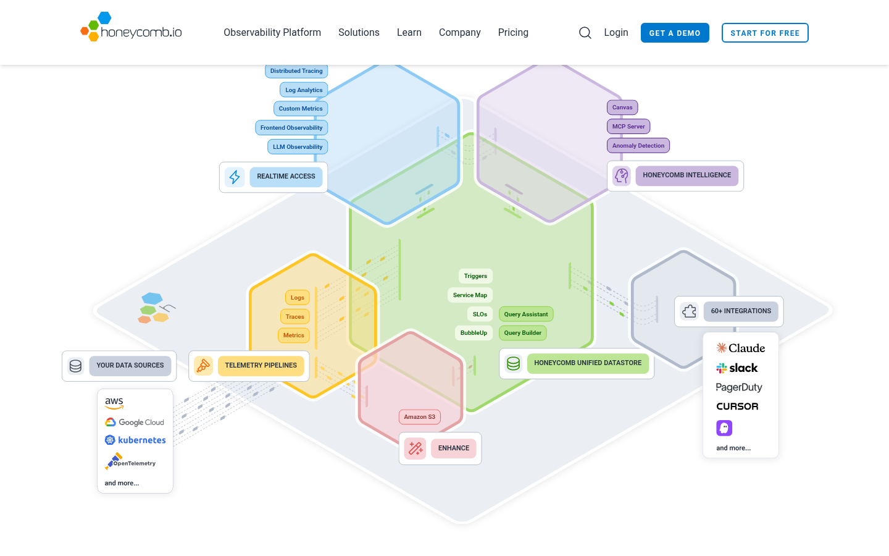
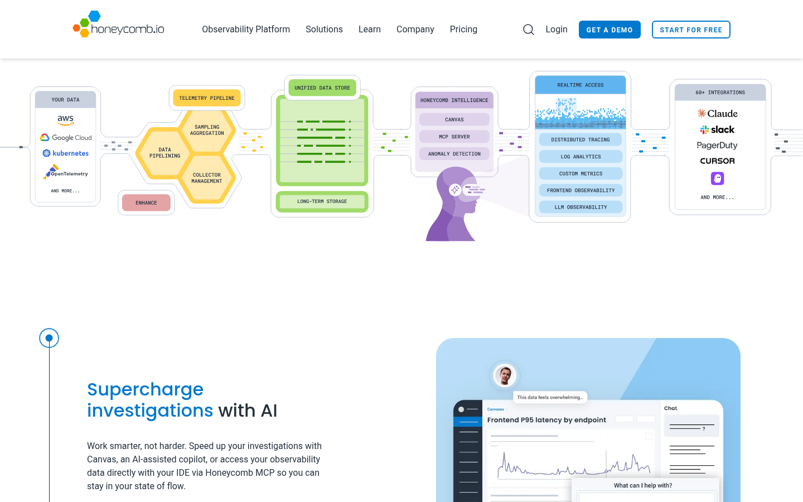
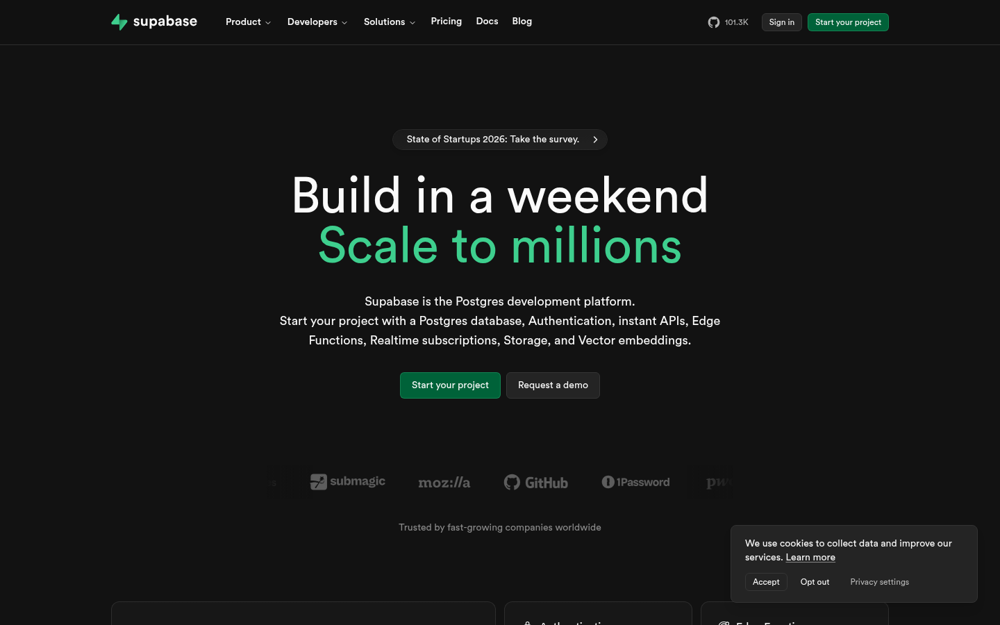
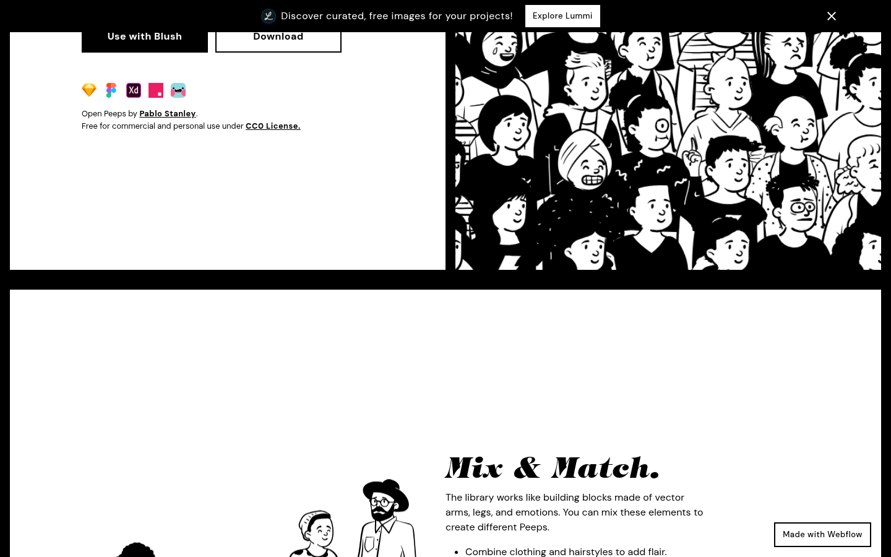
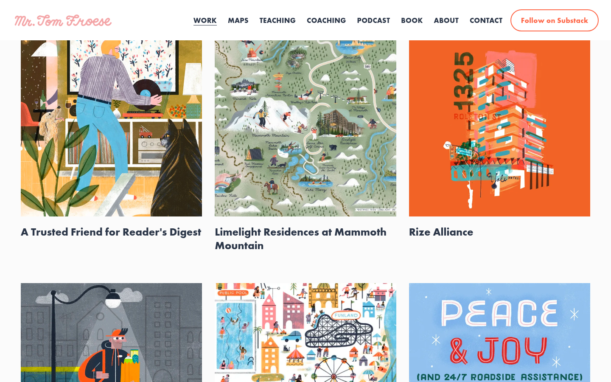
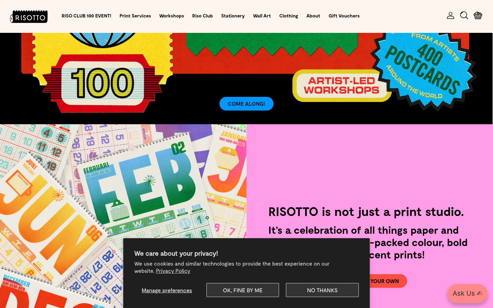

# Visuele motieven — hexagon-systeem, per-sectie-treatments, illustratie-stijl

Dit document beschrijft drie visuele beslissingen die de identiteit van de website fundamenteel bepalen. Ze horen bij elkaar omdat ze samen het **gevoel** van de site bepalen — meer dan kleur of typografie alleen doen.

1. **Hexagon als systematisch motief** — niet alleen de logo-wrapper, maar een terugkerend vorm-element over de hele UI (bulletjes, paginering, statussen, dividers, badges, …). Company-wide, dus ook relevant voor DESIGN.md.
2. **Per-sectie-treatments** — elke sectie van de site verdient bewuste gedachte over hoe we er iets bijzonders van kunnen maken. Niet alleen "hero + tekst + screenshot".
3. **Illustratie-stijl** — vector-line-figuren zoals op de huidige site, met een bepaalde gekende stijl. We kiezen hier een specifieke named style zodat een designer of AI reproduceerbare output levert.

---

## 1. Hexagon als systematisch motief

De zeshoek is Conduction's merk-vorm. Op de huidige stijl komt ze alleen voor rond het logo. Op de nieuwe site maken we er een **systeem** van — een herhalende vorm die op veel plekken in de UI terugkomt, zodat elke pagina zonder twijfel als "Conduction" herkend wordt.

### Regel: hexagon voor accenten, niet voor functionele containers

De zeshoek gaat op plekken waar een **vorm** betekenis heeft (accent, indicator, icoon, badge, markering). Niet op plekken waar een **container** een functie heeft (input, knop, modal, content-card). Functionele elementen blijven rechthoekig omdat dat beter klikt, tikt, leest en invult.

### Toepassingen — een catalogus

Onderstaande UI-elementen krijgen een hexagonale behandeling. Per element: welke vorm, hoe rendert het, wanneer inzetten.

| Element | Hexagon-behandeling | Wanneer |
|---|---|---|
| **List-bullets** | Kleine filled hex (6–8px) i.p.v. `•` bullet | In alle `<ul>`'s in body-tekst; CSS via pseudo-element |
| **Pagination** | Numbered hexagons — actieve pagina = gevuld cobalt; rest = outline | Catalogus-pagina's, blog-lijsten, zoekresultaten |
| **Step-indicators** | Hex-kralen op een horizontale lijn, current step gevuld | Multi-step-flows (onboarding, checkout-achtige flows — al hebben we die nauwelijks) |
| **Progress-bars** | Segmented progress als hex-reeks, gevulde hex = voltooid | Long-form-forms, onboarding-flows |
| **Status-badges** | Hex-pill i.p.v. rechthoekige pill voor app-status (stable / beta / experimental) | App-catalogus, app-detail-hero |
| **Avatars** | Hex-clipped foto (mask) met 2px cobalt-outline | About-pagina, team-sectie, testimonial-quotes |
| **App-logo's** | Hex-wrapper (al bestaand) | Alle app-iconografie |
| **Category-tags** | Hex-wrapped label met kleine hex-bullet ervoor | Solution-categorieën, app-filter-chips |
| **Ratings / scales** | Hexagons i.p.v. sterren (5 gevulde hexen = top rating) | Als we ooit ratings tonen — zie open vraag |
| **Section-dividers** | Horizontale dunne lijn onderbroken door één hex midden | Tussen homepage-secties, lange solution-pagina's |
| **Timeline-beads** | Hex-kralen op verticale of horizontale as | About-pagina's "Onze geschiedenis"-sectie, roadmap |
| **Empty-states** | Outline-hex met icoon erin — "niks gevonden"-illustraties | Lege catalogus-resultaten, 404-pagina |
| **Loading-spinner** | Pulserende hex of draaiende hex-constellatie | Overal waar async-laden gebeurt (apps-filter, zoek) |
| **Bullet-chars in pros/cons-lijsten** | Kleine filled hex met cobalt/oranje kleur naar sentiment | Do's/don'ts-blokken |
| **Section-headers** | Kleine hex-accent voor of achter de H2 | Optioneel, voor visueel ritme op lange pagina's |

### Wat **géén** hexagon krijgt

Functionele UI die rechthoekig hoort te zijn:

- Tekst-inputs, textareas, selects, checkboxes, radio-buttons — allemaal rechthoekig
- Buttons (primary/secondary/tertiary) — rechthoekig met subtiele radius
- Modals, dialogs, drawers — rechthoekig
- Content-cards (app-cards, solution-cards) — rechthoekig; het is de content die hex-accent krijgt (icoon, badge), niet de kaart
- Tables — rechthoekig
- Code-blocks — rechthoekig

De regel: als iemand *iets doet* met het element (typen, klikken, lezen), is het rechthoekig. Als het element *iets aanduidt* (status, volgorde, categorie), mag het hex zijn.

### Implementatie-niveau

**Technisch:**

- **Pure CSS hex** via `clip-path: polygon(25% 0%, 75% 0%, 100% 50%, 75% 100%, 25% 100%, 0% 50%)` voor rechte hex, of `clip-path: polygon(50% 0%, 100% 25%, 100% 75%, 50% 100%, 0% 75%, 0% 25%)` voor gedraaide hex
- **SVG hex** als icoon-primitief; bij gebruik als bullet inline via `<svg>` of als achtergrond-`url()`
- **Design-token** `shape.hexagon` in scope-B tokens met 2 varianten: `pointy-top` en `flat-top` (verschillende oriëntaties voor verschillende toepassingen)
- **Accessibility:** hex-vormen zijn puur decoratief; screen-readers negeren ze via `aria-hidden="true"`. Functie-dragend hex-icoon krijgt `aria-label`.

**Oriëntatie: altijd pointy-top.**

De Conduction-zeshoek heeft altijd de **punt naar boven**. Geen uitzonderingen, geen flat-top-varianten. Reden: één consistente oriëntatie maakt de vorm onmiddellijk herkenbaar als "Conduction" op elk oppervlak. Het bestaande logo is pointy-top; de bestaande portret-frames zijn pointy-top; dus alles blijft pointy-top.

Bij honeycomb-patronen (meerdere hexagons aaneengesloten) stapelen pointy-top-hexes in offset rijen horizontaal — dat werkt qua layout prima.

---

## 2. Per-sectie-treatments — iteraties en aanbevelingen

Elke sectie van de website verdient een eigen doordenking — niet *"hero + tekst + screenshot"* voor alles. Per sectie zetten we 2–4 alternatieven naast elkaar en recommenden er één, met rationale.

### Homepage

#### Sectie 1: Hero

**Opties:**

- **A. Screenshot van één app** — conservatief, gebruiksgericht, saai
- **B. Ecosystem-constellatie (flat)** — centrale hex met satellite-hexes, verbindingslijntjes, rustige animatie
- **C. Isometrisch platform-overview** (Honeycomb-stijl) — 3D-geëxtrudeerde hex-prisma's in verschillende pastel-kleuren, elk gelabeld met een app-categorie; externe "data sources" en "integrations" in rechthoeken links en rechts; dunne stippel-lijnen tonen data-flows
- **D. Eén grote hex met screenshot erin gecropt** — boldere statement maar beperkt tot één app
- **E. Typografie-eerst** — grote headline, geen beeld-hero, slechts hex-accenten

**Aanbevolen: C — Isometrisch platform-overview, ConNext-stijl.**

Waarom: communiceert in één oogopslag hoe **ConNext de Nextcloud-kernel doorontwikkelt van office suite naar workspace** — de strategische kern-boodschap. De 6 component-cards rondom de Nextcloud-kernel zijn de directe Conduction-vertaling van Honeycomb's pattern. Zie [referentie-screenshot](./references/ref-a-honeycomb-3d-platform.png) en [volledige platform-overview-sectie](#platform-overview-pattern--honeycomb-stijl-als-hero) hieronder voor de volledige vertaling.

**Hero-tagline (werkende keuze, te bevestigen)**: 

> # Make Nextcloud your workspace, not just your office suite
> 
> *ConNext is Conduction's set of open-source components that bring data, processes, AI, and integrations to your Nextcloud — turning a file-sync platform into your actual workplace.*

Boven de tagline: ConNext-wordmark in cobalt (`Con`) + Nextcloud-blauw (`Next`), met "*by Conduction*" subtitel + Conduction-hexagon-icoon klein ernaast.

Onder de tagline: het isometrische platform-overview-diagram met Nextcloud-kernel + 6 component-cards + side-box.

CTA's: primair *"Browse our apps"* (→ /apps), secundair *"How does ConNext work?"* (scroll naar architecture-uitleg).

Escape-hatch: als C te technisch-zakelijk ogend is, terug naar B (flat constellatie, zelfde boodschap maar minder visueel gewicht). A is alleen acceptabel als het onmogelijk blijkt om een goede overview-diagram te maken.

---

### Platform overview pattern — Honeycomb-stijl als hero

Honeycomb.io heeft één van de sterkste visuele patronen voor het tonen van "hoe een platform van samenwerkende modules in elkaar steekt" — en hun visualisatie-taal is letterlijk hexagonen. Dat is zo fundamenteel relevant voor ons dat het een eigen sectie verdient.

**De referentie:**



Wat deze visualisatie zo krachtig maakt:

1. **Data-flow-structuur:** links "Your Data Sources" (aws, Google Cloud, kubernetes, OpenTelemetry) → door "Telemetry Pipelines" → centrale "Unified Datastore" → verdeeld over "Realtime Access" + "Honeycomb Intelligence" → rechts "60+ Integrations" (Claude, Slack, PagerDuty, Cursor). De lezer volgt het pad van data-in tot actie-uit.
2. **Hexagon-prismatische extrusie** geeft diepte zonder foto-realistisch 3D te worden. Elke hex is duidelijk een "module" — een container voor functies.
3. **Kleur-codering per categorie** — blauw, paars, geel, groen, rood zijn zachte pastels, ieder eentje voor één product-gebied. Kleur navigeert de lezer.
4. **Feature-labels binnen elke hex** — kleine afgeronde pillen (Logs, Traces, Metrics; Canvas, MCP Server, Anomaly Detection; Triggers, Service Map, SLOs, …). Per hex zie je *wat erin zit*.
5. **Externe boxes** met integratie-logo's (aws, kubernetes, Claude, slack) staan expliciet buiten de platform-grens — een duidelijke scheiding tussen "wat is van ons" en "wat verbinden we".

Honeycomb.io heeft ook een **flat horizontale variant** van dezelfde boodschap (verder op de /platform-pagina) waar de hexen niet extrudeerd zijn maar op dezelfde manier data-flow tonen — zie [referentie-screenshot (flat-variant)](./references/ref-a1-honeycomb-section-3400.png). Die flat-variant is handig voor delen van de site waar minder visuele ruimte is.

**Conduction-vertaling — definitieve component-architectuur (6 component-cards rondom Nextcloud-kernel):**

> **Strategische narrative**: ConNext is Conduction's propositie die Nextcloud doorontwikkelt **van office suite naar workspace**. De 6 component-cards rondom de Nextcloud-kernel laten zien wat die uitbreiding inhoudt.

Wij volgen Honeycomb's pattern letterlijker dan onze eerdere 4-laag-versie: **één centrale kerncomponent** (Nextcloud) **met daaromheen samenwerkende peer-component-cards** (geen lagen, geen hiërarchie). Elke card is een coherente capability-bundel. Dit vervangt zowel de eerdere 6-categorie-mapping als de tussenstap met 4-lagen.

| Component-card | Kleur-familie | Pills (apps + features) | Status |
|---|---|---|---|
| **Nextcloud-kernel** *(centraal)* | Cobalt + Nextcloud-blauw gradient | Files · Mail · Calendar · Contacts · Talk · Office · Apps & SSO | Bestaand platform |
| **Technical Core** | Cobalt-diep | OpenRegister (data) · OpenConnector (integratie) · DocuDesk (documenten) · **NLDesign Theme** (theming) · **MyDash** (dashboards) | Live — 5 foundational capabilities |
| **Workplace App** | Coral / rood-oranje | OpenCatalogi · PipelinQ · Procest · ZaakAfhandelApp · DeciDesk · ShillinQ · LarpingApp · OpenWoo · SoftwareCatalog | Live — 9 user-facing apps |
| **AI** | Paars / lavendel | Automation · Agents · Intelligence | Cross-cutting capability |
| **Integrated Apps** | Geel / oker | OpenTalk · Matrix · n8n · OpenProject · XWiki · GitLab · Mattermost | Externe OSS-apps die we koppelen |
| **App Builder** | Groen / mint | Schema-driven · Low-code *(TBC)* | **Coming soon** — in actieve ontwikkeling |
| **Admin Tools** *(gedempt)* | Grijs | App-versions · Crontab | Beheerder-utilities, geen primair product |

**Side-box (alleen links — rechts vervalt)**:

- **Your data sources / Bron-systemen**: BAG · BRK · PDOK · BRP · KvK · DSO + bestaande Nextcloud-Files / -Contacts
- Externe productivity-apps (OpenProject, XWiki, etc.) zitten **niet** meer als rechter side-box — die zitten nu in de **Integrated Apps** component-card

**Visuele behandeling van Nextcloud-kernel**: groter dan de zes component-cards eromheen; gradient van cobalt (Conduction) naar Nextcloud-blauw `#0082C9` om de Conduction-Nextcloud-relatie visueel te coderen. Label *"Nextcloud"* in Nextcloud-blauw eronder.

**Visuele behandeling van App Builder Coming soon-badge**: standalone `<span class="badge badge-coming-soon">` in KNVB-oranje, niet-clickable, met `aria-label`. Past bij de attention-functie van oranje in onze huisstijl.

**NLDesign — twee verschillende dingen, niet verwarren:**

| Wat | Plek in de architectuur |
|---|---|
| **NLDesign-de-design-system** (NL Design System tokens, accessibility, government-standards) | Identiteits-overlay over de hele ConNext-site en alle apps. **Geen** component-card — zit overal in (typografie, kleuren, components). Vergelijkbaar met Material Design dat niet als component op een Google-platform-diagram verschijnt. |
| **NLDesign Theme app** (configurable theming voor je Nextcloud-instance, multiple themes) | Wél een component-card pill — als één van de **Workplace Apps**, naast OpenCatalogi, PipelinQ, etc. Het is een echte Conduction-app die klanten installeren en gebruiken. |

**Pos-noot — open punten** (vraag de gebruiker bij volgende ronde te bevestigen):
- Workplace App overflow — Technical Core absorbeert nu MyDash en NLDesign Theme, dus Workplace App heeft **9 pills**. Acceptabel als hex groot genoeg is; wordt actief problem zodra het naar >10 groeit. Split-strategie (twee thematische hexen of "View all" pill) blijft optie voor later.
- App Builder pill-content — wat zijn de werkelijke pills bij launch? (Schema-driven en Low-code zijn placeholders)

Externe boxes:

- **Links — "Je bestaande systemen":** Nextcloud zelf (als platform), BAG, BRK, PDOK, DSO, Basisregistraties, externe databases, Common Ground-componenten
- **Rechts — "Integraties & uitvoer":** Nextcloud app store, gov-portals (MijnOverheid, DigiD), e-mail / kalender, LLM-tools (Claude, GPT), PostNL / ondertekenen-apps

Stippel-lijnen tonen data-flow tussen categorieën (data komt uit bron-systemen binnen bij Data Foundation; Integration-hex distribueert naar andere categorieën; output gaat via Integrations naar externe tools).

Binnen elke categorie-hex labels die de **apps** zelf noemen (niet de features) — bij Data Foundation dus `OpenRegister` en `OpenCatalogi` als pillen; bij Integration alleen `OpenConnector`; etc. Klik-bare links naar de app-detail-pagina per pill.

**Een concreet feature-mapping voorbeeld per categorie-hex:**

- *"Data Foundation" hex*:
  - Pill: `OpenRegister` → schema-beheer, object-opslag, audit-trail
  - Pill: `OpenCatalogi` → federated catalogus, publicatie, harvester
- *"Integration" hex*:
  - Pill: `OpenConnector` → API-gateway, transformaties, webhook-fan-out
- *"Documents" hex*:
  - Pill: `DocuDesk` → document-generatie, anonimisering, sjablonen

**Waarom dit werkt voor ons:**

- **Claim stakes als "platform", niet als "losse apps":** bezoekers zien direct dat we een ecosystem zijn
- **Geeft ruimte voor groei:** nieuwe apps passen in bestaande categorieën zonder dat de hero herontworpen hoeft worden
- **Visualiseert data-flow** — nieuwe klanten begrijpen meteen hoe hun bestaande systemen verbinden met onze apps
- **Maximaal brand-consistent:** hexagons overal, kleurpalet uitgebreid naar pastel-familie (cobalt-kern + aanvullende pastels binnen ons merk)
- **Interactief te maken:** categorie-hex → klik/hover toont de apps erin; pill → klik naar app-detail-pagina. Dit is de **homepage-hero als navigation-device** in plaats van een scrollende feature-lijst.

**Implementatie — bevestigd via reverse-engineering van honeycomb.io (2026-04-23):**

Honeycomb heeft hun platform-diagram gebouwd als **pure SVG met `<foreignObject>`-HTML-overlays voor de labels**. Geen rasterized image, geen Lottie, geen animatie-library. Gewoon SVG + HTML + CSS. Exact de techniek die we zelf moeten gebruiken.

Concrete structuur van hun implementatie:

- **Eén root `<svg viewBox="0 0 1290 780">`** met responsieve wrapper `class="lg:w-[1000px] xl:w-[1280px]"`
- **119 `<path>`-elementen** die de hex-prism-geometrie opbouwen. Elke prisma bestaat uit meerdere paden (bovenvlak, linker-zijvlak, rechter-zijvlak) die samen de isometrische diepte-illusie creëren
- **77 `<rect>`-elementen** met rounded corners voor externe info-boxes ("Your Data Sources", "60+ Integrations") en pill-containers
- **8 `<foreignObject>`-elementen** — één per categorie-hex. Elk bevat een HTML `<div>` met gestapelde `<span>`-pills als feature-labels
- **87 elementen** met `cursor: pointer` — bijna alles is klikbaar. Pills zijn `<a>`-elementen die naar sub-pagina's navigeren (`/platform/distributed-tracing`, `/platform/canvas`, etc.)
- **CSS-hover via Tailwind `transition-colors`** — geen JS-animatie; alleen kleur-verloop over 150ms bij hover
- **Category-kleuren via design-tokens** — `hc-sky-100`, `hc-purple-200`, `hc-gold-200`, `hc-red-100`, `hc-green-200`, `hc-gray-200` — eigen Honeycomb-palet, genest in Tailwind-config

Dit is **exact buildable door Claude Design** zonder speciale libraries:

```html
<svg viewBox="0 0 1290 780" class="w-full">
  <!-- Hex-prism geometry (paths voor elke zijde van elke prisma) -->
  <g class="hex-prism hex-data-foundation">
    <path d="..." fill="var(--color-green-100)"/>  <!-- top face -->
    <path d="..." fill="var(--color-green-300)"/>  <!-- left face -->
    <path d="..." fill="var(--color-green-500)"/>  <!-- right face -->
  </g>
  <!-- ... andere hex-prisms ... -->

  <!-- HTML overlays voor pills via foreignObject -->
  <foreignObject x="650" y="350" width="340" height="220">
    <div xmlns="http://www.w3.org/1999/xhtml" class="flex flex-col gap-1.5">
      <a href="/apps/openregister" class="pill pill-green">OpenRegister</a>
      <a href="/apps/opencatalogi" class="pill pill-green">OpenCatalogi</a>
      <span class="category-label">DATA FOUNDATION</span>
    </div>
  </foreignObject>
  <!-- ... andere foreignObjects per categorie ... -->

  <!-- Dashed data-flow connectors tussen categorieën -->
  <path d="..." stroke="var(--color-cobalt-400)" stroke-dasharray="4 4" fill="none"/>
</svg>
```

**Voordelen van deze aanpak:**

- **Crisp op elke schaal** — pure vector, geen retina-issues
- **Accessible** — pills zijn echte `<a>`-elementen met focus-states, screen-reader-leesbaar, keyboard-navigeerbaar
- **SEO-friendly** — tekst staat in de DOM, niet gebakken in een image
- **Interactief zonder JS** — hover via CSS, navigation via standaard links
- **i18n-ready** — pills zijn HTML-tekst, dus vertalen via Docusaurus-i18n-patroon
- **Editable zonder design-tool** — labels wijzigen = HTML-tekst aanpassen; kleuren wijzigen = CSS custom properties
- **Bouwbaar door Claude Design** — alle onderdelen zijn standaard web-technieken

**Wat dit NIET is:**

- Niet een rasterized PNG/JPG-image (wat je met Midjourney zou genereren)
- Niet een Lottie JSON-animatie
- Niet een React-component-library met kant-en-klare hex-prism-componenten
- Niet een externe service / embed

**Consequentie voor productie:**

De homepage-hero (scène 1 in [`illustration-batch-1.md`](./illustration-batch-1.md)) wordt dus **niet via Midjourney gegenereerd als rasterized image** — Claude Design bouwt hem direct als interactieve SVG+HTML-component. Midjourney kan wel worden gebruikt om een *visuele referentie* te genereren (waar moeten de hex-prisms staan, welke hoek, welk palet) waar we de SVG-paden op ijken; maar het eindproduct is SVG.

**Flat sub-variant voor andere pagina's:**

Dezelfde compositie maar zonder extrusie kan gebruikt worden op:

- **App-detail-pagina's** — "Hoe deze app in het ecosystem past" als mini-diagram
- **Solution-landing-pagina's** — "De app-stack voor deze solution" gehighlight in een flat overview
- **About-pagina** — onze positie in het bredere NL-gov-ecosysteem (Common Ground, NL Design System)

Eenzelfde visuele taal, gewoon minder dominant visueel (geen grote hero).

#### Sectie 2: Waarde-teasers (4 blokken: "Open source" / "Eigen Nextcloud" / "Geen vendor lock-in" / "NL Design")

**Opties:**

- **A. 4 cards naast elkaar** — baseline, kaal
- **B. Honeycomb-row** — 4 hexagons die elkaar raken, icoon + titel + 1-regel-uitleg per hex
- **C. Staggered honeycomb** — 2 hexes boven, 2 onder, offset zoals een echte honeycomb
- **D. Centrale hex ("Conduction") omringd door 4 waarde-hexes** — visualiseert dat deze 4 waardes definieerden wie we zijn

**Aanbevolen: B — Horizontale honeycomb-row.**

Waarom: 4 raakelkaar-hexagons zijn direct herkenbaar als "honeycomb" (ecosystem-metafoor); werkt horizontaal op desktop; stackt netjes verticaal op mobile (wordt dan verticale kolom van 4 hexes). C is elegant maar vraagt meer verticale ruimte; D is te meta.

#### Sectie 3: Apps-grid — het hart van de homepage

Dit is de sectie waar je voorstel voor is gekomen:

- **Offset honeycomb-grid op desktop** — hexagons in een interlocking-patroon (twee rijen waarvan de tweede offset)
- **Elke hex bevat het app-icoon** — centraal, cobalt op wit
- **Hover over de hex**: cross-fade-overlay met app-naam + tagline uit [`app-taglines.md`](./app-taglines.md)
- **Klik**: navigeer naar app-detail

**Implementatie-details:**

- Grid-shape: 4-3-4 (offset) op desktop = 11 apps precies passend; 3-4 rijen op tablet; verticale lijst op mobile
- Mobile-fallback (< 768px): hex-icoon + tagline + "Read more" als verticale lijst, geen hover-trick
- Hover-transition: 200ms ease-out cross-fade
- Touch-friendly: tap/focus triggert dezelfde overlay (accessibility voor touch + keyboard)
- Accessibility: icoon heeft `aria-label` met app-naam; tagline in `aria-describedby`; reduced-motion respecteert = fade met 0ms
- Optional: subtle lift op hover (translateY(-2px) + shadow)

**Micro-interactie-idee:** bij laden *honeycomb builds in* — hexes verschijnen één-voor-één met 50ms stagger (totaal ~600ms). Geen blocking, alleen ritme.

#### Sectie 4: Solutions-teasers

**Opties:**

- **A. 3–4 cards horizontaal** — baseline
- **B. Hex-vormige solution-cards** — zelfde als apps maar met probleem-iconen (iets algemener)
- **C. Stack-diagram-teaser per solution** — klein hex-diagram dat de apps-stack achter elke solution toont (bv. WOO = OpenRegister + OpenCatalogi + OpenConnector + DocuDesk als geconnecteerde hexes)
- **D. "Probleem → Oplossing"-visual** — pain-point links, hex-pijl, app-stack rechts

**Aanbevolen: C — Stack-diagram-teaser.**

Waarom: communiceert op elke solution-kaart direct onze **onderscheidende boodschap** ("solutions = compositie van apps"). Dit is lezen-bestendig — iedere kaart toont waarom de solution uit óns ecosystem komt, niet uit een magische blackbox. Vanuit hier is de klik naar de volledige solution-pagina logisch.

Simpeler fallback: als C te druk oogt, kleine hex-iconen met tekst (variant van A met hex-accent).

#### Sectie 5: Stats-strip

**Opties:**

- **A. 4 grote getallen naast elkaar** — baseline
- **B. Hex-gekaderde getallen** — elk getal in een grote decoratieve hex
- **C. Honeycomb-achtergrond-patroon** met getallen daarover
- **D. Count-up-animatie** on scroll-into-view (getallen tellen op van 0)

**Aanbevolen: B + D — Hex-gekaderde getallen met count-up-animatie.**

Waarom: hex-frames verankeren het motief; count-up-animatie geeft leven bij scroll zonder dat het irriteert (gebeurt één keer). Mobile: staat stack; count-up blijft werken.

Respectering reduced-motion: animatie uitgeschakeld voor users die dat instellen.

#### Sectie 6: Support-teaser

**Opties:**

- **A. Standaard CTA-strip met "Explore Support"** — baseline
- **B. Twee hex-cards naast elkaar** — Standard + Premium als previews
- **C. Hex-gradient** — twee opeenvolgende hexes die tiers visualiseren
- **D. Quiet textueel** — één zin, één discreet hex-accent, één link

**Aanbevolen: D — Quiet textueel.**

Waarom: dit is bewust *niet* een sales-moment. Onze toon is "apps zijn gratis, Support is optioneel voor wie het wil". Een grote Support-strip zou die boodschap ondermijnen. Eén zin, subtiele hex-ornament, link naar `/support`. Klaar.

Concrete copy: *"Zelfstandig genoeg? Prima. Meer zekerheid nodig? Onze [Support](./support) zit klaar."*

#### Sectie 7: Footer

**Opties:**

- **A. Standaard 4-kolommen-footer** — baseline
- **B. Hex-pattern achtergrond** — subtiel honeycomb-patroon op 5–8% opacity als achtergrond
- **C. Hex-dividers tussen footer-secties** — kleine hex-ornament tussen kolommen
- **D. "Honeycomb-hive"-footer** — gestileerd honeycomb-element als visuele afsluiting van de pagina

**Aanbevolen: B — Subtiele hex-pattern-achtergrond.**

Waarom: afsluiting als "je zit nog steeds op een Conduction-pagina" zonder op te drukken. Pattern op 5–8% opacity is perceptibel maar niet storend. Mobile: zelfde pattern, desnoods iets groter schaal voor herkenbaarheid.

### App-detail-pagina

- **Hero**: hex-framed app-logo links, screenshot rechts
- **Sticky intra-page-nav**: hex-iconen per sectie (Features / Screenshots / Integraties / Tech / Install)
- **Feature-blokken**: hex-bullets in feature-lijsten
- **"Integreert met"**: visualiseert als mini-constellatie van hex-app-logos (zelfde stijl als homepage-hero maar kleiner)
- **Technical metadata-sidebar**: hex-accenten bij licentie, versie, NLDS-compliance
- **Install-CTA**: rechthoekige button (functioneel) met hex-icoon naast de label-tekst

### Solution-landing

- **Hero**: probleem-titel met kleine hex-ornament links
- **"Stack-diagram"-sectie**: hex-compositie die de apps toont; elke hex = één app; lijnen tonen relaties
- **FAQ**: hex-bullet per vraag-regel
- **App-stack-tabel**: tabel is rechthoekig, maar iedere app-rij krijgt hex-geframed app-icoon

### Support-pagina

- **Hero**: kleine hex-accent
- **Tiers-kolommen**: 2 kolommen (Standard, Premium). Hex-icoon bovenaan elke kolom (Standard = outline-hex; Premium = gevulde hex) — visuele hiërarchie-suggestie
- **Pricing-tabel**: rechthoekig (functioneel), maar elke app-rij heeft hex-app-icoon
- **Paden 1 en 2**: twee honeycomb-blokken naast elkaar, elk met zijn flow

### Services-pagina

- **Tarievenkaart**: rechthoekige tabel (functioneel); elk dienst-type heeft hex-icoon (dev, consultancy, training, cert)
- **Strippenkaart-visual**: stack van hex-kralen die aftellen bij gebruik — speelse visualisatie van "uren worden afgeboekt van je strippenkaart"
- **Training-varianten**: 3 hex-cards (fysiek / online / certificering)

### About

- **Team-sectie**: hex-clipped portretfoto's (eindelijk ons motief op foto's!)
- **Timeline**: hex-kralen op verticale lijn voor milestones
- **Values**: 5 hexes die onze 5 kernwaarden (Trots NL / Innovatief / Handelsgedreven / Penny-wise / Betrouwbaar) tonen

### 404

- Grote outline-hex met vraagteken erin, "lost in the grid" copy
- Zoekveld + links naar Apps / Solutions / Home
- Optioneel: subtiele geanimeerde honeycomb-achtergrond (hexes die rustig pulseren)

---

## 3. Illustratie-stijl — expliciete breuk met het huidige, fresh direction

### Wat de huidige stijl is (ter documentatie, we bewegen eraf)

De huidige conduction.nl-illustraties zijn **gedetailleerde flat vector characters** in wat in de stock-industrie bekend staat als "Freepik / Vectorjuice / Upklyak-achtige stijl" — vaak verkocht via Freepik-marketplace, Adobe Stock, Vecteezy. Kenmerken:

- **Filled shapes** (géén line-art zoals ik eerder aannam) — vormen worden gedefinieerd door kleur-contrast, niet door outlines
- **Gedetailleerde gezichten** — uitgewerkte ogen met pupillen, tanden zichtbaar bij glimlach, realistische wenkbrauwen
- **Shading binnen kleur** — haar heeft highlights, kleding heeft vouwen en schaduwen
- **Realistische proporties** — armen en benen hebben normale lengte, niet overdreven stretch
- **Felle kleurvlakken** — kobalt-blauw kleding, rode vesten, geel-oranje accenten
- **Getilte gekleurde achtergrondrechthoeken** — lichtblauw, geel, oranje parallellogrammen achter de figuren
- **Bestaande hexagon-portretten** — in de hex-frames (cobalt achtergrond) is het character-onderdeel van dezelfde stijl

Vergelijkbaar met illustratie-sets als "Upklyak – Business People", "Vectorjuice – Team Scenes", of de betaalde Freepik-vendor-stijl packs.

### Waarom we hier bewust van wegbewegen

Drie inhoudelijke redenen:

1. **Te "stock-foto" qua gevoel.** De huidige illustraties voelen als generieke marketing-stock: de bandleden, de mensen-met-map, de man-die-naar-zichzelf-wijst — ze kunnen op elke SaaS-website of consultancy-brochure staan. Dat botst met het onderscheidende merk dat we bouwen.
2. **Te veel detail voor product-first-positionering.** De realistische gezichten en shading trekken aandacht naar *de mensen*, niet naar *de apps*. Bij een productbedrijf wil je illustraties die het product ondersteunen, niet afleiden.
3. **Niet opnieuw te produceren zonder stockbibliotheek-afhankelijkheid.** Elke keer dat we een nieuwe illustratie nodig hebben, moeten we op de Freepik-marketplace zoeken naar een asset die "ongeveer past". Dat leidt onvermijdelijk tot inconsistentie (licht andere outline, licht andere paletten, licht andere proporties). Een fresh direction moet **reproduceerbaar** zijn — door ons of door een AI.

Plus een eerder argument uit [DESIGN.md](../../DESIGN.md#visuele-richting): bij een **productbedrijf** horen illustraties die **software tonen en abstracte concepten visualiseren**, niet "blije mensen in pakken" — dat was het dienstverlener-tijdperk.

**Het hexagon-portret-concept (zoals in de 3 portret-voorbeelden) blijft overeind.** Het frame + cobalt-achtergrond is goed en on-brand. Alleen het **character-binnenwerk** wordt opnieuw: geen Freepik-flat-vector-character meer, maar de stijl die we hieronder kiezen.

### Fresh direction — vier richtingen om uit te kiezen

Omdat we alles opnieuw doen, ligt het veld open. Hieronder vier genuinely verschillende richtingen met hun eigen feel. Per richting: wat het is, waarom het bij ons zou passen, en wat we ervoor nodig hebben.

#### Richting A — **Hex-first geometric** (mijn aanrader)

**Wat:** illustraties gebouwd uit hexagons en eenvoudige geometrische vormen. Géén (of zeer minimaal) mensen. Concepten worden visueel uitgelegd met hex-composities, verbindingslijntjes, gestapelde vormen.

**Twee sub-varianten:**

- **A1 — Flat** (voor gewone illustraties): zuivere 2D hex-composities zonder diepte, cobalt en oranje op wit. Voor solution-pagina-illustraties, icoon-accenten, decoratieve elementen, 404, empty-states.
- **A2 — Flat-isometric** (voor platform-/architectuur-diagrammen): hexagons geëxtrudeerd tot prisma's vanuit isometrisch perspectief (~30° hoek), subtiele diepte, pastel-kleur-codering per categorie. Voor de homepage-hero platform-overview en ecosystem-diagrammen. Referentie: Honeycomb.io (zie [platform-overview pattern](#platform-overview-pattern--honeycomb-stijl-als-hero)).

A2 is **technisch nog steeds flat** (geen photorealistisch 3D, geen lighting, geen gradients) — alleen isometrisch geconstrueerd. Dat onderscheidt het van "echt 3D" (Lottie-renders, Octane-renders) dat in onze anti-lijst staat.

**Voorbeelden:**
- "Ecosystem" = centrale hex + satellite-hexes + verbindingen (A1 of A2)
- "Integration" = twee hex-groepen die via een hex-brug verbinden (A1)
- "WOO-compliance" = fragmentarisch hex-veld dat consolideert tot één hex-cluster (A1)
- "Open source" = hex met open bovenkant, content stroomt eruit (A1)
- "Platform overview" = Honeycomb-stijl isometrische composities (A2)

**Palet:** cobalt #21468B dominant, KNVB oranje #F36C21 als accent, wit als adem. Geen andere kleuren.

**Waarom het past:**
- Maximaal merk-consistent — onze hex-motief wordt de illustratie-taal
- Zero stock-foto-risico
- Oneindig schaalbaar — elke nieuwe illustratie is gewoon een nieuwe hex-compositie
- Past bij product-first-positionering (technisch, niet emotioneel)
- Distinctief — niemand anders bouwt zijn illustratie-taal rond hexagons
- Makkelijk produceerbaar: een ontwerper, AI-tool (Midjourney, Figma), of zelfs een technisch-onderlegde developer kan ze maken

**Wat we ervoor nodig hebben:**
- Een master-briefing-tekst (zie onder)
- 4–6 example-illustraties om de stijl te ankeren
- SVG-bibliotheek met herbruikbare hex-primitieven

**Risico:** te koel, te technisch — als het palet te spaarzaam is, kan de site koud aanvoelen. Mitigatie: KNVB-oranje accents en warme Figtree-typografie doen het meeste emotionele werk. Illustraties zijn dan het "rustige rechtopstaande" element.

#### Richting B — **Minimal line-art characters** (karakters-variant)

**Wat:** als we echt menselijke figuren willen tonen (team, samenwerking, klant-sfeer), dan in de absolute tegenpool van de huidige stijl: **pure outline-only**, zero fill, dunne consistente lijnen. Stijlreferentie: Open Peeps of een eigen versie ervan.

**Voorbeelden:**
- Één persoon die naar een laptop kijkt (line-art, cobalt outline)
- Twee mensen die praten (line-art, geen shading)
- Eén persoon in hex-portret-frame (alleen contour zichtbaar tegen cobalt-fill)

**Palet:** cobalt #21468B outline, white fill (niks gekleurd aan de figuur zelf). Oranje accents alleen voor attributen (bv. een map, een laptop-scherm).

**Waarom het past:**
- Warmer dan richting A
- Past bij About-pagina's, testimonials, team-sectie
- Extreem consistent te produceren (lijn-stijl is reproduceerbaar)
- Compleet weg van "Freepik-detail"-feel

**Wat we ervoor nodig hebben:**
- Keuze tussen Open Peeps (CC0, kant-en-klaar) of custom-drawn (meer karakter, meer werk)
- Briefing-tekst voor consistentie

**Risico:** line-art-characters kunnen **saai** worden als ze overal verschijnen — ze leven in hun sobere lijn-esthetiek. Best mix met richting A (concept-illustraties in hex, mens-illustraties in line-art).

#### Richting C — **Editorial / paper-cut** (sophisticated variant)

**Wat:** gelaagde platte vormen die lijken op papiersnijkunst. Elk element is een geometrische vorm (rechthoek, cirkel, hex) met een subtiele textuur of lichte schaduw, die de indruk wekt dat ze op elkaar gelijmd zijn. Stijlreferentie: The New Yorker covers, moderne redactionele illustratie, Tom Froese-achtig.

**Voorbeelden:**
- "Data-catalogi" = gelaagde cirkels en hexagons met subtiele shadow
- "Open source" = een opengewerkte compositie waar je lagen kunt zien

**Palet:** cobalt + oranje + heel subtiele off-white accentlaag. Misschien een textuur-overlay (grain, noise).

**Waarom het past:**
- Sophisticated, volwassen — past bij een MKB-doelgroep die kwaliteit zoekt
- Distinctief — niet veel SaaS gebruikt editorial-stijl
- Duurzaam — editorial-illustraties verouderen minder snel

**Wat we ervoor nodig hebben:**
- Een illustrator of AI-tool die deze stijl kan reproduceren
- Waarschijnlijk duurder en trager te produceren dan richting A

**Risico:** voelt mogelijk te "kunst" voor MKB — kan als "highbrow" ervaren worden door praktisch-ingesteld publiek.

#### Richting D — **Riso / two-color print** (indie-craft variant)

**Wat:** illustraties in de stijl van risograph-prints. Twee kleuren (cobalt + oranje), subtiele offset en grain-textuur, handgemaakt gevoel. Stijlreferentie: moderne OSS-producten als Obsidian, indie dev-sites, zine-cultuur.

**Voorbeelden:**
- Karakters of abstracte scenes, altijd in twee kleuren
- Licht-afwijkende registratie (oranje laag minimaal verschoven t.o.v. cobalt)
- Korrel-textuur over het geheel

**Palet:** strikt cobalt + oranje + wit. Texturen simuleren inkt-overlap.

**Waarom het past:**
- Indie / OSS / crafted-feel — past bij onze community-kant
- Eerlijk en niet-corporate
- Distinctief

**Wat we ervoor nodig hebben:**
- AI-tool (Midjourney met riso-prompt) of een illustrator die dit beheerst
- Textuur-assets (grain overlays) die we als CSS-/SVG-filters consistent toepassen

**Risico:** kan te artsy-fartsy voelen voor conservatievere MKB-doelgroep; kan dated raken als riso-trend verdwijnt.

### Vergelijkingstabel

| Richting | Feel | Productie | Merkconsistentie | Risico |
|---|---|---|---|---|
| **A — Hex-first geometric** | Product, technisch, clean, Dutch-design | Laag — reproduceerbaar door iedereen | Maximaal (hex-motief overal) | Kan koel overkomen |
| **B — Minimal line-art** | Warm, menselijk, friendly | Middel — vraagt consistentie | Goed (cobalt-outline) | Kan saai worden bij overgebruik |
| **C — Editorial** | Sophisticated, redactioneel, volwassen | Hoog — vraagt illustrator | Goed (palet-restrictie) | Kan highbrow voelen voor MKB |
| **D — Riso** | Indie, crafted, OSS-spirit | Middel — vraagt tooling | Goed (twee-kleur-principe) | Kan trendy voelen |

### Gekozen: **Richting A2 — flat-isometric hex-prism, overall**

**Definitieve keuze (2026-04-23):** alle illustraties op de site krijgen de **flat-isometric hex-prism-behandeling** in de stijl van honeycomb.io. Geen richting B, geen line-art-karakters, geen editorial, geen riso. **A2 voor alles.**

Rationale:
- **Maximale merk-consistentie.** Eén visuele taal door de hele site; elke nieuwe pagina voelt automatisch "Conduction".
- **Eén reproduceerbare stijl** = één master-prompt voor Midjourney; geen gewrikte keuzes per scène over "is dit een A of B moment?".
- **Product-first positionering.** Hex-prism-diagrammen tonen software-structuur, niet emoties — exact passend bij waar we heen gaan.
- **Schaalbaar.** Nieuwe illustraties zijn variaties op hetzelfde patroon, niet nieuwe stijlen.

### Hoe "menselijke momenten" gerenderd worden in A2

We hebben soms mens-aanwezigheid nodig (About team-portretten, testimonials, "meekijkend support"-visuals). Binnen A2 doen we dat als volgt:

1. **Abstracte hex-figuren** — een hex-prism-torso met kleinere hex-prism-hoofd, geen gezichten, geen details. Meer een "iemand" dan "een persoon". Staat los van stock-photo-gevoel.
2. **Blanked hex-portretten** — behoud het bestaande hex-portret-concept (zie de huidige conduction.nl) maar vul de hex met een **abstracte silhouette** of **alleen de initialen** in plaats van een gedetailleerd getekend figuur. Functioneel als avatar, stilistisch consistent.
3. **Skip mens-depictie helemaal** — About-pagina toont organisaties en rollen via abstracte hex-composities (een "team"-hex met sub-hexen voor rollen); testimonials tonen alleen logo + tekst + titel zonder avatar.

Voor de eerste iteratie kiezen we **optie 3 (skip)**: team-details via tekst, testimonials zonder avatar. Dat houdt A2 schoon en vermijdt de complexiteit van abstracte figuren tekenen. Bij latere iteraties evalueren we of optie 1 of 2 nodig is.

### Nederlaag-scenario — wanneer terugvallen

Als A2 na 2–3 iteraties met Midjourney niet voldoende karakter oplevert (alles lijkt op hetzelfde hex-blob), overwegen we een **secundair spoor** voor 1–2 specifieke use-cases. Dat besluit nemen we ná de eerste batch, niet vooraf.

### Master-briefing-tekst voor richting A (hex-first geometric)

Bewaar als "master-prompt" voor illustrators en AI-tools. Kan gebruikt in Midjourney, DALL-E, Figma, of als briefing aan een freelance-illustrator.

> *"Vector-based geometric illustrations built from hexagons and simple geometric primitives (circles, rectangles, triangles). No human figures or faces. Pointy-top hexagons only (point at the top). Clean flat shapes, no gradients, no 3D, no shadows except subtle 2D drop-shadows where needed for depth. Colors: cobalt blue (#21468B) as dominant fill or outline; KNVB orange (#F36C21) as accent (maximum 10% of surface); white (#FFFFFF) as background. No other colors. Thin uniform line weight where lines are used (2px at source scale, consistent). Compositions should visualize abstract concepts: ecosystem (central hex with satellite hexes connected by thin lines), integration (two hex-groups joined by a hex-bridge), transparency (hexagons arranged in a visible layered grid), flow (hexagons arranged along a path or funnel). Feel: quiet, competent, Dutch-design-adjacent. Anti-references: no Freepik-style characters, no isometric, no 3D, no faces, no stock-photo feel, no gradients."*

### Master-briefing-tekst voor richting B (minimal line-art characters) — secundair

Voor de momenten waar we mensen moeten tonen:

> *"Minimal outline-only character illustrations. Pure line art, no fill inside the figure (just white). Thin uniform stroke weight (2px at source scale, consistent). Minimal facial features: two dots for eyes, simple curve for mouth, single lines for eyebrows only when expression is needed. Limbs proportional, not stretched. Simple clothing suggested with 2–3 outline details. Colors: cobalt blue (#21468B) outline only; KNVB orange (#F36C21) accent on small objects (a book, a laptop screen, a badge) — never on the figure itself. White (#FFFFFF) background, or placed inside a cobalt-fill hexagon frame for portraits. Style reference: Open Peeps minimalism. No shading, no gradients. One or two figures per illustration, never crowds. Feel: warm but restrained, friendly without being childish."*

### Licentie-overwegingen bij assets

Als we directe librararies gebruiken in plaats van custom:

- **Richting A**: geen bekende library heeft specifiek "hex-first geometric" — moeten we zelf creëren of via AI. Geen licentie-issue.
- **Richting B**: **Open Peeps** is CC0 (volledig vrij, inclusief commercieel gebruik, geen attributie). Dat is de kant-en-klare optie.
- **Richting C**: editorial is typisch custom werk per illustrator. Contract regelt de rechten.
- **Richting D**: riso is typisch custom werk of via Midjourney (check Midjourney-TOS voor commercial use).

Voor richting A + B is er dus geen licensing-probleem.

### Voorbeelden per richting — echte referentie-sites + screenshots

Per richting: 3–5 echte websites of illustrators waarvan de stijl matcht, een **lokaal opgeslagen screenshot** als visuele anker, plus concrete Conduction-scènes beschreven in die stijl zodat je kunt voorstellen hoe "onze" illustraties eruit zouden zien. Alle screenshots staan in [`briefs/website/references/`](./references/).

#### Richting A — Hex-first geometric

**Screenshot — Honeycomb.io platform-overview (3D-isometrisch, A2):**


**Screenshot — Honeycomb.io platform-flow (flat horizontaal, A1):**



**Screenshot — Supabase hero (typografie-led met technische visual-hints):**



**Bestaande sites/merken die dit register raken:**

- [honeycomb.io](https://honeycomb.io) en [honeycomb.io/platform](https://www.honeycomb.io/platform) — **topreferentie**, letterlijk hexagon-branding met zowel A1 flat- als A2 isometrische varianten
- [supabase.com](https://supabase.com) (vooral de feature-pagina's) — pure geometrische composities, modulair
- [hashicorp.com](https://www.hashicorp.com) — abstracte geometrische tech-illustraties (let op: gebruikt meer gradient/glow dan wij willen)
- [fly.io](https://fly.io) — sterk geometrisch, eenvoudig
- [cloudflare.com](https://www.cloudflare.com) (product-pagina's) — abstracte geometrische vormen als illustratie
- [plausible.io](https://plausible.io) — minimalistisch geometrisch
- [prisma.io](https://www.prisma.io) — technische geometrische visuals

**Pinterest/Dribbble voor "hex-based" en "geometric tech illustration":**

- [dribbble.com/tags/hexagon](https://dribbble.com/tags/hexagon)
- [dribbble.com/tags/geometric-illustration](https://dribbble.com/tags/geometric-illustration)

**Concrete Conduction-scènes in deze stijl:**

- **Homepage hero** — centrale cobalt hex met de C-logo erin; 11 kleinere app-hexen eromheen in een rustige constellatie; dunne cobalt-lijnen verbinden centrum met apps; enkele verbindingen ook app-aan-app; één oranje hex-accent ergens subtiel
- **Solution "WOO-compliance"** — links een fragmentarisch veld van losse, ongekleurde hex-outlines (= versnipperde informatie in silo's); een dunne-lijn-overgang naar rechts; rechts een geconsolideerd hex-cluster in cobalt (= publicatie-platform), één oranje hex bovenop (= de Woo-index harvester die binnenkomt)
- **About-pagina hero** — hex-raster, 5 hexen ingekleurd (onze 5 kernwaardes), verbonden tot een compositie; rest van het raster in outline-only
- **Support-pagina Standard vs Premium** — twee hex-stapels naast elkaar; Standard = 2 hexen gestapeld; Premium = 3 hexen plus een oranje accent-hex bovenop (proactief monitoring-signaal)
- **404** — één eenzame outline-hex "zwevend" links, een geconsolideerd hex-cluster rechts. Copy: *"Lost in the grid."*
- **Footer-achtergrond** — honeycomb-patroon van outline-hexes op 5–8% cobalt-opacity over de hele footer-breedte

**AI-prompt voor Midjourney/DALL-E:**

> *"Flat vector illustration, geometric composition built from hexagons and simple primitives (circles, rectangles, lines). Central large hexagon with smaller hexagons connected by thin lines forming a constellation. Cobalt blue #21468B as primary color, KNVB orange #F36C21 as accent (< 10% of surface), white background. No human figures. No gradients. No 3D. Pointy-top hexagon orientation (point at top). Clean, technical, Dutch-design feel. Style reference: honeycomb.io and supabase.com feature illustrations. --ar 16:9 --style raw"*

#### Richting B — Minimal line-art characters

**Screenshot — Open Peeps showcase:**



**Bestaande sites/merken:**

- [openpeeps.com](https://www.openpeeps.com) — de CC0-library zelf, met een live preview die de stijl toont
- [icons8.com/illustrations/style--outline](https://icons8.com/illustrations/style--outline) — Icons8's outline-style pagina met honderden voorbeelden
- [storyset.com](https://storyset.com) — filter op "Line Color" variant voor de minimalistische line-versies
- [linear.app](https://linear.app) — soms line-art characters op landings-/feature-pagina's
- [lobste.rs](https://lobste.rs) — illustraties in comments/posts zijn vaak minimal line-art (community-vibe)

**Dribbble-tag:**

- [dribbble.com/tags/open-peeps](https://dribbble.com/tags/open-peeps)
- [dribbble.com/tags/line-illustration](https://dribbble.com/tags/line-illustration)

**Concrete Conduction-scènes in deze stijl:**

- **About-pagina team-portretten** — 4–8 line-art silhouetten, één per teamlid, in de bestaande cobalt hex-frames. Alleen contour zichtbaar, plus minimale facial features (twee stippen = ogen, kort boogje = mond). Eventueel één KNVB-oranje accent per portret (bril, haarlok, baard-hint) om te individualiseren.
- **Testimonials** — klant-avatar in hex-frame naast quote; zelfde line-art-principe. "Karin, IT-manager Gemeente X" — minimal line van een hoofd en schouders, hex-frame.
- **Support-pagina "twee paden"-illustratie** — links een line-art persoon naast een kleine gebouw-outline (Nextcloud-leverancier) met handdruk-motion; rechts een line-art persoon alleen met laptop (self-managed). Compositie toont "jij kiest je pad".
- **Contact-pagina** — één minimal line-art figuur met hand opgestoken in welkom-gebaar, subtiele KNVB-oranje achter een gelezen tablet.

**AI-prompt voor Midjourney/DALL-E:**

> *"Minimal line-art illustration of a single human figure. Outline only, no fill inside the figure. Uniform thin stroke weight. Minimal facial features: two small dots for eyes, simple curve for mouth. Proportional limbs, friendly posture. Cobalt blue #21468B outline only. KNVB orange #F36C21 accent on one small object or element (glasses, a book, a badge). White background. No shading, no gradients, no 3D. Style reference: Open Peeps illustrations. --ar 1:1 --style raw"*

#### Richting C — Editorial / paper-cut

**Screenshot — Tom Froese portfolio (editorial work grid):**



**Bestaande sites/merken:**

- [newyorker.com](https://www.newyorker.com) — klassieke editorial cover-illustraties
- [tomfroese.com/work](https://www.tomfroese.com/work) — portfolio van Tom Froese, groot-format geometrisch-editorial
- [malikafavre.com](https://www.malikafavre.com) — Malika Favre, bekend om minimalistisch-editorial geometrie
- [owendavey.com](https://www.owendavey.com) — Owen Davey, retro-editorial, veelgebruikt door redacties
- [charliedavis.co.uk](https://www.charliedavis.co.uk) — Charlie Davis, paper-cut-achtige composities
- Mailchimp's 2018 rebrand (Kind of Collective's werk ervoor) — heeft editorial-elementen

**Dribbble:**

- [dribbble.com/tags/editorial-illustration](https://dribbble.com/tags/editorial-illustration)
- [dribbble.com/tags/paper-cut](https://dribbble.com/tags/paper-cut)

**Concrete Conduction-scènes in deze stijl:**

- **Homepage hero** — een gelaagde paper-cut-compositie: cobalt-achtergrond met een oranje-paper-cut "zon" erboven, daaronder drie gestapelde hex-vormen in verschillende cobalt-tinten (licht/medium/donker), elk met een subtiele drop-shadow zodat ze als losgeknipt papier voelen. Suggestie: "een ecosysteem in lagen."
- **Solution-landing "Zaakafhandeling"** — een abstract burgemeester-bureau-scène in paper-cut: een bureau als rechthoek, gelaagde papierstapels in cobalt-tinten, één document met oranje-hoek dat eruit springt, alles met subtiele shadow-offsets.
- **About hero** — abstracte "Nederland"-paper-cut: horizon van cobalt-heuvels, een stilistische windmolen uit papier geknipt, hex-gestalten in de lucht als wolken. Gecultiveerd, verfijnd. Geen pannekoek-Nederland-kitsch.
- **Blog post headers** — typische editorial-illustraties (gelaagd, geometrisch, subtiel shadowed) van thema-specifieke concepten.

**AI-prompt voor Midjourney/DALL-E:**

> *"Editorial paper-cut illustration. Layered geometric shapes (hexagons, circles, rectangles) with subtle drop shadows creating a sense of cut paper layered on top of each other. Limited palette: cobalt blue #21468B, KNVB orange #F36C21, off-white. Subtle grain or paper texture. Composition feels curated, deliberate, sophisticated. Style reference: The New Yorker covers, Tom Froese, Malika Favre. No human figures unless as silhouettes. Flat but with depth through layering. --ar 3:2 --style raw"*

#### Richting D — Riso / two-color print

**Screenshot — Risotto Studio (riso prints en stationery):**



**Bestaande sites/merken:**

- [risottostudio.com](https://risottostudio.com) — riso print studio in Edinburgh, met illustraties en prints van eigen werk + klanten
- [riso.party](https://riso.party) — showcase van risograph-prints van kunstenaars wereldwijd
- [peopleofprint.com](https://www.peopleofprint.com/tag/risograph/) — riso-tag van People of Print
- [obsidian.md](https://obsidian.md) — hun illustraties hebben een riso-leunende kwaliteit (grain, twee-kleur-vibe)
- [drawdown.org](https://drawdown.org) — subtiele riso-feel op hun klimaat-website
- Etsy "risograph print" sellers — duizenden voorbeelden

**Pinterest/Dribbble:**

- [pinterest.com/search/pins/?q=risograph+illustration](https://www.pinterest.com/search/pins/?q=risograph%20illustration)
- [dribbble.com/tags/riso](https://dribbble.com/tags/riso)

**Concrete Conduction-scènes in deze stijl:**

- **Homepage hero** — een twee-kleurs-scène van een hex-constellatie, cobalt als primaire inkt, oranje als secundaire met lichte misregistratie (oranje-laag staat 1–2px verschoven t.o.v. cobalt-laag), grain-textuur over het geheel die suggereert dat het geprint is op papier
- **Solutions-sectie** — elk solution-icon als riso-tinten-composite; cobalt + oranje + off-white met subtiel gestippelde textuur
- **Blog/pulse-illustraties** — karakters of scenes (kunnen meer expressief zijn dan in richting A) in twee-kleurs-riso-stijl; één karakter per illustratie, zonder achtergrond of met heel simpele riso-textuur achtergrond
- **Merchandise/gifts** — riso-stijl vertaalt uitstekend naar gedrukte stickers, postkaarten, t-shirts; past bij een OSS-community-gevoel

**AI-prompt voor Midjourney/DALL-E:**

> *"Risograph print style illustration. Two-color print effect with cobalt blue #21468B and KNVB orange #F36C21 inks slightly misregistered (offset 1-2 pixels) creating the characteristic riso look. Subtle grain and paper texture overlay. Limited, somewhat flat and chunky shapes. White or off-white paper background. Indie, crafted, hand-printed feel. Style reference: risograph prints, Risotto Studio, zine aesthetic. --ar 16:9 --style raw"*

### Hoe deze voorbeelden te gebruiken

- **Bij bevestiging van richting A + B** (mijn aanrader): de honeycomb.io- en openpeeps.com-referenties zijn genoeg vertrekpunt. Prompt + 2–3 referentie-screenshots aan de illustrator of AI-tool, en eerste batch is binnen in een dag.
- **Bij twijfel tussen richtingen**: deze lijst biedt genoeg materiaal om op een moodboard (Figma / Miro / Pinterest) te organiseren en één-op-één te vergelijken. Plaats 3–4 voorbeelden per richting naast elkaar, kijk welke het best bij de Conduction-tone en doelgroep past, kies.
- **Als extern illustratie-team gebruikt wordt**: stuur de relevante richting's master-prompt + referenties als brief. Dat geeft ze een concreet houvast om binnen 1–2 iteraties aan te landen.

### Beantwoorde vragen (2026-04-23)

1. **Richting:** A2 (flat-isometric hex-prism). Geen B als secundair. Mens-momenten behandelen volgens optie 3 ("skip" in eerste iteratie).
2. **Productie:** Midjourney voor eerste batch. Concrete prompts per illustratie: zie [`illustration-batch-1.md`](./illustration-batch-1.md).
3. **MVP-count:** 10–12 illustraties bevestigd.

---

## Open punten

- **Illustratie-stijl bevestigen** (zie hierboven)
- **Hex-animation-budget** — hoe veel animatie is gepast? Voor nu: één micro-interactie per sectie (entrance-stagger, hover, count-up). Reduced-motion altijd gehonoreerd. Verdere bijstelling na eerste mock.
- **Hex-tokens in tokens.json** (scope B) — voeg `shape.hexagon.pointy-top` en `shape.hexagon.flat-top` toe als reusable clip-paths, plus `spacing.hex-grid-gap` voor honeycomb-layouts
- **Honeycomb-layout-breakpoints** — op welke viewport stapt honeycomb over naar vertical stack? Voorstel: 768px. Valideren in de eerste mock.
- **Hex-bullet in body-tekst leesbaarheid** — potentieel visueel zwaar voor lange lijsten; bewaak met testen of het niet irriteert bij > 5 items. Anders: hex alleen voor bullet-lijsten tot 4 items, traditionele `•` voor langere.
