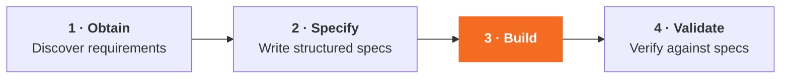
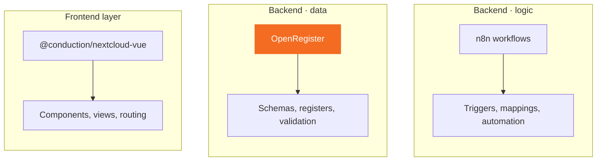
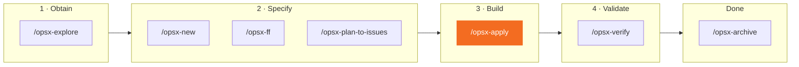

# Spec-Driven Development

At Conduction, we don't start coding before we know what we're building. We use a **spec-driven workflow** where every change is defined as structured artifacts before implementation begins. Specs live alongside code and persist across sessions, ensuring continuity and traceability.

## The Pipeline

All development follows four stages. Each stage feeds the next: discovery becomes specs, specs become software, software is checked against the specs that produced it.



- **1 · Obtain** — requirements come from issues, tenders, app research, and documentation. The output is a shared understanding of what to build.
- **2 · Specify** — the chain of artifacts (`proposal.md` → `specs.md` → `design.md` → `tasks.md`) becomes a set of trackable GitHub Issues.
- **3 · Build** — implement by assembling components, schemas, and workflows. This is the stage where working software lands.
- **4 · Validate** — run tests, check coverage, verify the implementation against the spec that produced it.

## OpenSpec

OpenSpec is our specification format. Every change produces a chain of artifacts:

```
proposal.md ──► specs.md ──► design.md ──► tasks.md ──► GitHub Issues
```

- **Proposal** — what and why (problem statement, scope, stakeholders)
- **Specs** — detailed requirements with GIVEN/WHEN/THEN acceptance criteria
- **Design** — technical approach, component selection, data model
- **Tasks** — breakdown into implementable units
- **Issues** — tasks become trackable GitHub Issues with an epic

Org-wide specs (test coverage baselines, API patterns, NL Design System compliance, i18n requirements) live in the [`openspec/`](https://github.com/ConductionNL/.github/tree/main/openspec) directory of this repository. Individual apps extend these with app-specific specs.

## Claude Code

We use [Claude Code](https://docs.anthropic.com/en/docs/claude-code) as our development orchestrator. Claude acts as an **architect and assembler** — it defines, configures, and validates, but delegates actual implementation to the platform's building blocks:



- **Frontend** — Claude selects and configures `@conduction/nextcloud-vue` components, defines views and routing. It does not hand-write UI components from scratch.
- **Backend data** — OpenRegister is the data spine. Claude defines schemas, registers, object structures, and validation rules. The runtime is the same across every app.
- **Backend logic** — business logic lives in n8n workflows. Claude designs the workflow, configures triggers, maps data; n8n executes it.

A shared configuration repository ([`claude-code-config`](https://github.com/ConductionNL/claude-code-config)) provides all commands, skills, and workflow instructions. It's added as a git submodule at `.claude/` in each app repository.

## Key Commands

Each command belongs to a stage in the pipeline. Run them in order; most changes only need `/opsx-ff` → `/opsx-apply` → `/opsx-verify`.



- **`/opsx-explore`** — investigate a topic or problem before committing to a change.
- **`/opsx-new`** — start a new change with a proposal.
- **`/opsx-ff`** — fast-forward: generate proposal, specs, design, and tasks in one pass.
- **`/opsx-plan-to-issues`** — convert tasks to trackable GitHub Issues with an epic.
- **`/opsx-apply`** — implement the tasks from the specs.
- **`/opsx-verify`** — check the implementation against the spec that produced it.
- **`/opsx-archive`** — close out a completed change.
