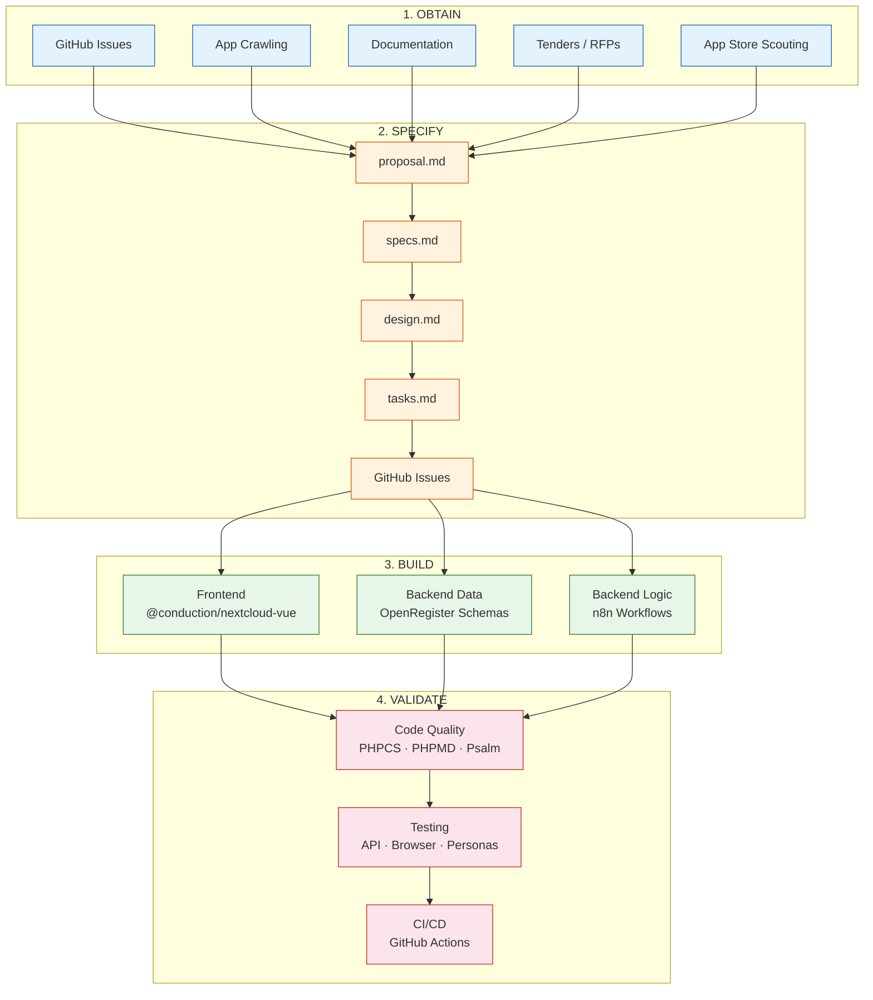
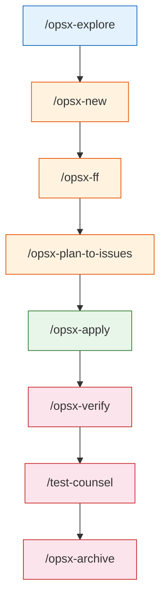

# Claude Code Developer Guide

Documentation for Conduction's spec-driven development workflow, combining OpenSpec, GitHub Issues, and Claude Code.

## Guides

### [Getting Started](./getting-started.md)
Step-by-step guide from installation to your first completed change. Start here if you're new to the workflow.

### [Workflow Overview](./workflow.md)
Architecture overview of the full system: how specs, GitHub Issues, and plan.json fit together. Includes the plan.json format and flow diagrams.

### [Command Reference](./commands.md)
Detailed reference for every skill — OpenSpec built-ins (`/opsx-new`, `/opsx-ff`, etc.) and custom Conduction skills (`/opsx-plan-to-issues`, `/opsx-apply-loop`, `/opsx-pipeline`). Includes expected output and usage tips.

### [OpenSpec Command Reference](./commands-openspec.md)
Focused reference for the per-project OpenSpec commands installed by `openspec init`. Split out from the main command reference for quick lookup.

### [Tender & Ecosystem Commands](./commands-tender.md)
Reference for the competitive analysis and ecosystem gap-finding commands (`/tender-scan`, `/tender-status`, `/tender-gap-report`, `/ecosystem-investigate`) that operate on the `concurrentie-analyse/intelligence.db` SQLite database.

### [Writing Specs](./writing-specs.md)
In-depth guide on writing effective specifications: RFC 2119 keywords, Gherkin scenarios, delta specs, shared spec references, task breakdown, and common mistakes to avoid.

### [Writing Skills](./writing-skills.md)
How to create and structure skills: folder layout (`templates/`, `references/`, `examples/`, `assets/`), SKILL.md format, naming conventions, common patterns, and the extraction threshold rule.

### [Skill Checklist](./skill-checklist.md)
Quick validation checklist to run before adding or reviewing a skill, organized by maturity level (L1–L7).

### [Skill Patterns](./skill-patterns.md)
Proven L3 building blocks for skills — description writing, subfolder layout (`templates/`, `references/`, `examples/`, `assets/`), and reusable patterns to apply consistently.

### [Skill Evaluation](./skill-evals.md)
Detailed L5 reference for evaluating, measuring, and improving skills with data — `evals.json` format, baseline scoring, trigger tests, and the iteration workflow.

### [Writing ADRs](./writing-adrs.md)
How to write Architectural Decision Records: structure, format, when to create one, and how ADRs feed into the OpenSpec workflow.

### [Writing Docs](./writing-docs.md)
Guidelines for writing and maintaining documentation within a project: structure, tone, what to document, and how docs connect to the spec-driven workflow.

### [App Lifecycle](./app-lifecycle.md)
Creating and managing Nextcloud apps: design research (`/app-design`), bootstrapping from template or onboarding an existing repo (`/app-create`), thinking through goals and features (`/app-explore`), applying config to code (`/app-apply`), and auditing for drift (`/app-verify`). Includes `project.md` and `openspec/config.yaml` templates, and an onboarding checklist.

### [Docker Environment](./docker.md)
Available docker-compose profiles, reset instructions, and environment setup.

### [Workstation Setup](./workstation-setup.md)
How to set up a new machine — Windows + WSL2 + Docker Desktop + VS Code installation, required/recommended extensions, Claude Code authentication, and WSL prerequisites (Node.js, PHP, Composer, GitHub CLI, Playwright, OpenSpec CLI).

### [Global Claude settings (`~/.claude`)](./global-claude-settings.md)
**Mandatory** user-level settings enforcing a read-only Bash policy and write-approval hooks. Versioned — Claude warns you at session start when an update is available. Install once per machine; see the doc for the full guide and update instructions.

### [Testing Reference](./testing.md)
All testing commands and skills in one place — when to use each, typical workflows (pre-PR, regression sweep, smoke test), per-command "use when" guidance, test scenario integration, and browser pool rules.

### [Parallel Agents & Subscription Cap](./parallel-agents.md)
How parallel agent commands (like `/test-counsel`, `/test-app`, and `/feature-counsel`) consume your Claude subscription cap, guidelines for responsible use, and which files to keep lean to reduce token usage.

### [Frontend Standards](./frontend-standards.md)
Frontend development standards enforced across all Conduction apps: OpenRegister dependency checking, CSS scoping, admin detection patterns, and reference implementations.

### [Local LLM Setup (Ollama + Qwen)](./local-llm.md)
How to run Claude Code with a local Qwen model via Ollama for privacy, cost reduction, and offline use. Includes the Double Dutch RAD workflow for pairing Claude (day shift) with Qwen (overnight batch jobs).

### [Playwright MCP Browser Setup](./playwright-setup.md)
Detailed setup guide for the 7 independent Playwright browser sessions used for parallel testing, including VS Code extension configuration, CLI alternatives, and usage rules.

### [Usage Tracker](../../usage-tracker/README.md)
Real-time Claude token usage monitoring in VS Code — color-coded status, threshold notifications, and multi-model support (Haiku, Sonnet, Opus). Reads Claude Code session files directly; no log configuration needed. Run `bash usage-tracker/install.sh` to get started.

### [End-to-End Walkthrough](./walkthrough.md)
A complete worked example showing every phase of the flow on a realistic feature (adding a search endpoint to OpenCatalogi). Shows exactly what you type and what happens.

### [Retrofit Playbook](./retrofit.md)
Bringing legacy apps under [ADR-003 §Spec traceability](https://github.com/ConductionNL/hydra/blob/main/openspec/architecture/adr-003-backend.md) — the three retrofit skills (`/opsx-coverage-scan`, `/opsx-annotate`, `/opsx-reverse-spec`) in order, plus the six coverage buckets and when to extend vs create new specs.

---

## Table of Contents

- [Work Pipeline](#work-pipeline)
  - [Stage 1: Obtain](#stage-1-obtain--discovery--requirements-gathering)
  - [Stage 2: Specify](#stage-2-specify--writing-openspec-artifacts)
  - [Stage 3: Build](#stage-3-build--configuration-not-code)
  - [Stage 4: Validate](#stage-4-validate--quality-assurance--verification)
- [Workstation Setup](#workstation-setup) _(new-machine setup → [workstation-setup.md](./workstation-setup.md))_
- [Local Configuration](#local-configuration)
- [Playwright MCP Browser Setup](#playwright-mcp-browser-setup)
- [Directory Structure](#directory-structure)
- [Personas](#personas)
- [Architectural Design Rules (ADRs)](#architectural-design-rules-adrs)
- [Usage Tracker](#usage-tracker)
- [Related: Hydra CI/CD Pipeline](#related-hydra-cicd-pipeline)
- [Scripts](#scripts)
- [Contributing](#contributing)
- [Troubleshooting](#troubleshooting)

---

## Work Pipeline

Claude follows a four-stage pipeline for all development work. Each stage has dedicated commands and tools. Claude operates as an **architect and orchestrator** — it defines, configures, and validates but delegates actual code generation to the platform's building blocks.



**Key commands per stage:**



### Stage 1: Obtain — Discovery & Requirements Gathering

Collect requirements, study existing solutions, and identify what to build. Claude explores without making changes.

| Source | How | Commands / Tools |
|--------|-----|------------------|
| **GitHub issues** | Sync and analyze open issues from project repos | `/swc-update`, `gh issue list`, `gh issue view` |
| **Other applications** | Crawl code or browse running apps to understand patterns | `/opsx-explore`, Playwright browsers (`browser-1`–`browser-7`) |
| **Documentation** | Read docs from other platforms, APIs, standards | `WebFetch`, `WebSearch`, `/opsx-explore` |
| **Tenders** | Scrape TenderNed, classify by category, analyze requirements and ecosystem gaps | `/tender-scan`, `/tender-status`, `/tender-gap-report`, `/ecosystem-investigate`, `Read` (PDF support) |
| **App store scouting** | Spot interesting apps on WordPress plugin directory, GitHub trending, ArtifactHub, Nextcloud app store | `WebSearch`, `WebFetch`, Playwright browsers |

**Typical discovery session:**

```
/opsx-explore                              # Investigate a topic or problem
> "What calendar apps exist on ArtifactHub and WordPress that we could learn from?"
> "Crawl the Nextcloud app store for document management apps"
> "Analyze the GitHub issues for openregister and summarize themes"
```

### Stage 2: Specify — Writing OpenSpec Artifacts

Turn discoveries into structured specifications. This stage produces the blueprint that guides implementation.

| Phase | Artifact | Command |
|-------|----------|---------|
| **Start** | Change directory + `proposal.md` | `/opsx-new <change-name>` |
| **Proposal → Tasks** | All artifacts in one go (proposal, specs, design, tasks) | `/opsx-ff` |
| **Incremental** | One artifact at a time | `/opsx-continue` |
| **Review** | Multi-perspective feature analysis | `/feature-counsel` |
| **Architecture** | Architecture review of specs | `/team-architect` |
| **Business value** | Acceptance criteria and prioritization | `/team-po` |
| **New app** | Full app design from scratch (architecture, features, wireframes) | `/app-design` |
| **Track** | Convert tasks to GitHub Issues with epic | `/opsx-plan-to-issues` |

**Artifact progression:**

```
proposal.md ──► specs/*.md ──► design.md ──► tasks.md ──► plan.json
                                                            │
                                                            ▼
                                                      GitHub Issues
```

**Typical spec session:**

```
/opsx-new add-document-preview            # Start the change
/opsx-ff                                   # Generate all artifacts
/feature-counsel                           # Get 8-persona feedback
# Human reviews and refines specs
/opsx-plan-to-issues                       # Create trackable issues
```

### Stage 3: Build — Configuration, Not Code

Claude acts as an **assembler**, not a coder. It defines schemas, configures workflows, and wires up components using the platform's three pillars:

| Layer | Tool | Claude's Role |
|-------|------|---------------|
| **Frontend UI** | `@conduction/nextcloud-vue` | Select and configure components, define views and layouts, set up routing |
| **Backend data** | OpenRegister | Define schemas, registers, and object structures; configure validation rules and relations |
| **Backend logic** | n8n workflows | Design workflow logic, configure triggers, map data transformations |

Claude does **not** write raw PHP business logic, custom Vue components from scratch, or manual SQL. Instead:
- UI comes from the shared `@conduction/nextcloud-vue` component library
- Data models are OpenRegister schemas (JSON-based configuration)
- Business processes are n8n workflows (visual/JSON configuration)

| Command | Purpose |
|---------|---------|
| `/opsx-apply` | Implement tasks from the change — assembles components per the specs |
| `/opsx-sync` | Sync delta specs to main specs during implementation |

**Typical build session:**

```
/opsx-apply                                # Implement tasks from specs
# Claude configures schemas, wires components, sets up n8n flows
/opsx-sync                                 # Keep specs in sync
```

### Stage 4: Validate — Quality Assurance & Verification

Verify that the implementation matches the specs, passes quality standards, and works for all user types.

#### Code Quality

| Tool | Command | Checks |
|------|---------|--------|
| **PHPCS** | `composer phpcs` | Coding standards (auto-fix: `composer cs:fix`) |
| **PHPMD** | `composer phpmd` | Complexity, naming, unused code |
| **PHPStan** | `composer phpstan` | Static type analysis |
| **Psalm** | `composer psalm` | Type analysis (stricter) |
| **phpmetrics** | `composer phpmetrics` | Code metrics + violations |
| **ESLint** | `npm run lint` | JavaScript/Vue linting (auto-fix: `npm run lint -- --fix`) |
| **Stylelint** | `npm run stylelint` | CSS/SCSS linting |

> If `composer phpcs` fails due to a permissions error on `vendor/`, see [PHP Quality Tools setup](#php-quality-tools-phpcs-phpmd-psalm-phpstan) in Prerequisites.

#### Testing

For the full list of testing commands, browser pool rules, and recommended workflows, see [testing.md](./testing.md) and [commands.md](./commands.md).

Key commands: `/opsx-verify` (spec verification), `/test-counsel` (8-persona test sweep), `/test-app` (automated browser testing), `/test-functional`, `/test-api`, `/test-accessibility`, `/test-performance`, `/test-security`, `/test-regression`, and `/test-persona-*` (per-persona testing).

#### CI/CD

All apps have `code-quality.yml` GitHub Actions workflows that block PRs on:
- PHPCS + PHPMD + Psalm (PHP quality)
- ESLint (frontend quality)
- PHPUnit (unit tests)

#### Completion

| Command | Purpose |
|---------|---------|
| `/opsx-verify` | Final verification against specs — generates `review.md` |
| `/opsx-archive` | Archive the change, merge delta specs into main specs |
| `/opsx-bulk-archive` | Archive multiple completed changes at once |

**Typical validation session:**

```
composer phpcs && composer phpmd           # Code quality gates
/opsx-verify                               # Verify against specs
/test-counsel                              # 8-persona test sweep
/test-api                                  # API compliance check
/opsx-archive                              # Archive when everything passes
```

---

## Workstation Setup

For new-machine setup instructions — Windows + WSL2 + Docker Desktop + VS Code installation, extensions, Claude Code authentication, and WSL prerequisites (Node.js, PHP, Composer, GitHub CLI, Playwright, OpenSpec CLI, etc.) — see **[workstation-setup.md](./workstation-setup.md)**.

---

## Local Configuration

Claude Code uses three settings files that work together. Understanding the difference prevents confusion:

| File | Scope | Committed? | Purpose |
|------|-------|------------|---------|
| `~/.claude/settings.json` | Machine-wide, all projects | No — installed per developer | Global read-only policy and safety hooks. Installed from [`global-settings/`](../../global-settings/) in step 7 above. |
| `.claude/settings.json` | Project-wide, all developers | **Yes** | Shared team permissions — MCP server approvals, `enableAllProjectMcpServers`. Do not edit locally. |
| `.claude/settings.local.json` | Project, per developer | No — gitignored | Your personal tool approvals on top of the shared settings. Auto-generated by Claude Code. |

### settings.local.json

This file is **auto-generated** by Claude Code the first time you approve a tool permission in a session — no manual setup needed. It stores your personal allow/deny rules on top of the shared project settings.

Optionally, bootstrap it upfront with common permissions to avoid approval prompts during normal development:

```json
{
  "$schema": "https://json.schemastore.org/claude-code-settings.json",
  "permissions": {
    "allow": [
      "Bash(docker:*)",
      "Bash(docker-compose:*)",
      "Bash(composer:*)",
      "Bash(git:*)",
      "Bash(npm:*)",
      "Bash(php:*)",
      "Bash(curl:*)",
      "Bash(bash:*)",
      "Bash(ls:*)",
      "Bash(mkdir:*)",
      "Bash(cp:*)",
      "Bash(mv:*)",
      "Bash(rm:*)",
      "WebFetch(domain:localhost)",
      "WebFetch(domain:github.com)",
      "WebFetch(domain:raw.githubusercontent.com)"
    ],
    "additionalDirectories": [
      "/tmp"
    ]
  }
}
```

Save this as `.claude/settings.local.json` in your project root. It is gitignored and will never be committed.

### CLAUDE.local.md

Contains environment-specific credentials and API tokens (passwords, keys, endpoints). **Never commit this file.**

Copy the [example template](./examples/CLAUDE.local.md.example) into your project and fill in your values:

```bash
cp docs/claude/examples/CLAUDE.local.md.example .claude/CLAUDE.local.md
# Edit with your credentials
```

---

## Playwright MCP Browser Setup

The workspace uses 7 independent Playwright browser sessions for parallel testing. Copy the [example .mcp.json](./examples/.mcp.json.example) to your project root as `.mcp.json`, or see the [playwright-setup.md](./playwright-setup.md) guide for the full configuration, verification steps, CLI alternatives, and usage rules.

**Quick summary:**

| Server | Mode | Purpose |
|--------|------|---------|
| `browser-1` | Headless | Main agent (default) |
| `browser-2`–`browser-5`, `browser-7` | Headless | Sub-agent / parallel |
| `browser-6` | **Headed** | User observation (visible window) |

**Usage rules:** Use `browser-1` for normal work. Assign `browser-2`–`browser-5` and `browser-7` to parallel sub-agents. Keep `browser-6` reserved for user observation only.

---

## Directory Structure

### This repository (`.github`)

This repo contains **documentation**, **global settings**, and **project templates** — not skills, personas, or scripts. Those live in each project's own `.claude/` directory (see below).

```
.github/
├── docs/
│   └── claude/                       # Developer guides (this documentation)
│       ├── README.md                     # This file — overview and setup
│       ├── getting-started.md            # First-change walkthrough
│       ├── workflow.md                   # Spec-driven architecture reference
│       ├── commands.md                   # Full command reference
│       ├── commands-openspec.md         # OpenSpec per-project commands
│       ├── commands-tender.md           # Tender & ecosystem intelligence commands
│       ├── testing.md                    # Testing commands and skills
│       ├── writing-specs.md              # How to write specs
│       ├── writing-skills.md             # How to create skills
│       ├── skill-checklist.md           # Pre-add / review checklist by maturity level
│       ├── skill-patterns.md            # Reusable L3 skill patterns and subfolder guide
│       ├── skill-evals.md               # Skill evaluation & measurement (L5 reference)
│       ├── writing-adrs.md              # How to write ADRs
│       ├── writing-docs.md              # Documentation standards
│       ├── app-lifecycle.md             # Nextcloud app lifecycle
│       ├── frontend-standards.md        # Frontend coding standards
│       ├── parallel-agents.md           # Parallel agents and cap usage
│       ├── local-llm.md                 # Ollama + Qwen + Double Dutch
│       ├── playwright-setup.md          # Playwright browser configuration
│       ├── walkthrough.md               # End-to-end worked example
│       ├── docker.md                    # Docker environment
│       ├── workstation-setup.md         # New machine setup (WSL2, VS Code, tools)
│       ├── global-claude-settings.md    # Global settings reference
│       ├── retrofit.md                  # Legacy app retrofit playbook
│       └── examples/                    # Project-level template files
│           ├── CLAUDE.local.md.example      # Template for project .claude/CLAUDE.local.md
│           └── .mcp.json.example            # Template for project root .mcp.json (7 browsers)
│
├── global-settings/                  # Mandatory user-level settings for ~/.claude/
│   ├── settings.json                     # → ~/.claude/settings.json (global read-only policy)
│   ├── block-write-commands.sh           # → ~/.claude/hooks/block-write-commands.sh
│   ├── check-settings-version.sh         # → ~/.claude/hooks/check-settings-version.sh
│   └── VERSION                           # Version tracking for update checks
│
└── usage-tracker/                    # Claude token usage monitoring tool
```

### Typical project workspace

Each Conduction project (Nextcloud apps, WordPress sites, etc.) has its own `.claude/` directory with skills, personas, and configuration. The [Hydra](https://github.com/ConductionNL/hydra) repo also maintains its own set of skills and personas for CI/CD agents.

```
<project-root>/
├── .mcp.json                     # Playwright browser MCP servers (see docs/claude/examples/.mcp.json.example)
│
└── .claude/
    ├── CLAUDE.md                     # Workflow rules, project context
    ├── CLAUDE.local.md               # [GITIGNORED] Your credentials
    ├── CLAUDE.local.md.example       # Template — copy from global-settings/ or customize per project
    ├── settings.json                 # [COMMITTED] Shared team permissions
    ├── settings.local.json           # [GITIGNORED] Personal tool permissions (auto-generated)
    │
    ├── skills/                       # Project-specific skills (see commands.md)
    ├── personas/                     # User personas for testing
    ├── scripts/                      # Shared shell utilities
    └── docs/                         # Project-specific documentation
```

---

## Personas

Each project defines its own user personas in `personas/`. Personas drive multi-perspective analysis via `/feature-counsel` and testing via `/test-counsel`.

The Nextcloud workspace uses 8 Dutch government personas (retired citizens, low-literate migrants, digital natives, CISOs, standards architects, MKB vendors, ZZP developers, small business owners). Other workspaces define personas relevant to their domain — e.g., a webshop workspace would carry shopper, returning-customer, and shop-owner personas instead.

For the full persona table with testing command mapping, see **[testing.md](./testing.md#commands-single-agent)**.

---

## Architectural Design Rules (ADRs)

ADRs define constraints that all OpenSpec artifacts must comply with. Company-wide ADRs live in `hydra/openspec/architecture/`; app-specific ADRs live in `{app}/openspec/architecture/`. They are enforced during artifact creation (via `config.yaml` rules injected into `openspec instructions` output) and during verification (via `/opsx-verify`).

For the full guide on ADR structure, format, the current list of company-wide ADRs, and when to create a new one, see **[writing-adrs.md](./writing-adrs.md)**.

---

## Usage Tracker

Monitor your Claude token usage in real-time to avoid hitting subscription limits mid-session. The tracker reads Claude Code's JSONL session files directly — no extra configuration needed.

```bash
# Install
bash usage-tracker/install.sh

# Quick status (all models)
python3 usage-tracker/claude-usage-tracker.py --status-bar --all-models

# Live monitoring (refreshes every 5 min)
python3 usage-tracker/claude-usage-tracker.py --monitor --all-models
```

See [usage-tracker/README.md](../../usage-tracker/README.md) for full documentation, VS Code task integration, and limit configuration.

---

## Related: Hydra CI/CD Pipeline

[Hydra](https://github.com/ConductionNL/hydra) is Conduction's agentic CI/CD platform that runs the same spec-driven workflow autonomously in Docker containers. It transforms OpenSpec change proposals into validated, security-scanned code on feature branches — with final human approval before merging.

Hydra maintains its own skills, personas, and OpenSpec workflows in its repository, running them through three specialized agent containers:

| Agent | Role | Permissions |
|-------|------|-------------|
| **Al Gorithm** (Builder) | Reads OpenSpec change, implements code, opens draft PR | Full: Read, Write, Edit, Bash |
| **Juan Claude van Damme** (Reviewer) | Code review for correctness, style, architecture | Read-only |
| **Clyde Barcode** (Security) | SAST analysis, secret detection, security hardening | Read-only |

The workflow and commands documented in this guide apply to both interactive development and Hydra's automated agents. See the [Hydra repository](https://github.com/ConductionNL/hydra) for container architecture, agent configuration, deployment models, and operational guides.

---

## Scripts

Each project may include shell scripts in its `.claude/scripts/` or `scripts/` directory, used by skills and developers. Common examples:

| Script | Description | Usage |
|--------|-------------|-------|
| `clean-env.sh` | Full Docker environment reset — stops containers, removes volumes, restarts, installs core apps | `bash scripts/clean-env.sh` or `/clean-env` |

---

## Contributing

### Adding a Skill

Skills are added to each project's `.claude/skills/` directory. See [writing-skills.md](./writing-skills.md) for the full guide on folder layout, SKILL.md format, naming conventions, maturity levels, and the extraction threshold rule.

Quick start:

1. Create `skills/<skill-name>/SKILL.md` in your project's `.claude/` directory
2. Use frontmatter:
   ```yaml
   ---
   name: skill-name
   description: What this skill does
   ---
   ```
3. Document instructions and expected behavior

### Adding a Persona

Personas are added to each project's `personas/` directory.

1. Create `personas/<firstname-lastname>.md`
2. Follow the existing format (see any existing persona file in the project)
3. Update skills that reference the persona list

### PR Process

1. Create a branch: `git checkout -b my-change`
2. Make changes, commit, push
3. Create PR against `main`

---

## Troubleshooting

### `openspec: command not found`

```bash
npm install -g @fission-ai/openspec
```

### Playwright browser not launching

```bash
npx playwright install chromium
# If permission errors:
npx playwright install --with-deps chromium
```

### MCP servers not showing in VS Code / not connected

1. Confirm `.mcp.json` exists in your **project root**
2. Confirm `settings.json` contains `"enableAllProjectMcpServers": true`
3. Reload the window: `Ctrl+Shift+P` → `reload window`
4. Check the output panel for errors: `Ctrl+Shift+P` → **"Output: Focus on Output"** → select **"Claude VSCode"**

You can verify the MCP binary itself starts correctly:

```bash
npx -y @playwright/mcp@latest --headless --isolated --port 9999
# Should print: Listening on http://localhost:9999
```

### Claude Code doesn't see commands

Ensure `.claude/` is at the workspace root and Claude Code is started from that directory.

### `gh: not logged in`

```bash
gh auth login
```

### Docker environment not starting

```bash
docker compose -f openregister/docker-compose.yml up -d
# Full reset:
/clean-env
```

### "You've hit your limit · resets 3pm (Europe/Amsterdam)"

This means you've reached your Claude subscription's usage cap. It can happen after running commands that launch many agents in parallel (`/test-counsel`, `/feature-counsel`, `/test-app` in Full mode).

See [parallel-agents.md](./parallel-agents.md) for an explanation of why parallel agents drain the cap, guidelines for careful use, and tips to reduce token usage (including always opening a fresh window before running these commands).

To monitor your usage proactively before hitting the limit, use the [usage tracker](../../usage-tracker/README.md):
```bash
python3 usage-tracker/claude-usage-tracker.py --status-bar --all-models
```
