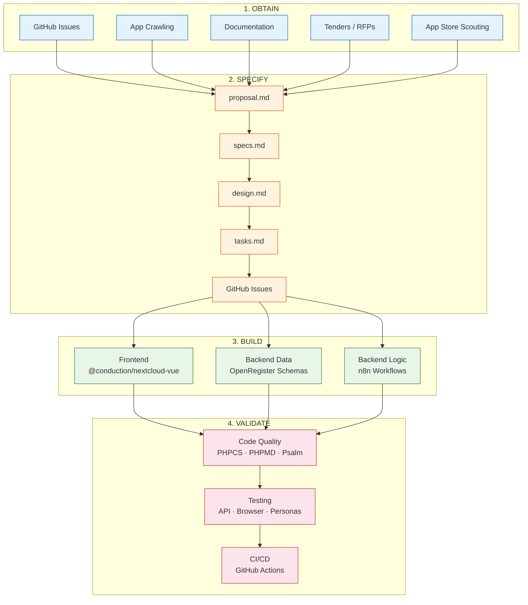
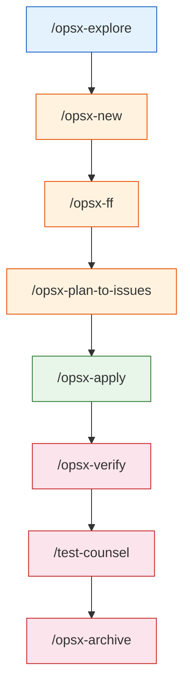

# Spec-Driven Development Documentation

Documentation for Conduction's spec-driven development workflow, combining OpenSpec, GitHub Issues, and Claude Code.

## Guides

### [Getting Started](./getting-started.md)
Step-by-step guide from installation to your first completed change. Start here if you're new to the workflow.

### [Workflow Overview](./workflow.md)
Architecture overview of the full system: how specs, GitHub Issues, plan.json, and Ralph Wiggum loops fit together. Includes the plan.json format and flow diagrams.

### [Command Reference](./commands.md)
Detailed reference for every skill — OpenSpec built-ins (`/opsx-new`, `/opsx-ff`, etc.), custom Conduction skills (`/opsx-plan-to-issues`, `/opsx-apply-loop`, `/opsx-pipeline`), and planned additions (`/opsx-ralph-start`, `/opsx-ralph-review` — not yet implemented). Includes expected output and usage tips.

### [Writing Specs](./writing-specs.md)
In-depth guide on writing effective specifications: RFC 2119 keywords, Gherkin scenarios, delta specs, shared spec references, task breakdown, and common mistakes to avoid.

### [Writing Skills](./writing-skills.md)
How to create and structure skills: folder layout (`templates/`, `references/`, `examples/`, `assets/`), SKILL.md format, naming conventions, common patterns, and the extraction threshold rule.

### [Writing ADRs](./writing-adrs.md)
How to write Architectural Decision Records: structure, format, when to create one, and how ADRs feed into the OpenSpec workflow.

### [Writing Docs](./writing-docs.md)
Guidelines for writing and maintaining documentation within a project: structure, tone, what to document, and how docs connect to the spec-driven workflow.

### [App Lifecycle](./app-lifecycle.md)
Creating and managing Nextcloud apps: design research (`/app-design`), bootstrapping from template or onboarding an existing repo (`/app-create`), thinking through goals and features (`/app-explore`), applying config to code (`/app-apply`), and auditing for drift (`/app-verify`). Includes `project.md` and `openspec/config.yaml` templates, and an onboarding checklist.

### [Docker Environment](./docker.md)
Available docker-compose profiles, reset instructions, and environment setup.

### [Global Claude settings (`~/.claude`)](./global-claude-settings.md)
**Mandatory** user-level settings enforcing a read-only Bash policy and write-approval hooks. Versioned — Claude warns you at session start when an update is available. Install once per machine; see the doc for the full guide and update instructions.

### [Testing Reference](./testing.md)
All testing commands and skills in one place — when to use each, typical workflows (pre-PR, regression sweep, smoke test), per-command "use when" guidance, test scenario integration, and browser pool rules.

### [Parallel Agents & Subscription Cap](./parallel-agents.md)
How parallel agent commands (like `/test-counsel`, `/test-app`, and `/feature-counsel`) consume your Claude subscription cap, guidelines for responsible use, and which files to keep lean to reduce token usage.

### [Usage Tracker](../../usage-tracker/README.md)
Real-time Claude token usage monitoring in VS Code — color-coded status, threshold notifications, and multi-model support (Haiku, Sonnet, Opus). Reads Claude Code session files directly; no log configuration needed. Run `bash usage-tracker/install.sh` to get started.

### [End-to-End Walkthrough](./walkthrough.md)
A complete worked example showing every phase of the flow on a realistic feature (adding a search endpoint to OpenCatalogi). Shows exactly what you type and what happens.

---

## Table of Contents

- [Work Pipeline](#work-pipeline)
  - [Stage 1: Obtain](#stage-1-obtain--discovery--requirements-gathering)
  - [Stage 2: Specify](#stage-2-specify--writing-openspec-artifacts)
  - [Stage 3: Build](#stage-3-build--configuration-not-code)
  - [Stage 4: Validate](#stage-4-validate--quality-assurance--verification)
- [Double Dutch (RAD Workflow)](#double-dutch-rad-workflow)
- [Workstation Setup (Windows)](#workstation-setup-windows)
- [Prerequisites (WSL)](#prerequisites-wsl)
  - [Node.js](#nodejs-via-nvm)
  - [PHP & Composer](#php-81--composer)
  - [GitHub CLI](#github-cli)
  - [PHP Quality Tools](#php-quality-tools-phpcs-phpmd-psalm-phpstan)
  - [Playwright Browsers](#playwright-browsers)
  - [OpenSpec CLI](#openspec-cli)
  - [Claude Code CLI](#claude-code-cli-optional-for-terminal-use)
  - [Ollama + Qwen (local LLM)](#ollama--qwen-coder-optional-local-llm)
- [Local Configuration](#local-configuration)
- [Playwright MCP Browser Setup](#playwright-mcp-browser-setup)
- [Directory Structure](#directory-structure)
- [Commands Reference](#commands-reference)
- [Skills Reference](#skills-reference)
- [Personas](#personas)
- [Scripts](#scripts)
- [Usage Tracker](#usage-tracker)
- [Architectural Design Rules (ADRs)](#architectural-design-rules-adrs)
- [Contributing](#contributing)
- [Troubleshooting](#troubleshooting)

---

## Work Pipeline

Claude follows a four-stage pipeline for all development work. Each stage has dedicated commands and tools. Claude operates as an **architect and orchestrator** — it defines, configures, and validates but delegates actual code generation to the platform's building blocks.



**Key commands per stage:**



### Stage 1: Obtain — Discovery & Requirements Gathering

Collect requirements, study existing solutions, and identify what to build. Claude explores without making changes.

| Source | How | Commands / Tools |
|--------|-----|------------------|
| **GitHub issues** | Sync and analyze open issues from project repos | `/swc-update`, `gh issue list`, `gh issue view` |
| **Other applications** | Crawl code or browse running apps to understand patterns | `/opsx-explore`, Playwright browsers (`browser-1`–`browser-7`) |
| **Documentation** | Read docs from other platforms, APIs, standards | `WebFetch`, `WebSearch`, `/opsx-explore` |
| **Tenders** | Scrape TenderNed, classify by category, analyze requirements and ecosystem gaps | `/tender-scan`, `/tender-status`, `/tender-gap-report`, `/ecosystem-investigate`, `Read` (PDF support) |
| **App store scouting** | Spot interesting apps on WordPress plugin directory, GitHub trending, ArtifactHub, Nextcloud app store | `WebSearch`, `WebFetch`, Playwright browsers |

**Typical discovery session:**

```
/opsx-explore                              # Investigate a topic or problem
> "What calendar apps exist on ArtifactHub and WordPress that we could learn from?"
> "Crawl the Nextcloud app store for document management apps"
> "Analyze the GitHub issues for openregister and summarize themes"
```

### Stage 2: Specify — Writing OpenSpec Artifacts

Turn discoveries into structured specifications. This stage produces the blueprint that guides implementation.

| Phase | Artifact | Command |
|-------|----------|---------|
| **Start** | Change directory + `proposal.md` | `/opsx-new <change-name>` |
| **Proposal → Tasks** | All artifacts in one go (proposal, specs, design, tasks) | `/opsx-ff` |
| **Incremental** | One artifact at a time | `/opsx-continue` |
| **Review** | Multi-perspective feature analysis | `/feature-counsel` |
| **Architecture** | Architecture review of specs | `/team-architect` |
| **Business value** | Acceptance criteria and prioritization | `/team-po` |
| **New app** | Full app design from scratch (architecture, features, wireframes) | `/app-design` |
| **Track** | Convert tasks to GitHub Issues with epic | `/opsx-plan-to-issues` |

**Artifact progression:**

```
proposal.md ──► specs.md ──► design.md ──► tasks.md ──► plan.json
                                                          │
                                                          ▼
                                                    GitHub Issues
```

**Typical spec session:**

```
/opsx-new add-document-preview            # Start the change
/opsx-ff                                   # Generate all artifacts
/feature-counsel                           # Get 8-persona feedback
# Human reviews and refines specs
/opsx-plan-to-issues                       # Create trackable issues
```

### Stage 3: Build — Configuration, Not Code

Claude acts as an **assembler**, not a coder. It defines schemas, configures workflows, and wires up components using the platform's three pillars:

| Layer | Tool | Claude's Role |
|-------|------|---------------|
| **Frontend UI** | `@conduction/nextcloud-vue` | Select and configure components, define views and layouts, set up routing |
| **Backend data** | OpenRegister | Define schemas, registers, and object structures; configure validation rules and relations |
| **Backend logic** | n8n workflows | Design workflow logic, configure triggers, map data transformations |

Claude does **not** write raw PHP business logic, custom Vue components from scratch, or manual SQL. Instead:
- UI comes from the shared `@conduction/nextcloud-vue` component library
- Data models are OpenRegister schemas (JSON-based configuration)
- Business processes are n8n workflows (visual/JSON configuration)

| Command | Purpose |
|---------|---------|
| `/opsx-apply` | Implement tasks from the change — assembles components per the specs |
| `/opsx-sync` | Sync delta specs to main specs during implementation |

**Typical build session:**

```
/opsx-apply                                # Implement tasks from specs
# Claude configures schemas, wires components, sets up n8n flows
/opsx-sync                                 # Keep specs in sync
```

### Stage 4: Validate — Quality Assurance & Verification

Verify that the implementation matches the specs, passes quality standards, and works for all user types.

#### Code Quality

| Tool | Command | Checks |
|------|---------|--------|
| **PHPCS** | `composer phpcs` | Coding standards (auto-fix: `composer cs:fix`) |
| **PHPMD** | `composer phpmd` | Complexity, naming, unused code |
| **PHPStan** | `composer phpstan` | Static type analysis |
| **Psalm** | `composer psalm` | Type analysis (stricter) |
| **phpmetrics** | `composer phpmetrics` | Code metrics + violations |
| **ESLint** | `npm run lint` | JavaScript/Vue linting (auto-fix: `npm run lint -- --fix`) |
| **Stylelint** | `npm run stylelint` | CSS/SCSS linting |

> If `composer phpcs` fails due to a permissions error on `vendor/`, see [PHP Quality Tools setup](#php-quality-tools-phpcs-phpmd-psalm-phpstan) in Prerequisites.

#### Testing

| Type | Command | What it tests |
|------|---------|---------------|
| **Spec verification** | `/opsx-verify` | Implementation matches spec requirements (CRITICAL / WARNING / SUGGESTION) |
| **Functional** | `/test-functional` | Feature correctness via browser |
| **API** | `/test-api` | REST API + NLGov Design Rules compliance |
| **Accessibility** | `/test-accessibility` | WCAG 2.1 AA compliance |
| **Performance** | `/test-performance` | Load times, API response, network |
| **Security** | `/test-security` | OWASP Top 10, BIO2, multi-tenancy |
| **Regression** | `/test-regression` | Cross-app regression |
| **Persona testing** | `/test-persona-*` | 8 user-perspective tests (Henk, Fatima, Sem, etc.) |
| **Multi-perspective** | `/test-counsel` | All 8 personas test simultaneously |
| **Browser testing** | `/test-app <appname>` | Automated browser testing (single or 6 parallel agents) |

#### CI/CD

All apps have `code-quality.yml` GitHub Actions workflows that block PRs on:
- PHPCS + PHPMD + Psalm (PHP quality)
- ESLint (frontend quality)
- PHPUnit (unit tests)

#### Completion

| Command | Purpose |
|---------|---------|
| `/opsx-verify` | Final verification against specs — generates `review.md` |
| `/opsx-archive` | Archive the change, merge delta specs into main specs |
| `/opsx-bulk-archive` | Archive multiple completed changes at once |

**Typical validation session:**

```
composer phpcs && composer phpmd           # Code quality gates
/opsx-verify                               # Verify against specs
/test-counsel                              # 8-persona test sweep
/test-api                                  # API compliance check
/opsx-archive                              # Archive when everything passes
```

---

## Double Dutch (RAD Workflow)

A two-shift Rapid Application Development cycle that pairs Claude (daytime, fast, cloud) with Qwen (overnight, slow, local/free).

```
         09:00                    17:00                   09:00
           |                        |                       |
  ┌────────┴────────────────────────┴───────────────────────┴──
  │  REVIEW    ◄── DAY SHIFT (Claude) ──►    HANDOFF    NIGHT SHIFT (Qwen)
  │  Qwen's        Specs, architecture,      Prepare     PHPCS fixes,
  │  output         complex logic,           task files   boilerplate,
  │                 code review, PRs                      bulk refactors,
  │                                                       test generation
  └────────────────────────────────────────────────────────────
```

### Daily Cycle

**Morning (09:00)** — Review Qwen's overnight output: code changes, test results, PHPCS fixes. Accept or reject changes, note issues for the day's work.

**Day (09:00-17:00)** — Spec work with Claude: clarify requirements, write OpenSpec artifacts (`/opsx-ff`, `/opsx-new` → `/opsx-continue`), design architecture, solve hard problems, review PRs. Claude handles the thinking.

**Evening (17:00)** — Hand off to Qwen: prepare self-contained task files (e.g., `qwen-phpcs-task.md`) with specific, mechanical work. Start Qwen batch and leave overnight.

### Division of Labor

| | Claude (Day) | Qwen (Night) |
|---|---|---|
| **Strengths** | Reasoning, architecture, specs, multi-file design | Mechanical fixes, repetitive changes, bulk ops |
| **Speed** | ~3s/response (cloud API) | ~2min/response (local 14b on 8GB VRAM) |
| **Cost** | API tokens (Max plan) | Free (local GPU) |
| **Best for** | Complex logic, code review, client deliverables | PHPCS fixes, boilerplate, test scaffolding |

### Task File Format

Qwen works best with narrow, explicit task files. Example:

```markdown
# Task: Fix PHPCS Named Parameter Errors

Working directory: `/path/to/app`

## Files to fix
1. `lib/Controller/FooController.php` (3 errors)
2. `lib/Service/BarService.php` (1 error)

## How to fix
Find function calls without named parameters. Look up the method signature
and add the parameter name:
- BEFORE: `$this->setName('value')` where signature is `setName(string $name)`
- AFTER: `$this->setName(name: 'value')`

## Verification
Run: `./vendor/bin/phpcs --standard=phpcs.xml <files>`
Expected: 0 errors
```

### Running Qwen Overnight

```bash
# Terminal 1 — start Qwen with Claude Code CLI
ANTHROPIC_BASE_URL=http://localhost:11434 ANTHROPIC_API_KEY=ollama \
  claude --model qwen3:14b

# Then paste or reference the task file
```

> **Requires `qwen3:14b` or larger** for tool calling (file editing, shell commands). See [Ollama setup](#ollama--qwen-coder-optional-local-llm) for details.

> **Known limitation:** Tool calling via CLI is unreliable with local models when system prompts are large. For now, Qwen works best on tasks where it can output code changes as text that you review and apply manually in the morning.

---

## Workstation Setup (Windows)

Our development environment runs on **Windows + WSL2 + Docker Desktop + VS Code**. Follow these steps on a fresh Windows machine.

### 1. Install WSL2

Open PowerShell as Administrator:

```powershell
wsl --install -d Ubuntu-24.04
```

Restart your machine when prompted. After reboot, Ubuntu will ask you to create a Linux username and password.

### 2. Install Docker Desktop

Download and install [Docker Desktop for Windows](https://www.docker.com/products/docker-desktop/).

After installation:
1. Open Docker Desktop > **Settings** > **Resources** > **WSL Integration**
2. Enable integration with your Ubuntu distro
3. Click **Apply & Restart**

Verify in WSL:
```bash
docker --version
docker compose version
```

### 3. Install VS Code

Download and install [Visual Studio Code](https://code.visualstudio.com/).

### 4. Install VS Code Extensions

Open VS Code and install these extensions (`Ctrl+Shift+X`):

**Required:**

| Extension        | ID                           | Purpose                                              |
| ---------------- | ---------------------------- | ---------------------------------------------------- |
| Claude Code      | anthropic.claude-code        | AI coding assistant — core to this setup             |
| WSL              | ms-vscode-remote.remote-wsl  | Connect VS Code to WSL (Windows side)                |
| Docker           | ms-azuretools.vscode-docker  | Dockerfile syntax, container management              |
| PHP Intelephense | bmewburn.vscode-intelephense | PHP autocompletion, type checking, go-to-definition  |
| Volar            | vue.volar                    | Vue 2/3 language support (templates, script, style)  |
| ESLint           | dbaeumer.vscode-eslint       | JavaScript/Vue linting                               |
| Python           | ms-python.python             | Python language support (for ExApp sidecar wrappers) |

**Recommended:**

| Extension           | ID                           | Purpose                                                        |
| ------------------- | ---------------------------- | -------------------------------------------------------------- |
| PowerShell          | ms-vscode.powershell         | PowerShell 7 scripting (`.ps1` files)                          |
| GitLens             | eamodio.gitlens              | Advanced Git history, blame, line annotations                  |
| GitHub Copilot Chat | github.copilot-chat          | AI pair programmer (requires Copilot license)                  |
| YAML                | redhat.vscode-yaml           | Syntax & validation for `docker-compose.yml` and OpenSpec YAML |
| GitHub Actions      | github.vscode-github-actions | View and validate CI/CD workflows                              |
| Makefile Tools      | ms-vscode.makefile-tools     | Makefile support (`make check-strict`)                         |
| Pylance             | ms-python.vscode-pylance     | Enhanced Python type checking and IntelliSense                 |

**Optional:**

| Extension     | ID                      | Purpose                                                                 |
| ------------- | ----------------------- | ----------------------------------------------------------------------- |
| Git Assistant | ivanhofer.git-assistant | Commit message suggestions + uncommitted changes warnings on branch switch |
| Rainbow CSV   | mechatroner.rainbow-csv | Color-coded CSV/TSV highlighting                                        |
| Live Preview  | ms-vscode.live-server   | Preview HTML files directly inside VS Code (right-click → Show Preview) |

Or install all required + recommended at once from the CLI (run inside WSL terminal):

```bash
code --install-extension anthropic.claude-code
code --install-extension ms-azuretools.vscode-docker
code --install-extension bmewburn.vscode-intelephense
code --install-extension vue.volar
code --install-extension dbaeumer.vscode-eslint
code --install-extension ms-python.python
code --install-extension ms-vscode.powershell
code --install-extension eamodio.gitlens
code --install-extension github.copilot-chat
code --install-extension redhat.vscode-yaml
code --install-extension github.vscode-github-actions
code --install-extension ms-vscode.makefile-tools
code --install-extension ms-python.vscode-pylance
```

> **Note:** `ms-vscode-remote.remote-wsl` must be installed on the **Windows side** of VS Code, not inside WSL. Install it from VS Code on Windows before connecting to WSL.

### 4a. Extension Setup After Installing

Most extensions work immediately after install, but a few need a small configuration step.

#### PHP Intelephense

Intelephense indexes your PHP files automatically on first open. No configuration needed for basic usage. A few tips:

- The free tier covers autocompletion, go-to-definition, and diagnostics — enough for Nextcloud app development.
- If VS Code shows duplicate PHP suggestions, disable the built-in PHP extension: `Ctrl+Shift+P` → **"Extensions: Disable (Workspace)"** → search **PHP** → disable `vscode.php-language-features`.
- Premium license (one-time purchase) adds rename, code folding, and type inference across files — optional.

#### GitLens vs. GitKraken

**GitLens** (VS Code extension) gives you inline blame, commit history, and file/line comparisons directly in the editor — no separate app needed.

**GitKraken** is a standalone GUI Git client with a visual branch graph, interactive rebase, and team features. It runs alongside GitLens (they don't conflict). Install it **inside WSL** so it runs natively against your Linux repos — this avoids path translation issues that occur when a Windows-installed GitKraken tries to open `\\wsl$\` paths:

```bash
wget https://release.gitkraken.com/linux/gitkraken-amd64.deb
sudo dpkg -i gitkraken-amd64.deb && rm gitkraken-amd64.deb
# Fix any missing dependencies:
sudo apt-get install -f
# Launch:
gitkraken &
```

> Requires **WSLg** (Windows 11 with WSL 2.0+) for the GUI window to appear. Run `wsl --version` in PowerShell to confirm — look for `WSLg version`.

### 5. Connect VS Code to WSL

1. Open VS Code
2. Press `Ctrl+Shift+P` > **"WSL: Connect to WSL"**
3. Choose your Ubuntu distro
4. VS Code will install its server component in WSL automatically

From here, all VS Code terminal work happens inside WSL.

### 6. Claude Code Authentication

After installing the Claude Code extension, authenticate:

1. Open the Claude Code panel in VS Code (sidebar icon)
2. Sign in with your Anthropic account
3. Or from the terminal: `claude auth login`

### 7. Configure Global Claude Settings

Before using Claude in this workspace, set up user-level permissions and a safety hook that restricts which shell commands Claude can run automatically.

See **[global-claude-settings.md](./global-claude-settings.md)** for the full guide, including copy-ready example files and a new-machine checklist.

Quick install:

```bash
mkdir -p ~/.claude/hooks
cp global-settings/settings.json ~/.claude/settings.json
cp global-settings/block-write-commands.sh ~/.claude/hooks/block-write-commands.sh
chmod +x ~/.claude/hooks/block-write-commands.sh
```

---

## Local Configuration

Claude Code uses three settings files that work together. Understanding the difference prevents confusion:

| File | Scope | Committed? | Purpose |
|------|-------|------------|---------|
| `~/.claude/settings.json` | Machine-wide, all projects | No — installed per developer | Global read-only policy and safety hooks. Installed from [`global-settings/`](../../global-settings/) in step 7 above. |
| `.claude/settings.json` | Project-wide, all developers | **Yes** | Shared team permissions — MCP server approvals, `enableAllProjectMcpServers`. Do not edit locally. |
| `.claude/settings.local.json` | Project, per developer | No — gitignored | Your personal tool approvals on top of the shared settings. Auto-generated by Claude Code. |

### settings.local.json

This file is **auto-generated** by Claude Code the first time you approve a tool permission in a session — no manual setup needed. It stores your personal allow/deny rules on top of the shared project settings.

Optionally, bootstrap it upfront with common permissions to avoid approval prompts during normal development:

```json
{
  "$schema": "https://json.schemastore.org/claude-code-settings.json",
  "permissions": {
    "allow": [
      "Bash(docker:*)",
      "Bash(docker-compose:*)",
      "Bash(composer:*)",
      "Bash(git:*)",
      "Bash(npm:*)",
      "Bash(php:*)",
      "Bash(curl:*)",
      "Bash(bash:*)",
      "Bash(ls:*)",
      "Bash(mkdir:*)",
      "Bash(cp:*)",
      "Bash(mv:*)",
      "Bash(rm:*)",
      "WebFetch(domain:localhost)",
      "WebFetch(domain:github.com)",
      "WebFetch(domain:raw.githubusercontent.com)"
    ],
    "additionalDirectories": [
      "/tmp"
    ]
  }
}
```

Save this as `.claude/settings.local.json` in your project root. It is gitignored and will never be committed.

---

## Prerequisites (WSL)

Run these commands inside WSL (the VS Code terminal after connecting to WSL).

### Node.js (via nvm)

```bash
curl -o- https://raw.githubusercontent.com/nvm-sh/nvm/v0.40.1/install.sh | bash
source ~/.bashrc
nvm install 20
```

### PHP 8.1+ & Composer

```bash
sudo apt update
sudo apt install -y php8.1-cli php8.1-xml php8.1-mbstring php8.1-curl php8.1-zip unzip
curl -sS https://getcomposer.org/installer | php
sudo mv composer.phar /usr/local/bin/composer
```

### GitHub CLI

```bash
sudo apt install -y gh
gh auth login
```

### PHP Quality Tools (phpcs, phpmd, psalm, phpstan)

Run `composer install` once after cloning an app to install PHP dev dependencies locally:

```bash
composer install
```

For commands, see [Code Quality](#code-quality) in the Stage 4 section above.

If `composer install` fails because `vendor/` is owned by root (common when Docker first creates it):

```bash
# Option 1 — fix vendor ownership (requires sudo password)
sudo chown -R $USER:$USER vendor/
composer install

# Option 2 — install phpcs globally (no sudo needed)
composer global require "squizlabs/php_codesniffer:^3.9"
~/.config/composer/vendor/bin/phpcs --standard=phpcs.xml
```

> **Important:** Use phpcs v3 (`^3.9`) — the CI uses v3. phpcs v4 is incompatible with the project's `phpcs.xml` config.

### Playwright Browsers

The Playwright MCP servers use the Playwright-managed Chromium binary. Install it once:

```bash
npx playwright install chromium
```

> If the MCP server reports a different revision is needed (e.g. after a `@playwright/mcp` update), run the install from the npx cache that the MCP server uses. You can find it at `~/.npm/_npx/` — look for the directory containing `@playwright/mcp`.

### OpenSpec CLI

Used by all `/opsx-*` commands for spec-driven development:

```bash
npm install -g @fission-ai/openspec
```

> **Do NOT run `openspec init`** in an existing Conduction project — it already has a customized `openspec/` directory with Conduction-specific schemas, shared specs, and project changes. Running `init` would overwrite them.

**OpenSpec documentation:**
- [Official site](https://openspec.dev/) — Getting started, concepts, customization
- [GitHub](https://github.com/Fission-AI/OpenSpec) — Source, issues, releases
- [npm](https://www.npmjs.com/package/@fission-ai/openspec) — Package info
- [Workflow docs](./workflow.md) — Our workspace-specific workflow

**Local docs:**

| File | Content |
|------|---------|
| [getting-started.md](./getting-started.md) | First-time setup and orientation |
| [global-claude-settings.md](./global-claude-settings.md) | User-level Claude permissions, hooks, and safety settings |
| [workflow.md](./workflow.md) | Full spec-driven development workflow |
| [writing-specs.md](./writing-specs.md) | How to write good specs |
| [commands.md](./commands.md) | CLI command reference |
| [walkthrough.md](./walkthrough.md) | Step-by-step example of a full cycle |
| [testing.md](./testing.md) | All testing commands and skills — when to use each, recommended workflows |
| [app-lifecycle.md](./app-lifecycle.md) | Creating and managing Nextcloud apps — design, bootstrap, onboarding, config, and drift detection |
| [parallel-agents.md](./parallel-agents.md) | How parallel agents work, subscription cap implications, responsible use |
| [frontend-standards.md](./frontend-standards.md) | Frontend standards enforced across all Conduction apps |
| [docker.md](./docker.md) | Docker environment setup, profiles, and common operations |
| [exapp-sidecar-status.md](./exapp-sidecar-status.md) | Status report for ExApp sidecar wrapper projects |

### Claude Code CLI (optional, for terminal use)

```bash
npm install -g @anthropic-ai/claude-code
```

### Ollama + Qwen Coder (optional, local LLM)

Claude Code can run with a **local LLM** instead of the Anthropic API, using [Ollama](https://ollama.com/) and Alibaba's [Qwen3-Coder](https://ollama.com/library/qwen3-coder) model. Ollama v0.14.0+ includes built-in Anthropic Messages API compatibility, so Claude Code connects to it without any proxy or adapter.

#### When to use local vs Claude API

| Use case | Recommendation |
|----------|---------------|
| **Data sovereignty** — code or data must stay in the EU / on-premise | Local Qwen |
| **Security-sensitive work** — credentials, private APIs, client data | Local Qwen |
| **Offline / air-gapped environments** | Local Qwen |
| **Simple tasks** — formatting, renaming, small refactors, boilerplate | Local Qwen |
| **Cost reduction** — high-volume, repetitive prompts | Local Qwen |
| **Complex reasoning** — architecture, debugging, multi-file changes | Claude API |
| **Large context** — analyzing entire codebases or long specs | Claude API |
| **Quality-critical** — production code, specs, client deliverables | Claude API |

> **Rule of thumb:** Use Qwen locally for work that is private, simple, or high-volume. Use Claude API when quality and reasoning depth matter most. You can switch between them freely — they use the same Claude Code interface, tools, and commands.

#### Step 1: Install Ollama

Install Ollama **natively on WSL** (not in Docker — native gives better GPU passthrough and performance):

```bash
curl -fsSL https://ollama.com/install.sh | sh
```

Ollama runs as a background service automatically. Verify it's running:

```bash
ollama --version    # Should show 0.14.0+
```

#### Step 2: Pull a Qwen model

Choose the right model for your GPU VRAM:

| Model | Download | Size | Min VRAM | Speed (RTX 3070) | Tool calling? |
|-------|----------|------|----------|-------------------|---------------|
| `qwen3:8b` | `ollama pull qwen3:8b` | 5.2 GB | 8 GB (fits 100%) | ~12s | **No** (chat only) |
| **`qwen3:14b`** | `ollama pull qwen3:14b` | **9.3 GB** | 12 GB | **~2min** (spills to CPU on 8GB) | **Yes** |
| `qwen3-coder` | `ollama pull qwen3-coder` | 18 GB | 24 GB | ~6min (mostly CPU on 8GB) | Yes |

**Recommended: `qwen3:14b`** — the smallest model that supports **tool calling** (reading files, editing code, running commands). On 8GB VRAM it's slow (~2min/response) but works as a batch/overnight agent. On 12GB+ VRAM it runs at interactive speed (~15s).

```bash
ollama pull qwen3:14b
```

> **Why not `qwen3:8b`?** It's faster but can only chat — it cannot use tools (file access, shell commands, code editing). The model is too small to reliably produce the structured function-call format that CLI agents require. It will show its thinking but won't execute anything.
>
> **Why not `qwen3-coder`?** It's the most capable (30B params) but requires 24GB+ VRAM. On an 8GB GPU it runs ~68% on CPU and takes ~6 minutes per response. Only use it with a workstation GPU (RTX 4090, A6000, etc).

Check your available memory:

```bash
free -h           # Look at the "available" column
nvidia-smi        # Check GPU VRAM
```

If you don't have enough system memory, increase the WSL allocation. On **Windows**, edit (or create) `%USERPROFILE%\.wslconfig`:

```ini
[wsl2]
memory=24GB
```

Then restart WSL from PowerShell:

```powershell
wsl --shutdown
```

Reopen your Ubuntu terminal — the new memory limit is now active.

#### Step 3: Run Claude Code with Qwen

Open a **new terminal** and run (replace model name with whichever you pulled):

```bash
ANTHROPIC_BASE_URL=http://localhost:11434 ANTHROPIC_API_KEY=ollama claude --model qwen3:14b
```

This opens the full interactive Claude Code CLI — same interface, same tools, same commands — but powered by Qwen running locally on your machine. No data leaves your workstation.

For a quick **one-shot prompt** (no interactive session):

```bash
ANTHROPIC_BASE_URL=http://localhost:11434 ANTHROPIC_API_KEY=ollama claude --model qwen3:14b --print "explain this function"
```

#### Running local and API side by side

The env vars are **scoped to that single terminal window only**. This means you can run both simultaneously:

- **Terminal 1** — Qwen locally (free, private, slower) doing a long-running task like a bulk refactor or code review
- **Terminal 2 / VS Code** — Claude API (fast, powerful) for your main interactive development work

This is the recommended workflow: **sidecar the free local model** for background tasks while you continue your normal work with Claude API at full speed. The local session won't affect your API session in any way — they're completely independent.

```
┌─────────────────────────┐  ┌─────────────────────────┐
│  Terminal 1 (Qwen)      │  │  VS Code / Terminal 2   │
│                         │  │                         │
│  Free, local, private   │  │  Claude API (Opus)      │
│  Running: bulk refactor │  │  Fast interactive dev   │
│  Speed: ~15 tok/s       │  │  Speed: ~50-80 tok/s    │
│  Cost: $0               │  │  Cost: normal API usage │
│                         │  │                         │
│  ► Background task      │  │  ► Your main work       │
└─────────────────────────┘  └─────────────────────────┘
```

To go back to Claude API in any terminal, simply open a new terminal as normal — no env vars to unset.

#### Performance expectations

Benchmarked on an RTX 3070 (8GB VRAM) with 24GB WSL memory:

| Model | Simple task | Tool calling | Fits in 8GB VRAM | Usable interactively? |
|-------|-------------|-------------|------------------|----------------------|
| qwen3:8b | ~12 seconds | No | Yes (100% GPU) | Chat only |
| **qwen3:14b** | **~2 minutes** | **Yes** | No (spills to CPU) | **Batch/overnight** |
| qwen3-coder (30B) | ~6 minutes | Yes | No (68% CPU) | No |
| Claude API (Opus) | ~3 seconds | Yes | N/A (cloud) | Yes |

**Be honest about the trade-off:** The recommended local model (`qwen3:14b`) is **~40x slower** than Claude API on 8GB VRAM hardware. It's not viable for interactive coding — but it **does support tool calling**, which makes it a real coding agent that can read files, edit code, and run commands. Use it for batch jobs you kick off and walk away from (e.g., overnight PHPCS fixes, bulk refactors, code reviews).

**Where local shines:**
- **Nightly / batch jobs** — automated code reviews, linting suggestions, documentation generation, bulk refactors where you kick it off and walk away
- **Cost** — completely free, no API usage, no token limits, run it as much as you want
- **Privacy** — nothing leaves your machine, ideal for client code under NDA or government data
- **Simple interactive tasks** — quick renames, formatting, boilerplate generation where the speed difference barely matters

#### Alternative: Qwen Code CLI (native Qwen experience)

Qwen has its own dedicated CLI tool (v0.11+) with an interface similar to Claude Code, optimized for Qwen models:

```bash
sudo npm install -g @qwen-code/qwen-code@latest
```

**Configure it to use your local Ollama** by editing `~/.qwen/settings.json`:

```json
{
  "modelProviders": {
    "openai": [
      {
        "id": "qwen3:14b",
        "name": "Qwen3 14B (Local Ollama)",
        "envKey": "OLLAMA_API_KEY",
        "baseUrl": "http://localhost:11434/v1"
      }
    ]
  },
  "security": {
    "auth": {
      "selectedType": "openai"
    }
  },
  "env": {
    "OLLAMA_API_KEY": "ollama"
  },
  "model": {
    "name": "qwen3:14b"
  }
}
```

> Adjust the model `id` and `name` if you pulled a different model (e.g., `qwen3:8b` for chat-only, or `qwen3-coder` on 24GB+ VRAM).

The key parts: `security.auth.selectedType: "openai"` bypasses the OAuth prompt, `modelProviders.openai` tells Qwen Code where your local Ollama lives, and `env.OLLAMA_API_KEY` provides the dummy API key that Ollama ignores but Qwen Code requires.

**Launch it:**

```bash
cd /path/to/your-project
qwen
```

**Tool calling requires `qwen3:14b` or larger.** The `qwen3:8b` model runs in chat-only mode — it can reason and answer questions but cannot use tools (no file access, no shell commands, no code editing). The `qwen3:14b` model supports structured tool calling and works as a full coding agent, though it's slow on 8GB VRAM (~2min/response). On 12GB+ VRAM it runs at interactive speed.

**Sharing context with Claude Code:** Qwen Code reads `QWEN.md` instead of `CLAUDE.md`, but supports `@path/to/file.md` imports. You can create a `QWEN.md` in the workspace root that imports the Claude configuration:

```markdown
@CLAUDE.md
```

This gives Qwen Code the same project context and coding standards as Claude Code. However, Qwen Code does **not** support Claude's `/opsx-*` slash commands or skills — those are Claude Code-specific. For the full OpenSpec workflow, use Claude Code (with either API or local Qwen backend).

#### Tips

- **Don't close the terminal** where Ollama is running — if Ollama stops, your Claude Code session loses its backend
- **One model at a time** — Ollama loads/unloads models automatically, but running two large models simultaneously will OOM
- **VS Code extension** still uses Claude API — the env var trick only works for the CLI. This is fine: use VS Code for complex work (Claude API) and terminal for quick local tasks (Qwen)
- **All Claude Code features work** — tools, file editing, git, commands, skills, browser MCP — because the interface is the same, only the model backend changes

### Summary Checklist

```bash
# Verify everything is installed
node --version        # v20.x+
php --version         # 8.1+
composer --version    # 2.x
docker --version      # 24+
gh --version          # 2.x+
openspec --version    # 1.x
npx playwright --version  # 1.x
```

---

## Playwright MCP Browser Setup

The workspace uses **7 independent Playwright browser sessions** for parallel testing.

### Browser Pool

| Server | Mode | Purpose |
|--------|------|---------|
| `browser-1` | Headless | Main agent (default) |
| `browser-2` | Headless | Sub-agent / parallel |
| `browser-3` | Headless | Sub-agent / parallel |
| `browser-4` | Headless | Sub-agent / parallel |
| `browser-5` | Headless | Sub-agent / parallel |
| `browser-6` | **Headed** | User observation (visible window) |
| `browser-7` | Headless | Sub-agent / parallel |

### VS Code Extension Setup

The VS Code extension loads MCP servers from `.mcp.json` in the **project root**. The file defines 7 browser instances. Browsers 1–5 and 7 are headless:

```json
{
  "mcpServers": {
    "browser-1": { "command": "npx", "args": ["-y", "@playwright/mcp@latest", "--browser", "chromium", "--headless", "--isolated"] },
    "browser-2": { "command": "npx", "args": ["-y", "@playwright/mcp@latest", "--browser", "chromium", "--headless", "--isolated"] },
    "browser-3": { "command": "npx", "args": ["-y", "@playwright/mcp@latest", "--browser", "chromium", "--headless", "--isolated"] },
    "browser-4": { "command": "npx", "args": ["-y", "@playwright/mcp@latest", "--browser", "chromium", "--headless", "--isolated"] },
    "browser-5": { "command": "npx", "args": ["-y", "@playwright/mcp@latest", "--browser", "chromium", "--headless", "--isolated"] },
    "browser-6": { "command": "npx", "args": ["-y", "@playwright/mcp@latest", "--browser", "chromium", "--isolated"] },
    "browser-7": { "command": "npx", "args": ["-y", "@playwright/mcp@latest", "--browser", "chromium", "--headless", "--isolated"] }
  }
}
```

**Headed browser** (browser-6 — for watching tests live):

```json
{
  "browser-6": {
    "command": "npx",
    "args": ["-y", "@playwright/mcp@latest", "--browser", "chromium", "--isolated"]
  }
}
```

> `browser-6` omits `--headless` so the browser window is visible when you want to watch.

The shared `settings.json` has two pre-approval entries:

- **`"enableAllProjectMcpServers": true`** — auto-approves all servers from `.mcp.json` without prompting on each reload.
- **All `mcp__browser-*` tool calls** — pre-approved for all 7 browsers so that parallel sub-agents (used by `/test-app` Full mode and `/test-counsel`) can use their assigned browser without needing an interactive permission prompt. Without this, background agents are silently denied and no testing occurs.

Then **reload the VS Code window**: `Ctrl+Shift+P` → type `reload window` → Enter.

### Verification

After reload, open the MCP servers panel to verify all 7 browsers show **Connected**. You can do this two ways:
- Type `/MCP servers` in the Claude Code chat input
- Or `Ctrl+Shift+P` → search **"MCP servers"**


If any server shows an error, check the output panel: `Ctrl+Shift+P` → **"Output: Focus on Output"** → select **"Claude VSCode"** from the dropdown.

### CLI Alternative (terminal only)

For the Claude Code CLI (`claude` terminal command, not VS Code), you can start servers as HTTP endpoints on fixed ports and reference them via URL:

```bash
# Start headless browsers
for port in 9221 9222 9223 9224 9225 9227; do
  npx -y @playwright/mcp@latest --headless --isolated --port $port &
done

# Start headed browser
npx -y @playwright/mcp@latest --isolated --port 9226 &
```

> This is **not needed for VS Code** — the extension manages server processes automatically via `.mcp.json`. Only use this approach if you're running `claude` from the terminal without VS Code.

### Usage Rules

1. **Default**: Use `browser-1` for normal work
2. **Parallel agents**: Assign sub-agents `browser-2` through `browser-5` and `browser-7`
3. **User watching**: Switch to `browser-6` when the user wants to observe
4. **Fallback**: If a browser errors, try the next numbered browser
5. **Keep `browser-6` reserved**: Only for explicit user observation

---

## Directory Structure

```
<project-root>/
├── .mcp.json                     # Playwright browser MCP servers
│
└── .claude/                      # Claude Code configuration (this repository)
    ├── CLAUDE.md                     # Workflow rules, project context, Docker env
    ├── .mcp.json                     # Template — copy to project root on setup
    ├── settings.json                 # [COMMITTED] Shared project permissions (MCP approvals, enableAllProjectMcpServers)
    ├── settings.local.json           # [GITIGNORED] Your personal tool permissions — auto-generated by Claude Code
    │
    ├── docs/                         # This documentation
    │
    ├── global-settings/              # Source files for ~/.claude/ — install once per machine (see step 7)
    │   ├── settings.json             #   → installed as ~/.claude/settings.json (global read-only policy)
    │   ├── block-write-commands.sh   #   → installed as ~/.claude/hooks/block-write-commands.sh
    │   ├── check-settings-version.sh #   → installed as ~/.claude/hooks/check-settings-version.sh
    │   └── VERSION                   #   → version tracking for update checks
    │
    ├── skills/                       # See docs/commands.md for full reference
    │   ├── app-*/                        # App lifecycle (create, design, apply, verify, explore)
    │   ├── ecosystem-*/                  # Ecosystem research (investigate, propose-app)
    │   ├── opsx-*/                       # OpenSpec workflow (new, ff, apply, verify, archive, …)
    │   ├── swc-*/                        # Softwarecatalogus (test, update)
    │   ├── team-*/                       # Scrum team agents (architect, backend, frontend, …)
    │   ├── tender-*/                     # Tender intelligence (scan, status, gap-report)
    │   ├── test-*/                       # Testing (counsel, app, personas, scenarios, …)
    │   ├── clean-env/                    # Reset Docker environment
    │   ├── create-pr/                    # Create a PR on GitHub
    │   ├── feature-counsel/              # Multi-persona spec analysis
    │   ├── intelligence-update/          # Sync external data sources
    │   ├── sync-docs/                    # Sync documentation to current state
    │   └── verify-global-settings-version/
    │
    ├── personas/                     # 8 Dutch government user personas
    │   ├── henk-bakker.md
    │   ├── fatima-el-amrani.md
    │   ├── sem-de-jong.md
    │   ├── noor-yilmaz.md
    │   ├── annemarie-de-vries.md
    │   ├── mark-visser.md
    │   ├── priya-ganpat.md
    │   └── janwillem-van-der-berg.md
    │
    └── usage-tracker/                # Claude token usage monitoring
```

---

## Commands Reference

Commands are invoked as `/namespace-command [args]` in Claude Code.

### OpenSpec Workflow (`/opsx-*`)

**Core lifecycle:**

| Command | Description |
|---------|-------------|
| `/opsx-new <name>` | Start a new change |
| `/opsx-ff` | Fast-forward: create all artifacts (proposal, specs, design, tasks) |
| `/opsx-continue` | Create the next artifact incrementally |
| `/opsx-apply` | Implement tasks from a change |
| `/opsx-verify` | Check implementation against specs (includes test coverage + documentation checks) |
| `/opsx-archive` | Archive a completed change, merge delta specs, update feature docs |
| `/opsx-bulk-archive` | Archive multiple changes at once |
| `/opsx-sync` | Sync delta specs to main specs |
| `/opsx-plan-to-issues` | Convert tasks.md to GitHub Issues with tracking epic |
| `/opsx-pipeline` | Process multiple changes in parallel — full lifecycle per change, up to 5 concurrent agents |

**Discovery & design:**

| Command | Description |
|---------|-------------|
| `/opsx-explore` | Read-only investigation mode |
| `/opsx-onboard` | Guided walkthrough for new team members |

**App lifecycle:**

| Command | Description |
|---------|-------------|
| `/app-design [app-name]` | Full upfront design — architecture research, competitor analysis, feature matrix, ASCII wireframes, OpenSpec setup. Run **before** `/app-create` for new apps. |
| `/app-create [app-id]` | Bootstrap a new app from template or onboard an existing repo — creates `openspec/`, scaffolds files, sets up GitHub repo |
| `/app-explore [app-id]` | Think through and evolve app configuration — updates `openspec/app-config.json`, feature specs, and ADRs |
| `/app-apply [app-id]` | Apply `openspec/app-config.json` changes to the actual app files (info.xml, CI workflows, PHP namespaces, etc.) |
| `/app-verify [app-id]` | Read-only audit — reports drift between `openspec/app-config.json` and the actual files (CRITICAL / WARNING / INFO) |

**Team role agents:**

| Command | Role |
|---------|------|
| `/team-architect` | Architecture review (API, data models, cross-app) |
| `/team-backend` | Backend implementation (PHP, entities, services) |
| `/team-frontend` | Frontend implementation (Vue, state, UX) |
| `/team-po` | Product Owner (business value, acceptance criteria) |
| `/team-qa` | QA Engineer (test coverage, edge cases) |
| `/team-reviewer` | Code review (standards, conventions) |
| `/team-sm` | Scrum Master (progress, blockers) |

**Testing agents:**

| Command | Focus |
|---------|-------|
| `/test-functional` | Feature correctness via browser |
| `/test-api` | REST API + NLGov Design Rules compliance |
| `/test-accessibility` | WCAG 2.1 AA compliance |
| `/test-performance` | Load times, API response, network |
| `/test-security` | OWASP Top 10, BIO2, multi-tenancy |
| `/test-regression` | Cross-app regression testing |
| `/test-persona-*` | 8 persona-specific testing agents |

**Typical workflow:**

```
/opsx-new add-search-filters     # Define the change
/opsx-ff                          # Generate all spec artifacts
/opsx-plan-to-issues              # Create GitHub issues (optional)
/opsx-apply                       # Implement the tasks
/opsx-verify                      # Verify against specs
/opsx-archive                     # Archive when done
```

### Softwarecatalogus (`/swc-*`)

| Command | Description |
|---------|-------------|
| `/swc-test [mode]` | Run tests — `api`, `browser`, `all`, or `personas` |
| `/swc-update` | Sync GitHub issues and update test infrastructure |

---

## Skills Reference

Skills are invoked as `/skill-name [args]`.

### General

| Skill | Description |
|-------|-------------|
| `/clean-env` | Full Docker environment reset (stop, remove volumes, restart, install apps) |
| `/feature-counsel` | Analyze specs from 8 persona perspectives, suggest missing features |
| `/test-app [appname]` | Automated browser testing — single agent or 6 parallel perspectives |
| `/test-counsel` | Execute tests from 8 persona perspectives using browser + API |

> These commands spawn multiple agents in parallel and consume your Claude usage cap faster than normal. See [parallel-agents.md](./parallel-agents.md) for cap impact, guidelines, and tips to reduce token usage.

### Tender & Ecosystem Intelligence

| Skill | Description |
|-------|-------------|
| `/tender-scan` | Scrape TenderNed for new tenders, import to SQLite, classify by software category using local Qwen |
| `/tender-status` | Dashboard: tenders by source, category, status, gaps, and top integration systems |
| `/tender-gap-report` | Generate gap analysis report — categories with tender demand but no Conduction product |
| `/ecosystem-investigate <category>` | Deep-dive competitor research for a software category (GitHub, G2, Capterra, AlternativeTo) |
| `/ecosystem-propose-app <category>` | Generate a structured app proposal from tender requirements and competitor research |
| `/intelligence-update [source]` | Sync external data sources into `intelligence.db` (due sources by default, or specify `all`/`<name>`) |

> Requires `concurrentie-analyse/intelligence.db` to exist. `/tender-scan` requires a local Qwen model via Ollama (`http://localhost:11434`).

---

## Personas

Eight Dutch government user personas in `personas/` represent the full spectrum of public sector users:

| Persona | Age | Role | Perspective |
|---------|-----|------|-------------|
| Henk Bakker | 78 | Retired citizen | Accessibility, simple Dutch |
| Fatima El-Amrani | 52 | Low-literate migrant | Icons, mobile-first, B1 language |
| Sem de Jong | 22 | Digital native student | Performance, keyboard, dark mode |
| Noor Yilmaz | 36 | Municipal CISO | Security, BIO2, audit trails |
| Annemarie de Vries | 38 | VNG standards architect | GEMMA, NLGov API, interoperability |
| Mark Visser | 48 | MKB software vendor | CRUD efficiency, bulk operations |
| Priya Ganpat | 34 | ZZP developer | API quality, OpenAPI, DX |
| Jan-Willem van der Berg | 55 | Small business owner | Plain language, findability |

Used by `/feature-counsel` and `/test-counsel` for multi-perspective analysis.

---

## Scripts

Shell scripts in `scripts/` are shared utilities used by skills and developers.

| Script | Description | Usage |
|--------|-------------|-------|
| `clean-env.sh` | Full Docker environment reset — stops containers, removes volumes, restarts, installs core apps | `bash scripts/clean-env.sh` or `/clean-env` |

---

## Usage Tracker

Monitor your Claude token usage in real-time to avoid hitting subscription limits mid-session. The tracker reads Claude Code's JSONL session files directly — no extra configuration needed.

```bash
# Install
bash usage-tracker/install.sh

# Quick status (all models)
python3 usage-tracker/claude-usage-tracker.py --status-bar --all-models

# Live monitoring (refreshes every 5 min)
python3 usage-tracker/claude-usage-tracker.py --monitor --all-models
```

See [usage-tracker/README.md](../../usage-tracker/README.md) for full documentation, VS Code task integration, and limit configuration.

---

## Architectural Design Rules (ADRs)

ADRs define constraints that all OpenSpec artifacts must comply with. Company-wide ADRs live in `openspec/architecture/`; app-specific ADRs live in `{app}/openspec/architecture/`. They are enforced at two points:

1. **During artifact creation** — `config.yaml` rules reference ADRs, which get injected into `openspec instructions` output
2. **During verification** — `/opsx-verify` checks ADR compliance as a report dimension

### Current ADRs

| ADR | Title | Enforced In |
|-----|-------|-------------|
| 001 | OpenRegister as Universal Data Layer | design: no custom DB tables |
| 002 | REST API Conventions | specs: URL patterns, error format |
| 003 | NL Design System for All UI | design: CSS variables only |
| 004 | Nextcloud App Framework Patterns | design: DI, annotations |
| 005 | i18n — Dutch and English Required | tasks: translation tasks |
| 006 | OpenRegister Schema Standards | specs: schema definitions |
| 007 | Security and Authentication | specs: auth requirements |
| 008 | Backend Layering (Controller -> Service -> Mapper) | design: layer structure |
| 009 | Mandatory Test Coverage (75%) | tasks: test tasks |
| 010 | Documentation with Screenshots | tasks: docs + Playwright screenshots |
| 011 | Deduplication Check Against OR Core | proposal: check existing features |
| 012 | Frontend Patterns (@conduction/nextcloud-vue) | design: component reuse |
| 013 | Loadable Register Templates | specs: register JSON format |
| 014 | Per-App Register Content i18n | specs: translatable fields |
| 015 | Per-App Prometheus Metrics | specs: metrics endpoints |
| 016 | Mandatory Seed Data for Testability | design: seed data section; tasks: seed data task |

### How ADRs Flow Into Work

```
config.yaml rules -> openspec instructions -> artifact content -> verify checks
```

ADRs are referenced in each app's `openspec/config.yaml` under the `rules:` section per artifact type. When an agent creates a proposal, design, spec, or task list, the CLI injects these rules into the instructions. The agent MUST follow them.

### Adding a New ADR

1. Create `openspec/architecture/adr-NNN-title.md` (company-wide) or `{app}/openspec/architecture/adr-NNN-title.md` (app-specific) following the template in `openspec/architecture/README.md`
2. Add reference rules to `config.yaml` for the relevant artifact types
3. Update this table

---

## Contributing

### Adding a Skill

1. Create `skills/<skill-name>/SKILL.md`
2. Use frontmatter:
   ```yaml
   ---
   name: skill-name
   description: What this skill does
   ---
   ```
3. Document instructions and expected behavior

### Adding a Persona

1. Create `personas/<firstname-lastname>.md`
2. Follow the existing format (see `henk-bakker.md`)
3. Update skills that reference the persona list

### PR Process

1. Create a branch: `git checkout -b my-change`
2. Make changes, commit, push
3. Create PR against `main`

---

## Troubleshooting

### `openspec: command not found`

```bash
npm install -g @fission-ai/openspec
```

### Playwright browser not launching

```bash
npx playwright install chromium
# If permission errors:
npx playwright install --with-deps chromium
```

### MCP servers not showing in VS Code / not connected

1. Confirm `.mcp.json` exists in your **project root**
2. Confirm `settings.json` contains `"enableAllProjectMcpServers": true`
3. Reload the window: `Ctrl+Shift+P` → `reload window`
4. Check the output panel for errors: `Ctrl+Shift+P` → **"Output: Focus on Output"** → select **"Claude VSCode"**

You can verify the MCP binary itself starts correctly:

```bash
npx -y @playwright/mcp@latest --headless --isolated --port 9999
# Should print: Listening on http://localhost:9999
```

### Claude Code doesn't see commands

Ensure `.claude/` is at the workspace root and Claude Code is started from that directory.

### `gh: not logged in`

```bash
gh auth login
```

### Ollama model won't load (out of memory)

Increase WSL memory in `%USERPROFILE%\.wslconfig`:

```ini
[wsl2]
memory=24GB
```

Then restart WSL from PowerShell: `wsl --shutdown`

### Docker environment not starting

```bash
docker compose -f openregister/docker-compose.yml up -d
# Full reset:
/clean-env
```

### "You've hit your limit · resets 3pm (Europe/Amsterdam)"

This means you've reached your Claude subscription's usage cap. It can happen after running commands that launch many agents in parallel (`/test-counsel`, `/feature-counsel`, `/test-app` in Full mode).

See [parallel-agents.md](./parallel-agents.md) for an explanation of why parallel agents drain the cap, guidelines for careful use, and tips to reduce token usage (including always opening a fresh window before running these commands).

To monitor your usage proactively before hitting the limit, use the [usage tracker](../../usage-tracker/README.md):
```bash
python3 usage-tracker/claude-usage-tracker.py --status-bar --all-models
```
