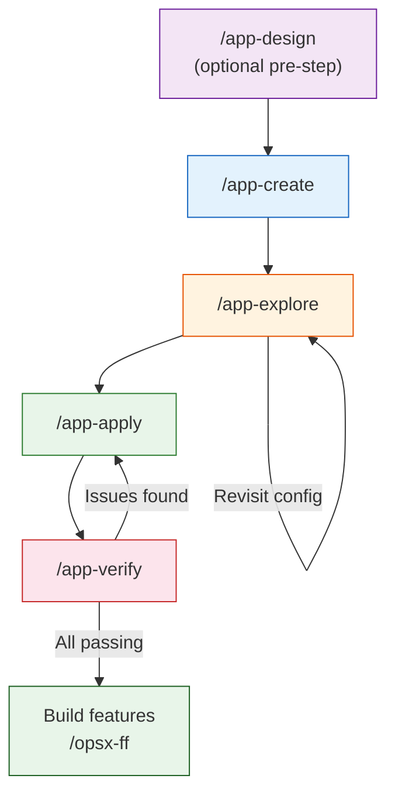

# App Lifecycle — Creating and Managing Nextcloud Apps

App lifecycle commands live in the `app-` namespace. OpenSpec workflow commands (`opsx-`) handle feature implementation; `app-` commands handle the app itself — bootstrapping, configuration, and health checks.

---

## Flow Diagram



```
[/app-design]          ← optional: architecture, features, wireframes
       ↓
/app-create ──► /app-explore ──► /app-apply ──► /app-verify
                          ▲                                          │
                          └──────────── revisit (if drift found) ───┘
                          ↓
                    openspec/app-config.json  ◄── single source of truth
```

---

## Commands

### `/app-design [app-name]` _(optional pre-step)_

**Full upfront design for a new app — architecture, features, wireframes, OpenSpec setup.**

Run this **before** `/app-create` when building a brand new app from scratch. It does deep research and produces:

| Artifact | Contents | Optional? |
|----------|---------|-----------|
| `docs/ARCHITECTURE.md` | Standards research, data model, entity definitions, OpenRegister schema, Vue component decisions | No |
| `docs/FEATURES.md` | 10+ competitor analysis, feature matrix (MVP/V1/Enterprise), settings & notifications derived from features | No |
| `docs/DESIGN-REFERENCES.md` | ASCII wireframes, UX inspiration, missing feature patterns | No |
| `openspec/config.yaml` | OpenSpec CLI context — standards, architecture summary, rules for specs/design/tasks | No |
| `img/app-store.svg` | Blue hexagon app logo | Yes _(asked during Phase 5)_ |
| `docusaurus/` + `.github/workflows/documentation.yml` | Docusaurus documentation site, GitHub Pages deployment | Yes _(asked during Phase 5)_ |

`/app-create` and `/app-explore` will automatically read these documents as context when they exist.

**When to use:** Starting a brand new app and you want comprehensive design research before writing any code. Skip for simple apps or when onboarding an existing repo.

**Re-running:** Safe to run again — prompts you to overwrite, update, or skip each existing document individually.

**`openspec/config.yaml` — OpenSpec CLI configuration**

`/app-design` generates this file as part of its output. The template uses the shared `conduction` schema; customise the `context` and `rules` blocks for your project:

```yaml
schema: conduction

context: |
  Project: <Project Name>
  Repo: ConductionNL/<repo-name>
  Type: Nextcloud App (PHP)
  Description: <one-line description>
  Key components: <list main components>
  Database: PostgreSQL (via OpenRegister's ObjectService)
  Mount path: /var/www/html/custom_apps/<appname>

  Shared specs: See ../openspec/specs/ for cross-project conventions
  Project guidelines: See ../project.md for workspace-wide standards

rules:
  proposal:
    - Reference shared nextcloud-app spec for app structure requirements
    - <add project-specific proposal rules>
  specs:
    - <add project-specific spec rules>
  design:
    - <add project-specific design rules>
  tasks:
    - <add project-specific task rules>
```

- **`context`**: Injected into every artifact Claude generates — include purpose, tech stack, and architecture
- **`rules`**: Per-artifact-type rules that guide Claude when writing specs for this project

If not using `/app-design`, create this file manually before running `openspec validate --all`.

---

### `/app-create [app-id]`

**Bootstrap or onboard a Nextcloud app.**

Starts the interactive setup process. Collects app identity, goal, dependency choices, and GitHub details — then either clones the template as a starting point or onboards an existing folder by comparing it against the template structure.

Always creates an `openspec/` folder with:
- `app-config.json` — the canonical config file for all decisions
- `README.md` — documents the app's goal and structure

If `/app-design` was run first, reads `docs/ARCHITECTURE.md` and `docs/FEATURES.md` to pre-populate fields. Never overwrites existing design artifacts.

After `/app-create` you have a fully scaffolded app with all template placeholders replaced and both `main` + `development` branches on GitHub.

**When to use:** Starting a brand new app, or onboarding an existing repo into the lifecycle flow for the first time.

**`project.md` — project description for Claude context**

Each app should have a `project.md` at its root. This file is loaded by Claude as context when working on the project. `/app-create` scaffolds a stub; complete it with the details below:

```markdown
# <Project Name>

## Overview
<What this project does and why it exists>

## Repository
- **GitHub**: https://github.com/ConductionNL/<repo-name>
- **Organization**: ConductionNL
- **Container mount**: /var/www/html/custom_apps/<appname>

## Architecture

### Key Components
- **<Component A>** — <description>
- **<Component B>** — <description>

### Important Patterns
- <Pattern or gotcha worth knowing, e.g. "route ordering matters in routes.php">

### Directory Structure
​```
lib/
  Controller/
  Service/
  Db/
appinfo/
  info.xml
  routes.php
​```

## Dependencies
- **Depends on**: <list upstream dependencies>
- **Depended on by**: <list downstream dependents>

## API
- Base URL: `/index.php/apps/<appname>/api/`
- Auth: <authentication method>
- Format: JSON

## Testing
- <How to run tests for this project>
```

List known gotchas, dependencies in both directions, and any project-specific patterns that differ from the workspace-wide standards in `apps-extra/project.md`.

---

### `/app-explore [app-id]`

**Think through and evolve the app configuration.**

Opens an interactive exploration session. Acts as a thinking partner — questions assumptions, maps features, explores architecture, and helps you clarify what the app should do and how it should be built.

Reads `openspec/app-config.json`, feature specs, ADRs, and — when present — `docs/ARCHITECTURE.md`, `docs/FEATURES.md`, and `docs/DESIGN-REFERENCES.md` from `/app-design`. Never writes application code.

What you can do in explore mode:
- Refine the app's goal or summary
- Map out features and write `openspec/specs/{feature-name}/spec.md` files
- Change category, OpenRegister dependency, CI settings
- Sketch architecture with ASCII diagrams
- Surface open questions and risks
- Create app-specific ADRs in `openspec/architecture/`

**When to use:** When starting to plan features, when the app's purpose has evolved, or when you need to think through a design decision before building.

---

### `/app-apply [app-id]`

**Apply config changes from `openspec/app-config.json` to the actual app files.**

Reads the config, compares it against all tracked files, shows you a diff of what would change, and applies approved changes. Updates `appinfo/info.xml`, all CI/CD workflows, `composer.json`, `package.json`, Vue files, README, and more.

Always shows the change summary and asks for confirmation before modifying anything.

**When to use:** After `/app-explore` has updated `openspec/app-config.json` and you're ready to push those changes into the codebase. Also use after manually editing `app-config.json` directly.

---

### `/app-verify [app-id]`

**Audit the app files against `openspec/app-config.json`.**

Read-only. Checks every tracked file and reports findings with severity:
- **CRITICAL** — Identity mismatches that break CI or cause runtime errors
- **WARNING** — Metadata drift that is incorrect but not breaking
- **INFO** — Minor cosmetic differences

Also checks for deprecated components (`CnDetailViewLayout`) and CHANGELOG version alignment.

**When to use:** After `/app-apply` to confirm changes landed correctly. Also useful as a periodic health check to detect drift (e.g. after manual edits to CI files).

---

## The `openspec/` Folder

Every app managed by this lifecycle has an `openspec/` folder at its root. This folder is the **single source of truth** for all configuration decisions — it is what `/app-apply` reads and what `/app-verify` checks against.

```
openspec/
├── app-config.json       # Core configuration (id, name, goal, dependencies, CI settings)
├── README.md             # Documents the app's goal and structure
├── architecture/         # Architectural Decision Records (app-specific ADRs)
│   └── adr-001-*.md
└── specs/                # Feature specifications (created during /app-explore)
    └── {feature-name}/
        └── spec.md
```

### `app-config.json` Structure

```json
{
  "id": "my-app",
  "name": "My App",
  "namespace": "MyApp",
  "summary": "One-line description (~100 chars)",
  "goal": "Full description of what this app does and the problem it solves.",
  "category": "organization",
  "version": "0.1.0",
  "license": "EUPL-1.2",
  "author": "Conduction B.V.",
  "repository": "https://github.com/ConductionNL/my-app",
  "dependencies": {
    "requiresOpenRegister": true,
    "additionalCiApps": [
      {"repo": "ConductionNL/openregister", "app": "openregister", "ref": "main"}
    ]
  },
  "cicd": {
    "phpVersions": ["8.3", "8.4"],
    "nextcloudRefs": ["stable31", "stable32"],
    "enableNewman": false
  },
  "createdAt": "2026-01-01",
  "updatedAt": "2026-03-20"
}
```

### Feature Specs

Feature specs live in `openspec/specs/{feature-name}/spec.md` and are created during `/app-explore` sessions:

```markdown
# {Feature Name} Specification

**Status**: idea | planned | in-progress | done

**OpenSpec changes:** _(links to openspec/changes/ when in-progress or done)_

## Purpose

What this feature does and why it matters to users.

## Requirements

### Requirement: {Requirement Name}
The system MUST/SHOULD/MAY {requirement statement}.

#### Scenario: {Scenario Name}
- GIVEN {precondition}
- WHEN {action}
- THEN the system {MUST/SHOULD} {expected outcome}

## User Stories

- As a [role], I want to [action] so that [outcome]

## Acceptance Criteria

- [ ] ...

## Notes

Open questions, constraints, dependencies, related ADRs.
```

> For `idea` status, a lightweight spec (Purpose + User Stories + Acceptance Criteria) is fine. Fill in formal Requirements/Scenarios when moving to `planned` — that is what `/opsx-ff` reads to generate the change artifacts.

---

## Tracked Files

`/app-apply` and `/app-verify` track the following files and keep them in sync with `app-config.json`:

| File | What is tracked |
|------|----------------|
| `appinfo/info.xml` | App ID, name, summary, goal, namespace, category, GitHub URLs |
| `lib/AppInfo/Application.php` | APP_ID constant, PHP namespace |
| `composer.json` | Package name, PSR-4 namespace |
| `package.json` | Package name |
| `webpack.config.js` | App ID constant |
| `src/App.vue` | OpenRegister gate (present/absent) |
| `README.md` | Title, goal section |
| `.github/workflows/code-quality.yml` | App name, PHP versions, NC refs, Newman flag, additional apps |
| `.github/workflows/release-beta.yml` | App name |
| `.github/workflows/release-stable.yml` | App name |
| `.github/workflows/issue-triage.yml` | App name |
| `.github/workflows/openspec-sync.yml` | App name |

---

## Typical Sessions

### Starting a brand new app (full design-first flow)

```
/app-design my-new-app     # Architecture, competitor research, wireframes, OpenSpec setup
/app-create my-new-app     # Scaffold from template, create GitHub repo
/app-explore my-new-app    # Think through goals and features
# Approve saving changes to openspec/
/app-apply my-new-app      # Push config changes to app files
/app-verify my-new-app     # Confirm everything landed correctly
openspec validate --all    # Verify OpenSpec config is valid
/opsx-onboard              # Confirm Claude integration works
```

### Starting a new app (quick flow, no upfront design)

```
/app-create my-new-app     # Scaffold from template, create GitHub repo
/app-explore my-new-app    # Think through goals and features
/app-apply my-new-app      # Push config changes to app files
/app-verify my-new-app     # Confirm everything landed correctly
openspec validate --all    # Verify OpenSpec config is valid
/opsx-onboard              # Confirm Claude integration works
```

### Onboarding checklist

After completing the steps above, confirm:

- [ ] `openspec/` directory initialized with `app-config.json`
- [ ] `openspec/config.yaml` present and pointing to `conduction` schema with project context
- [ ] `project.md` at app root — describes purpose, architecture, and dependencies
- [ ] `openspec validate --all` passes
- [ ] `/opsx-onboard` works in Claude Code

### Evolving an existing app

```
/app-explore my-app        # Revisit goals, add feature files
# Update summary, category, or CI settings
/app-apply my-app          # Apply the changes
/app-verify my-app         # Verify
```

### Periodic health check

```
/app-verify my-app         # Check for drift
# If CRITICAL or WARNING issues:
/app-apply my-app          # Fix them
```

---

## Architectural Decision Records (ADRs)

App-specific ADRs live in `openspec/architecture/` and document why the app is built the way it is. They are created and explored during `/app-explore` sessions.

> **Company-wide ADRs** (ADR-001 through ADR-015) live in `hydra/openspec/architecture/` and apply to all Conduction apps. Only create an app-specific ADR when the decision is unique to that app.

Good candidates for app-specific ADRs:
- Data storage approach (OpenRegister vs own tables)
- Frontend architecture choices unique to this app
- Authentication and authorization model
- External API dependencies and coupling decisions
- Standards compliance choices (ZGW, GEMMA, CMMN)

**Format:** `openspec/architecture/adr-{NNN}-{slug}.md` with fields for Context, Decision, Consequences, and Alternatives Considered.

---

## Handoff to OpenSpec — The Cut-off Point

The app lifecycle flow handles everything up to and including **"we know what to build"**. OpenSpec takes over when you are ready to **write the spec and implement**.

The cut-off is driven by feature status:

```
openspec/specs/           openspec/changes/
───────────────           ─────────────────
idea                      (not here yet)
planned ─────────────────► /opsx-ff creates the change
in-progress               proposal.md → specs.md → tasks.md
done                      archived
```

**Trigger:** When a feature in `openspec/specs/` moves from `idea` to `planned` — meaning it has a clear goal, user stories, and acceptance criteria — it is ready for `/opsx-ff {feature-name}`.

### One feature → multiple changes

A single feature can result in **multiple OpenSpec changes**. This is intentional — OpenSpec changes should be independently deployable slices:

```
openspec/specs/document-upload/spec.md (planned)
        │
        ├──► openspec/changes/document-upload-backend/   (schema + API)
        ├──► openspec/changes/document-upload-frontend/  (Vue upload UI)
        └──► openspec/changes/document-upload-notify/    (notifications)
```

The feature spec tracks the overall concept; the OpenSpec changes track implementation.

---

## Preventing Duplication Between `openspec/` and `openspec/changes/`

The two layers have distinct roles — duplication is avoided by keeping each layer at the right level of detail:

| | `openspec/` (app config layer) | `openspec/changes/` (implementation layer) |
|---|---|---|
| **Question** | WHAT should this app do? | HOW should we build it? |
| **Level** | Concept and goal | Technical specification |
| **Feature detail** | User stories + acceptance criteria | Architecture, design, tasks |
| **Decisions** | WHY (ADRs in `openspec/architecture/`) | HOW (design.md per change) |
| **Output** | Input for OpenSpec | Output for development |

**Rule of thumb:**
- If you are deciding *what* the app needs → `openspec/specs/{feature}/spec.md`
- If you are deciding *how* to implement a specific change → `openspec/changes/{change}/`
- If a decision is about the overall architecture of the app → `openspec/architecture/adr-NNN-*.md`
- If a decision is about the design of a specific feature → `openspec/changes/{change}/design.md`

The `README.md` in the app root references the `openspec/` folder and links to key documents — it is the entry point, not a duplicate.

---

## Scope of `/app-apply`

App Apply is deliberately narrow. It only touches scaffold and configuration files:

✅ **Syncs:** `appinfo/info.xml`, CI/CD workflow parameters, PHP namespaces, package names, `README.md` header sections, `src/App.vue` OpenRegister gate.

❌ **Does not touch:** Feature code, business logic, Vue components, controllers, OpenRegister schemas.

If a user asks `/app-apply` to do something outside this scope, it redirects to the right tool:
- Config decision → `/app-explore` to capture it, then `/app-apply`
- Feature implementation → `/opsx-ff {feature-name}`

---

## `/app-design` vs `/app-explore` vs `/app-create` — When to Use Which

These three commands can feel overlapping. Here's the clear distinction:

| | `/app-design` | `/app-create` | `/app-explore` |
|---|---|---|---|
| **When** | Before the repo exists | Once, at bootstrap | Repeatedly throughout app lifetime |
| **Does** | Research + document (architecture, competitors, wireframes) | Scaffold files + set up GitHub | Think + iterate on config and features |
| **Writes to** | `docs/`, `openspec/config.yaml`, `openspec/specs/` | Template files, `openspec/app-config.json` | `openspec/app-config.json`, `openspec/specs/`, `openspec/architecture/` |
| **Requires** | Nothing (pre-repo) | Git repo, optionally design docs | Existing app with `openspec/app-config.json` |
| **Skip when** | Onboarding existing repo / simple app | Already done | Never — use it repeatedly |

**Overlap note:** `/app-design` creates `openspec/config.yaml` and initial `openspec/specs/`. `/app-create` creates `openspec/app-config.json`. These are different files with different purposes — the design docs don't replace the machine-readable config file.

---

## Relationship to the OpenSpec Flow

App lifecycle commands (`app-`) work alongside the OpenSpec workflow commands (`opsx-`), making the full workflow coherent:

| | App Lifecycle commands | OpenSpec implementation commands |
|---|---|---|
| **Purpose** | Bootstrap, configure, and audit the app itself | Specify, implement, and validate features |
| **Source of truth** | `openspec/app-config.json` | `openspec/changes/` directories |
| **Writes to** | App files (metadata, CI, config) | Application code (PHP, Vue, schemas) |
| **Start with** | A new or existing app repo | A specific feature or change to implement |
| **ADR location** | `openspec/architecture/` (app-wide decisions) | `openspec/changes/*/design.md` (feature decisions) |

Typical combined workflow:
1. Design (optional): `/app-design`
2. Bootstrap and configure: `/app-create` → `/app-explore` → `/app-apply`
3. Define features and ADRs: `/app-explore` (repeated as the app evolves)
4. Implement features: `/opsx-ff {feature-name}` → `/opsx-apply` → `/opsx-verify` → test (`/test-functional`, `/test-counsel`) → `/create-pr` → `/opsx-archive`
5. Keep config in sync: `/app-verify` periodically, `/app-apply` when drift is found

For guidance on testing commands and when to use each, see [testing.md](testing.md).
