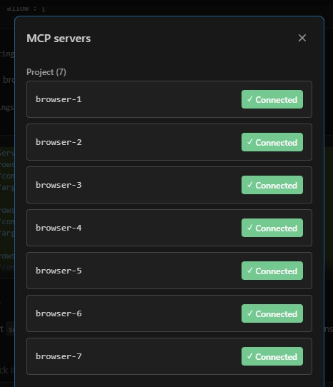

# Playwright MCP Browser Setup

Each project workspace configures its own Playwright MCP browser sessions in a `.mcp.json` file at the project root. The Nextcloud workspace uses 7 browsers; other projects (e.g., [wordpress-docker](https://github.com/ConductionNL/wordpress-docker)) may use fewer. An [example .mcp.json](./examples/.mcp.json.example) with the 7-browser configuration is available as a starting point.

## Browser Pool (Nextcloud workspace)

| Server | Mode | Purpose |
|--------|------|---------|
| `browser-1` | Headless | Main agent (default) |
| `browser-2` | Headless | Sub-agent / parallel |
| `browser-3` | Headless | Sub-agent / parallel |
| `browser-4` | Headless | Sub-agent / parallel |
| `browser-5` | Headless | Sub-agent / parallel |
| `browser-6` | **Headed** | User observation (visible window) |
| `browser-7` | Headless | Sub-agent / parallel |

## VS Code Extension Setup

The VS Code extension loads MCP servers from `.mcp.json` in the **project root** (this file lives in each project repo, not in the `.github` documentation repo). The file defines 7 browser instances. Browsers 1–5 and 7 are headless; browser-6 is headed (omits `--headless`) so the browser window is visible when you want to watch:

```json
{
  "mcpServers": {
    "browser-1": { "command": "npx", "args": ["-y", "@playwright/mcp@latest", "--browser", "chromium", "--headless", "--isolated"] },
    "browser-2": { "command": "npx", "args": ["-y", "@playwright/mcp@latest", "--browser", "chromium", "--headless", "--isolated"] },
    "browser-3": { "command": "npx", "args": ["-y", "@playwright/mcp@latest", "--browser", "chromium", "--headless", "--isolated"] },
    "browser-4": { "command": "npx", "args": ["-y", "@playwright/mcp@latest", "--browser", "chromium", "--headless", "--isolated"] },
    "browser-5": { "command": "npx", "args": ["-y", "@playwright/mcp@latest", "--browser", "chromium", "--headless", "--isolated"] },
    "browser-6": { "command": "npx", "args": ["-y", "@playwright/mcp@latest", "--browser", "chromium", "--isolated"] },
    "browser-7": { "command": "npx", "args": ["-y", "@playwright/mcp@latest", "--browser", "chromium", "--headless", "--isolated"] }
  }
}
```

The project's shared `.claude/settings.json` has two pre-approval entries:

- **`"enableAllProjectMcpServers": true`** — auto-approves all servers from `.mcp.json` without prompting on each reload.
- **All `mcp__browser-*` tool calls** — pre-approved for all 7 browsers so that parallel sub-agents (used by `/test-app` Full mode and `/test-counsel`) can use their assigned browser without needing an interactive permission prompt. Without this, background agents are silently denied and no testing occurs.

Then **reload the VS Code window**: `Ctrl+Shift+P` → type `reload window` → Enter.

## Verification

After reload, open the MCP servers panel to verify all 7 browsers show **Connected**. You can do this two ways:
- Type `/MCP servers` in the Claude Code chat input
- Or `Ctrl+Shift+P` → search **"MCP servers"**



If any server shows an error, check the output panel: `Ctrl+Shift+P` → **"Output: Focus on Output"** → select **"Claude VSCode"** from the dropdown.

## CLI Alternative (terminal only)

For the Claude Code CLI (`claude` terminal command, not VS Code), you can start servers as HTTP endpoints on fixed ports and reference them via URL:

```bash
# Start headless browsers
for port in 9221 9222 9223 9224 9225 9227; do
  npx -y @playwright/mcp@latest --headless --isolated --port $port &
done

# Start headed browser
npx -y @playwright/mcp@latest --isolated --port 9226 &
```

> This is **not needed for VS Code** — the extension manages server processes automatically via `.mcp.json`. Only use this approach if you're running `claude` from the terminal without VS Code.

## Usage Rules

1. **Default**: Use `browser-1` for normal work
2. **Parallel agents**: Assign sub-agents `browser-2` through `browser-5` and `browser-7`
3. **User watching**: Switch to `browser-6` when the user wants to observe
4. **Fallback**: If a browser errors, try the next numbered browser
5. **Keep `browser-6` reserved**: Only for explicit user observation
