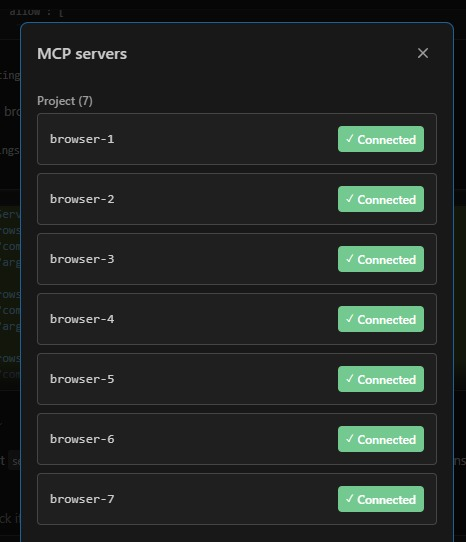

# Playwright MCP Browser Setup

Each project workspace configures its own Playwright MCP browser sessions in a `.mcp.json` file at the project root. The Nextcloud workspace uses 7 browsers; other workspaces may use fewer depending on the parallelism their tests demand. An [example .mcp.json](./examples/.mcp.json.example) with the 7-browser configuration is available as a starting point.

Hydra ships this file at its repository root (`hydra/.mcp.json`). A workspace that symlinks Hydra's `.claude/skills` should symlink `.mcp.json` the same way, so the browser pool always travels with the skills that depend on it:

```bash
ln -sfn /path/to/hydra/.mcp.json /path/to/workspace/.mcp.json
```

Do **not** put `mcpServers` in `~/.claude/settings.json` — Claude Code ignores that key there ([docs](https://code.claude.com/docs/en/debug-your-config#check-common-causes)).

## Browser Pool (Nextcloud workspace)

| Server      | Mode       | Purpose                           |
| ----------- | ---------- | --------------------------------- |
| `browser-1` | Headless   | Main agent (default)              |
| `browser-2` | Headless   | Sub-agent / parallel              |
| `browser-3` | Headless   | Sub-agent / parallel              |
| `browser-4` | Headless   | Sub-agent / parallel              |
| `browser-5` | Headless   | Sub-agent / parallel              |
| `browser-6` | **Headed** | User observation (visible window) |
| `browser-7` | Headless   | Sub-agent / parallel              |

## VS Code Extension Setup

The VS Code extension loads MCP servers from `.mcp.json` in the **project root** (this file lives in each project repo, not in the `.github` documentation repo). The file defines 7 browser instances. Browsers 1–5 and 7 are headless; browser-6 is headed (omits `--headless`) so the browser window is visible when you want to watch:

```json
{
  "mcpServers": {
    "browser-1": {
      "command": "npx",
      "args": [
        "-y",
        "@playwright/mcp@latest",
        "--browser",
        "chromium",
        "--headless",
        "--isolated"
      ]
    },
    "browser-2": {
      "command": "npx",
      "args": [
        "-y",
        "@playwright/mcp@latest",
        "--browser",
        "chromium",
        "--headless",
        "--isolated"
      ]
    },
    "browser-3": {
      "command": "npx",
      "args": [
        "-y",
        "@playwright/mcp@latest",
        "--browser",
        "chromium",
        "--headless",
        "--isolated"
      ]
    },
    "browser-4": {
      "command": "npx",
      "args": [
        "-y",
        "@playwright/mcp@latest",
        "--browser",
        "chromium",
        "--headless",
        "--isolated"
      ]
    },
    "browser-5": {
      "command": "npx",
      "args": [
        "-y",
        "@playwright/mcp@latest",
        "--browser",
        "chromium",
        "--headless",
        "--isolated"
      ]
    },
    "browser-6": {
      "command": "npx",
      "args": [
        "-y",
        "@playwright/mcp@latest",
        "--browser",
        "chromium",
        "--isolated"
      ]
    },
    "browser-7": {
      "command": "npx",
      "args": [
        "-y",
        "@playwright/mcp@latest",
        "--browser",
        "chromium",
        "--headless",
        "--isolated"
      ]
    }
  }
}
```

Project servers from `.mcp.json` need a one-time approval per workspace: accept the workspace-trust dialog when Claude Code first opens the folder, then approve the servers from `/mcp` if prompted. That is all — **no pre-approval settings are required**:

- `enableAllProjectMcpServers` only skips that one prompt. Hydra deliberately does not commit `.claude/settings.json` (it is machine-specific, see its `.gitignore`), and Claude Code ignores committed approvals in an untrusted folder anyway ([docs](https://code.claude.com/docs/en/mcp#project-server-approvals-and-workspace-trust)).
- An `mcp__browser-*` allow-list is not needed for parallel sub-agents (`/test-app` Full mode, `/test-counsel`): background subagents surface their permission prompts in the main session, and in auto mode the classifier evaluates their tool calls with the same rules as the main conversation ([subagent permissions](https://code.claude.com/docs/en/sub-agents)). Earlier versions of this page claimed sub-agents were "silently denied" without it; that is no longer how Claude Code behaves.

Then **reload the VS Code window**: `Ctrl+Shift+P` → type `reload window` → Enter.

## Verification

After reload, open the MCP servers panel to verify all 7 browsers show **Connected**. You can do this two ways:

- Type `/MCP servers` in the Claude Code chat input
- Or `Ctrl+Shift+P` → search **"MCP servers"**



If any server shows an error, check the output panel: `Ctrl+Shift+P` → **"Output: Focus on Output"** → select **"Claude VSCode"** from the dropdown.

## User scope (all projects on this machine)

To have the browser pool in every project on your machine — including repositories that do not ship a `.mcp.json` — register the servers at user scope. They are stored in `~/.claude.json` and load in every project. Run once:

```bash
for i in 1 2 3 4 5 7; do
  claude mcp add --scope user "browser-$i" -- npx -y @playwright/mcp@latest --browser chromium --headless --isolated
done
claude mcp add --scope user browser-6 -- npx -y @playwright/mcp@latest --browser chromium --isolated   # headed
```

Verify with `claude mcp list`. A project `.mcp.json` that defines the same server name takes precedence over the user-scope entry, so both can coexist. Remove one with `claude mcp remove --scope user browser-N`.

## CLI Alternative (terminal only)

For the Claude Code CLI (`claude` terminal command, not VS Code), you can start servers as HTTP endpoints on fixed ports and reference them via URL:

```bash
# Start headless browsers
for port in 9221 9222 9223 9224 9225 9227; do
  npx -y @playwright/mcp@latest --headless --isolated --port $port &
done

# Start headed browser
npx -y @playwright/mcp@latest --isolated --port 9226 &
```

> This is **not needed for VS Code** — the extension manages server processes automatically via `.mcp.json`. Only use this approach if you're running `claude` from the terminal without VS Code.

## Usage Rules

1. **Default**: Use `browser-1` for normal work
2. **Parallel agents**: Assign sub-agents `browser-2` through `browser-5` and `browser-7`
3. **User watching**: Switch to `browser-6` when the user wants to observe
4. **Fallback**: If a browser errors, try the next numbered browser
5. **Keep `browser-6` reserved**: Only for explicit user observation
