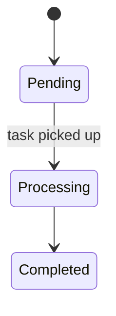

# Writing Documentation

How to write and maintain documentation in this project. These rules apply whenever Claude or a developer writes or updates any `.md` file — `docs/`, `.claude/docs/`, `openspec/specs/`, `openspec/ROADMAP.md`, `README.md`, or anywhere else.

See [writing-specs.md](writing-specs.md) for the separate guide on writing OpenSpec requirements and scenarios.

---

## Contents

**Part 1 — Principles**
- [The Core Rule: Reference, Don't Duplicate](#the-core-rule-reference-dont-duplicate)
- [Sources of Truth](#sources-of-truth)
- [Audience Determines Location](#audience-determines-location)
- [Language](#language)
- [Where Does This Content Go?](#where-does-this-content-go)

**Part 2 — Writing Mechanics**
- [Document Lifecycle Markers](#document-lifecycle-markers)
- [Link Structure](#link-structure)
- [Lists, Tables, and Structure](#lists-tables-and-structure)
- [Table of Contents](#table-of-contents)
- [Diagrams and Images](#diagrams-and-images)
- [Formatting Alignment](#formatting-alignment)

**Part 3 — Maintenance**
- [Keeping Docs Current](#keeping-docs-current)
- [Staleness Signals](#staleness-signals)
- [Outdated and Legacy Documentation](#outdated-and-legacy-documentation)
- [Common Mistakes](#common-mistakes)
- [Writing Anti-Patterns](#writing-anti-patterns)

---

## Part 1 — Principles

---

## The Core Rule: Reference, Don't Duplicate

**Every piece of information should live in exactly one place.** When another document needs to refer to it, link to the source of truth — never copy the content.

```
✓ Good — link to the source of truth
"See [openspec/specs/publications/spec.md](../../openspec/specs/publications/spec.md) for API endpoint requirements."

✗ Bad — copies requirements into a guide
"The API MUST return HTTP 404 when the publication does not exist."
  → this information already lives in the spec; now you have two places to keep in sync
```

When content is duplicated, it will eventually diverge. One copy gets updated; the other goes stale. The reader gets confused. The solution is to pick the source of truth and link from everywhere else.

---

## Sources of Truth

| Concern                                                     | Source of truth                                                          |
|-------------------------------------------------------------|--------------------------------------------------------------------------|
| **Vision & Direction**                                      |                                                                          |
| Project vision and phases                                   | `openspec/ROADMAP.md` (if present)                                       |
| Target audience and personas                                | `openspec/audience.md` (if present)                                      |
| Architectural decisions (why)                               | `openspec/architecture/adr-{NNN}-*.md`                                   |
| Architecture decisions index                                | `.claude/openspec/architecture/README.md`                                |
| Technical decisions and constraints                         | `openspec/architecture/` ADRs                                            |
| **Standards & Patterns**                                    |                                                                          |
| NL Design System and UI standards                           | `openspec/specs/{domain}/spec.md` (app-specific) or company ADR-003      |
| API conventions and URL structure                           | `openspec/specs/{domain}/spec.md` (app-specific) or company ADR-002      |
| **Requirements**                                            |                                                                          |
| Feature requirements and scenarios                          | `openspec/specs/{domain}/spec.md`                                        |
| **Guides & Documentation**                                  |                                                                          |
| User-facing how-to guides                                   | `docs/` feature docs                                                     |
| App administrator procedures                                | `docs/admin-guide.md` (if present)                                       |
| Developer setup and environment                             | `README.md`                                                              |
| Available `make` commands and scripts                       | workspace root `Makefile`                                                |
| Developer workflow and commands                             | `.claude/docs/commands.md`, `.claude/docs/workflow.md`                   |
| Testing conventions and persona usage                       | `.claude/docs/testing.md`                                                |
| Docker environment and setup                                | `.claude/docs/docker.md`, `.claude/docs/getting-started.md`              |
| Frontend standards                                          | `.claude/docs/frontend-standards.md`                                     |
| Standards compliance references                             | `docs/features/README.md` (GEMMA, ZGW, Forum Standaardisatie)            |
| **Testing**                                                 |                                                                          |
| Persona testing behavior and scripts                        | `.claude/personas/`                                                      |
| Reusable test scenarios (Gherkin)                           | `test-scenarios/TS-*.md`                                                 |
| **Meta**                                                    |                                                                          |
| Spec and doc writing conventions                            | `.claude/docs/writing-specs.md`, `.claude/docs/writing-docs.md`          |
| OpenSpec schema and artifact templates                      | `.claude/openspec/schemas/conduction/schema.yaml`, `templates/`          |
| Parallel agent conventions                                  | `.claude/docs/parallel-agents.md`                                        |
| Claude harness configuration (permissions, hooks, env vars) | `.claude/global-settings/settings.json`                                  |
| Global Claude settings guide                                | `.claude/docs/global-claude-settings.md`                                 |
| Claude usage tracking documentation                         | `.claude/usage-tracker/README.md`                                        |

---

## Audience Determines Location

Each document has one target audience. Don't mix them.

| Audience                              | Location                                                 | Style                                                                        |
|---------------------------------------|----------------------------------------------------------|------------------------------------------------------------------------------|
| End users / citizens                  | `docs/` feature docs                                     | Plain language, no jargon, task-oriented                                     |
| App administrator                     | `docs/admin-guide.md` (if present)                       | Task-oriented, step-by-step                                                  |
| Developer (setup, environment)        | `README.md`                                              | Technical, precise                                                           |
| Claude / spec workflow                | `.claude/docs/`, `.claude/skills/`                       | Instruction-style, precise — Claude reads this at runtime                    |
| Spec / requirements                   | `openspec/specs/`                                        | RFC 2119, Gherkin — see [writing-specs.md](writing-specs.md)                 |
| Architectural decisions (why)         | `openspec/architecture/`                                 | ADR format — context, decision, consequences; written for future developers  |
| Claude test agents (persona testers)  | `.claude/personas/`                                      | Persona cards — behavior, goals, device preference; loaded by test commands at runtime |
| Claude test agents (scenario execution) | `test-scenarios/`                                      | Gherkin-style test scenarios; loaded by `/test-scenario-run`                 |

**Developer/technical content does not belong in `docs/`.** If you find implementation details, class names, or spec requirements in a user-facing guide, replace them with plain-language descriptions or links to the spec.

---

## Language

**All documentation is written in English** — `docs/`, `.claude/docs/`, `openspec/`, `README.md`.

**Filenames** also MUST be English — `user-guide.md`, not `handleiding.md`.

**Language support for user-facing features:** Many apps in this ecosystem are Dutch-first for end users. When documenting such features, note the Dutch-first default and where English is also required. Per ADR-005, both Dutch and English MUST be supported for i18n-enabled features.

---

## Where Does This Content Go?

Use this when you're not sure which file to write new content into. These rules cover the most common cases without needing to cross-reference both tables above.

1. **Is it _why_ a decision was made?** → `.claude/openspec/architecture/adr-{NNN}-*.md`
2. **Is it _what must be true_ (a requirement, acceptance criterion, or constraint)?** → `.claude/openspec/specs/{domain}/spec.md` (or per-project `openspec/specs/{domain}/spec.md`)
3. **Is it instructions for an _end user or citizen_ using an app?** → `docs/` feature docs for that app
4. **Is it instructions for an _app administrator_?** → `docs/admin-guide.md` (if present in that app)
5. **Is it _developer setup_ or environment instructions?** → `README.md`
6. **Is it instructions for _Claude_ at runtime (workflow, testing, commands, spec writing)?** → `.claude/docs/`
7. **Is it about _project direction, phase goals, or technical strategy_?** → `.claude/openspec/ROADMAP.md` (if present)
8. **Is it _standards compliance_ information (GEMMA, ZGW, Forum Standaardisatie)?** → `docs/features/README.md`
9. **Is it a reusable _test flow_ (Given/When/Then)?** → `test-scenarios/TS-*.md`

If you're still unsure: write it once in the most specific location and link from everywhere else. When content could fit in two places, it almost always belongs in the more authoritative one (spec over guide, ADR over design doc) and should be referenced from the other.

---

## Part 2 — Writing Mechanics

---

## Document Lifecycle Markers

### The `[Future]` Marker

In `docs/` user-facing guides, functionality that is not yet implemented is marked with `[Future]`:

```markdown
## Export to PDF [Future]

Users will be able to export publications to PDF format.
```

**Adding the marker:**
- Only use `[Future]` in `docs/` files — not in specs or `.claude/docs/`
- Only mark features on the active roadmap. Don't document speculative or far-future items — if you don't know when they'll ship, don't document them yet
- Write the section body in future tense: "Users will be able to..."

**Auditing for stale markers:**
- Run `/sync-docs app` to check automatically
- When archiving any change, check whether it implements something currently marked `[Future]` in any doc
- When reading a doc and encountering a `[Future]` section, verify against current specs before assuming it's still future

**Removing the marker — not just deletion:**
When a feature ships, don't just strip the label — do a content review:
1. Switch future tense to present tense: "will be available" → "is available"
2. Verify the description still matches what was actually built — planned and implemented are not always identical
3. Update any example steps, URLs, or screenshots
4. Check whether the companion guide (feature doc ↔ admin-guide) also has a `[Future]` section for the same feature — update both together
5. Remove any "once implemented..." caveats that assumed the feature wasn't ready

### The `[Legacy]` Marker

See [Outdated and Legacy Documentation](#outdated-and-legacy-documentation) for when to use `[Legacy]` and how to handle deprecated content.

---

## Link Structure

- Use **relative paths** for internal links, not absolute paths
  - Good: `[spec](../../openspec/specs/publications/spec.md)`
  - Bad: `/home/user/apps-extra/opencatalogi/openspec/specs/publications/spec.md`
- **Verify linked files exist** before writing the link — a broken link is worse than no link
- For section links, use the GitHub anchor format: `#section-name-lowercase-hyphenated`

---

## Lists, Tables, and Structure

### When to use a list

**Bulleted list** — unordered items with no inherent sequence:
- Three or more items that would be awkward as a run-on sentence
- Items where order doesn't matter

**Numbered list** — always use when sequence matters:
- Step-by-step instructions
- Ordered procedures where skipping or reordering a step would cause problems

Avoid lists for fewer than three items — prose is usually cleaner: "Feature A and Feature B are both required" is better than a two-item bullet list.

### When to use a table

Use a table when each item has **two or more parallel attributes**:
- Comparing options across a consistent set of criteria
- Mapping one thing to another (status → meaning, command → effect, field → description)
- Reference material readers will scan rather than read linearly

Don't use a table for a simple list of items with a single attribute — that's a bulleted list.

### Ordering rows in a table

- **Lifecycle or workflow order** — if rows represent phases, steps, or statuses (preferred for commands, status transitions, phases)
- **Most-used first** — if the table is a lookup reference readers scan frequently
- **Alphabetical** — only when there is no logical order and readers are likely to search by name
- Avoid insertion order or random order

### Ordering list items

- Put the most important or most common item first
- Use consistent grammatical parallelism — all items should start with the same form (all imperatives, all noun phrases, all clauses)
- For instructional lists, use the order the reader should encounter the items

---

## Table of Contents

**Add a ToC when:**
- The document has 5 or more sections and is longer than ~50 lines
- The document serves as an overview or index (any `README.md`)
- The document is a guide that readers navigate non-linearly (feature docs, admin-guide.md, commands.md)

**Don't add a ToC when:**
- The document is short (under ~50 lines)
- The document has a single coherent top-to-bottom flow
- The document is primarily a single table or reference list

### Keeping the ToC up to date

- Use GitHub anchor format: `#section-name-lowercase-with-hyphens`
- When you add, rename, or remove a section heading, update the ToC in the same edit — never leave them out of sync
- Before adding a ToC link, verify the anchor matches the exact heading text (GitHub derives anchors from heading text, with spaces replaced by `-` and special characters stripped)
- Run `/sync-docs` to surface stale ToC entries automatically

---

## Diagrams and Images

### Diagrams

Prefer diagrams over prose when the relationship between things is genuinely hard to express linearly — state transitions, multi-party flows, decision branches. Do not add a diagram just to make a doc look more thorough; a clear table or numbered list is often better.

**Use Mermaid** for all new diagrams. Mermaid renders natively in GitHub, lives as text in the file (so it can be diffed and updated), and requires no external assets.

✓ **Good** — inline Mermaid, lives with the doc, diffs cleanly:



✗ **Bad** — exported PNG of a diagram created in a separate tool:

```

```

→ now two things to keep in sync; the image goes stale silently

**Mermaid diagram types and when to use them:**

| Type               | Use for                                                              |
|--------------------|----------------------------------------------------------------------|
| `flowchart`        | Process flows, decision trees, "what happens when"                   |
| `sequenceDiagram`  | Multi-party interactions (user → Nextcloud app → external service)   |
| `stateDiagram-v2`  | State machines — task lifecycle, status transitions                  |
| `erDiagram`        | Data model relationships between entities                            |
| `gitGraph`         | Branch topology (use sparingly — only if it genuinely aids understanding) |

**Where diagrams live:**

- Inline in the document that uses them — never in separate files
- Never copy a diagram into two documents; put it in the most authoritative location and link from the other

**When not to use a diagram:**

- When a table, numbered list, or short prose communicates the same thing clearly
- When the diagram would describe something that changes frequently — prose is cheaper to update than a Mermaid block
- When the audience is an end user or admin — `docs/` guides should use plain language, not technical diagrams

---

### Images and Screenshots

Use screenshots to illustrate UI steps that are genuinely hard to describe in text — for example, navigating to a specific setting buried in the admin interface. Do not screenshot things that change frequently; an outdated screenshot misleads more than it helps.

**Where images live:**

| Purpose                                                  | Location                                   | Committed? |
|----------------------------------------------------------|--------------------------------------------|------------|
| Documentation screenshots for `docs/` guides             | `docs/images/`                             | Yes — commit alongside the doc |
| Documentation screenshots for `.claude/docs/`            | `.claude/docs/images/`                     | Yes — commit alongside the doc |
| Automated test screenshots (browser tests)               | `{app}/test-results/`                      | **No** — gitignored |

The `docs/images/` and `.claude/docs/images/` directories do not exist yet — create them when you add the first image.

**The gitignore boundary:**

Test screenshots saved to `{app}/test-results/` are gitignored. They are ephemeral test artifacts — do not use them as documentation assets. If a screenshot captured during a test run is worth keeping in documentation, copy it to the appropriate committed location:

```bash
cp {app}/test-results/screenshots/feature-flow.png docs/images/feature-flow.png
```

Then reference `docs/images/feature-flow.png` in the doc, not the original path.

**Taking screenshots with the browser agent:**

When a screenshot would genuinely improve a doc and the app is running in Docker, use the browser agent to capture the specific screen you need. Save directly to the target `docs/images/` path — not to `test-results/` — so it is committed immediately and stays out of the gitignore.

Use descriptive filenames based on what is shown, not sequential numbers:

```
✓ docs/images/admin-user-management.png
✗ docs/images/screenshot-1.png
✗ docs/images/image.png
```

**Referencing images in markdown:**

Always use relative paths and write meaningful alt text:

```markdown

```

- `docs/` docs: path is relative to the doc file, so `images/filename.png` resolves to `docs/images/filename.png`
- `.claude/docs/` docs: same pattern — `images/filename.png` resolves to `.claude/docs/images/filename.png`
- Never use absolute paths (see [Link Structure](#link-structure))

**Keeping screenshots current:**

- Note in the doc if a screenshot reflects a specific app version or configuration state
- When running `/sync-docs`, flag image references where the UI may have changed since the screenshot was taken
- When a UI step changes, retake the screenshot and replace the file — do not leave a stale image with a note saying "this may look different"

---

## Formatting Alignment

Correct visual alignment in tables and diagrams makes documentation easier to read, edit, and maintain. Misaligned source is a sign of a partial edit — fix it when you touch the file.

### Markdown tables

GFM renders tables regardless of source padding, but readable source matters for editing. When writing or updating a table:

- **Separator rows** (`|---|---|`) must span the full width of each column — a one-character `|-|` under a wide column signals the row was added without checking alignment
- **Cell padding** should be visually consistent across rows in the same column — if most cells in a column are padded to 20 characters, an outlier cell should match
- **Pipe characters** (`|`) must be present on both ends of every row

✓ Well-aligned:

```markdown
| Concern         | Source of truth             |
|-----------------|-----------------------------|
| Requirements    | `openspec/specs/`           |
| Developer setup | `README.md`                 |
```

✗ Misaligned separator — won't break rendering, but signals a partial edit:

```markdown
| Concern         | Source of truth             |
|--|--|
| Requirements    | `openspec/specs/`           |
```

### ASCII box diagrams

ASCII diagrams use box-drawing characters to show lifecycle or flow order. Misalignment here is immediately visible to anyone reading the raw file.

- **Vertical bars** (`│`) must sit in the same column on every row in the same block
- **Label/description spacing** must be consistent — if one row uses 8 spaces between a command name and its description, all rows in that block must use the same spacing
- **Borders** must be complete — `┌` and `┐` at the top, `└` and `┘` at the bottom, `─` characters filling horizontal lines without gaps

✓ Consistent spacing:

```
│  1. /opsx-new              Start a new change            │
│  2. /opsx-ff               Generate all specs at once    │
│  3. /opsx-apply            Implement the tasks           │
```

✗ Inconsistent spacing — second row label runs into its description:

```
│  1. /opsx-new              Start a new change            │
│  2. /opsx-ff Generate all specs at once                  │
│  3. /opsx-apply            Implement the tasks           │
```

**When editing any file that contains a table or diagram:** check the entire table/diagram for alignment before saving — not just the rows you changed. A partial fix that leaves other rows misaligned is worse than leaving everything as-is.

---

## Part 3 — Maintenance

---

## Keeping Docs Current

A stale doc is worse than no doc — it misleads. After any change that affects documented behavior:

1. Update the source-of-truth file first
2. If the change affects a `docs/` guide (user-facing), update that too
3. Check for cross-references in other docs and update them if needed
4. After archiving a change, verify that the affected specs and `docs/` guides still reflect the new state
5. Run `/sync-docs` periodically to catch drift across all docs

---

## Staleness Signals

When reading or reviewing documentation, certain patterns are signals to stop and verify before trusting. Some indicate the doc has drifted from reality; others indicate it was never finished.

| Pattern found in a doc                                                        | What to check                                                                           |
|-------------------------------------------------------------------------------|-----------------------------------------------------------------------------------------|
| `[Future]`                                                                    | Whether the feature has since been implemented                                          |
| `[Legacy]`                                                                    | Whether the content can now be fully removed                                            |
| `TODO` / `TBD` in a shipped doc                                               | Whether it needs resolving or a proper `[Future]` marker                                |
| Hardcoded version numbers in prose                                            | The relevant version source for what's actually pinned                                  |
| File path references (`openspec/specs/publications/spec.md`, etc.)            | Whether the file still exists at that path                                              |
| Environment variable names                                                    | `.env.example` or app config to confirm still a valid variable                          |
| Hardcoded port or URL (`localhost:8080`)                                      | App config to confirm current port and URL                                              |
| Links to other docs                                                           | Whether the linked file and section still exist                                         |
| Phase references ("In Phase 1", "POC phase")                                  | `openspec/ROADMAP.md` to see if the phase has advanced                                  |
| App or tool names ("OpenCatalogi", "OpenConnector")                           | App install scripts or `apps-extra/` to confirm still active                            |
| Persona names                                                                 | `.claude/personas/` to confirm the persona still exists                                 |
| Command names (`/opsx-archive`, `make reset`)                                 | `.claude/skills/` or `Makefile` to confirm still valid                                  |
| Table of Contents entries                                                     | Whether each linked section still exists with the same heading                          |
| "See [document title]" cross-references                                       | Whether the referenced doc still has the described content                              |
| Screenshot references (``)                                  | Whether the file exists AND whether the UI has changed since the screenshot was taken   |
| `(not yet created)` or `(none created yet)` in a table                        | Whether the file now exists and the annotation should be removed                        |
| Mermaid diagrams (states, flows, sequences)                                   | Whether the underlying process, states, or parties still match reality                  |
| Specific UI navigation paths ("Go to Settings > Users")                       | Whether the menu structure still exists with those exact labels                         |
| Step-by-step numbered instructions in guides                                  | Whether the step count and order still match the current UI                             |
| Code block examples with commands or config snippets                          | Whether the syntax or API contract still holds                                          |
| Standards references ("GEMMA", "ZGW", "Forum Standaardisatie")                | `docs/features/README.md` to confirm still the governing standards                      |
| ADR references (`adr-003-...`)                                                | Whether the file exists at that path in `openspec/architecture/`                        |
| References to `openspec/changes/` proposals                                   | Whether the change was archived and links need updating or removal                      |

---

## Outdated and Legacy Documentation

Docs accumulate. Some sections go stale, some get superseded by automation, and occasionally a whole file outlives its purpose. Knowing when to update, move, mark, or delete is as important as knowing how to write.

### When to update in place

Update a section when the underlying facts changed but the content's purpose and location are still correct:

- A setting was renamed, a URL changed, or a step was added
- A `[Future]` marker should be removed because the feature shipped
- A link points to a file that was moved or renamed

### When to move content

Move content when it is in the right state but the wrong place — usually because the audience changed or the project structure evolved:

- Technical steps that ended up in a user-facing guide → move to `README.md` or a developer doc
- A section in a user guide that only makes sense to a developer → move to `.claude/docs/` or `README.md`
- A spec requirement copy-pasted into a guide → replace with a link, remove the copy

When moving, always replace the old location with a short link to the new one. Never just delete without redirecting.

### When to mark as legacy

Use a `[Legacy]` marker when content describes something that still works but should no longer be used or recommended:

- An old setup procedure replaced by an automated script
- A manual configuration step that is now automated
- An API pattern or plugin version that has been superseded

```markdown
## Manual CORS Configuration [Legacy]

> This approach was used before the shared API middleware. Use the `openconnector` service instead — it handles CORS automatically.
```

### When to remove a section

Remove a section outright (not just mark it) when:

- The feature it describes was removed from scope entirely
- The content is factually wrong and there is no "old way" worth preserving
- The section is pure duplication of a source of truth elsewhere — replace with a link

### When to remove an entire file

Remove a whole doc file when:

- All its content is superseded by another file or by automation
- The audience or purpose it served no longer exists in the project
- It was a transitional document (e.g. a migration guide) that is no longer relevant

Before deleting, grep for the filename across all `.md` files to find incoming links. Update or remove them first.

### Handling large duplicates

When two docs describe the same thing at length, don't merge them line by line. Instead:

1. Pick the source of truth (see the table above)
2. Keep the full content in the source-of-truth file
3. In the other file, replace the duplicate block with a one-line link: `See [X](path/to/file.md).`
4. Before removing the copy, check whether it contains any updates the source of truth is missing — merge those in first

Run `/sync-docs` to surface large duplicates automatically.

---

## Common Mistakes

| Mistake                                                        | Fix                                                               |
|----------------------------------------------------------------|-------------------------------------------------------------------|
| Copying a spec requirement into a user guide                   | Link to the spec instead                                          |
| Writing technical setup steps in a user-facing guide           | Move to `README.md` or a developer doc                            |
| Describing the same feature in both the spec and a design doc  | Keep requirements in the spec; keep design decisions in `design.md` |
| Using absolute file paths in links                             | Use relative paths                                                |
| Describing API internals in user docs                          | Keep API details in specs and API docs                            |
| Marking a feature `[Future]` after it ships                    | Remove the marker when the feature is live                        |

---

## Writing Anti-Patterns

The mistakes above are structural — wrong place, wrong audience, wrong format. These are writing-style patterns that make documentation go stale faster or harder to read.

| Anti-pattern                                                        | Why it's a problem                                              | Fix                                                                          |
|---------------------------------------------------------------------|-----------------------------------------------------------------|------------------------------------------------------------------------------|
| Using "currently", "as of now", "recently", "at the time of writing" | Becomes misleading the moment circumstances change             | Write as timeless fact: "The app uses X" not "Currently, the app uses X"    |
| Hardcoding version numbers in prose                                 | Versions change; prose doesn't update automatically            | Link to the relevant version source instead                                  |
| "It should be noted that…" / "Please be aware that…"               | Adds noise without adding information                           | State the fact directly                                                      |
| Describing what a thing *is* instead of what the reader should *do* | User guides become encyclopedias instead of task guides         | Lead with the action: "Click X to do Y", not "X is the button that does Y"  |
| Naming the actor vaguely ("the user", "you should")                 | Unclear whether "you" means end user, admin, or developer       | Name the actor explicitly: "The administrator clicks…", "The citizen sees…" |
| Writing "as we discussed" or "following the recent change"          | Assumes shared context the reader doesn't have                  | Docs must be self-contained; link to the change or ADR instead              |
| Using Dutch strings without labelling them                          | Readers who don't speak Dutch can't tell if it's a slug, a label, or a typo | Annotate: `` `zaaktype` (Dutch term for case type) ``           |
| Adding "TODO" or "TBD" in shipped documentation                     | Signals the doc is incomplete; confuses readers                 | Use `[Future]` with a specific description, or don't document it yet        |
| Writing "see below" or "as mentioned above"                         | Breaks when the doc is restructured                             | Use a named section link: `[see API Conventions](#api-conventions)`         |
| Doc file proliferation — creating a new file for every concern      | Increases maintenance surface; readers can't find the right doc | Before creating a new file, check if the content belongs as a section in an existing one. A standalone doc is justified when it has internal navigation needs, targets a distinct audience, or is frequently referenced from multiple places. Run `/sync-docs dev` → Part C to audit doc structure periodically. |
