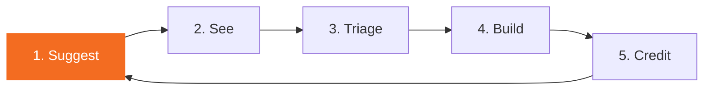

# Users are the moat

Three years ago a software company's moat was code. Two years ago it was the framework. Last year it was the data and the integrations. None of those moats hold any more. This doc explains what we believe the new moat is, and the system we build around it.

## The argument

**Code is commoditised.** Claude, ChatGPT, Grok, Qwen and Mistral can ship a working feature from a prompt. The technical bar to "build it yourself" has collapsed. We don't compete on lines of code.

**Open specs are commoditised.** OpenSpec is a public format. Anyone can write specs and feed them to an LLM. Our spec workflow is good practice, not a secret.

**Frameworks are commoditised.** Nextcloud is open source. Vue is open source. Our component library is EUPL. A competitor can fork it tonight.

**Business intelligence is commoditised.** Specter is one of many tender-scraping pipelines. Tender data, competitor analysis, requirement clusters: all reproducible.

What is **not** commoditised is **the actual humans using our product**, the **way they use it**, and the **things they tell us they need**. That information lives in one place: with us. Nobody else can read their minds. Nobody else sees their pain.

That makes user input the moat. Not code, not specs, not frameworks. **What we know about our users, sooner than anyone else.**

## What that means for the product

If user input is the moat, every part of the product must be tuned to one job: **make user input flow to us at the lowest possible friction, then turn it into shipped software faster than anyone else can.**

We've already built the front half (people can suggest things from inside the app). This strategy doc names the back half (how we turn suggestions into shipped code with their name on it) and locks the contract.

## The flywheel

Five steps. Each one feeds the next. Break any one and the moat leaks.



### 1. Suggest, effortlessly

The user must be able to suggest a feature from anywhere they are inside the product. No login wall, no separate ticket system, no email back-and-forth.

The modal offers **two submission paths**. The user picks which one suits them:

**Path A: continue on GitHub (attribution, preferred).** The modal collects the user's wording + the auto-detected context, then opens GitHub's New-Issue form in a new tab with **every field pre-populated** via deep-link URL parameters. The user reviews, edits anything they want, and clicks "Submit new issue" on github.com. The issue is posted under their **own GitHub account** — real attribution, `Co-Authored-By` trailer when the feature ships, public credit on the contributors page, live follow on comments/reactions/status labels. No app-side PAT, no proxy write path, GitHub's own form-validation rules apply.

```
https://github.com/<owner>/<repo>/issues/new?template=feature-request.yml
  &title=[FEATURE]+Filter+contacts+by+last+interaction+date
  &problem=I+want+to+filter+contacts+by+last+interaction...
  &proposed-solution=A+date-range+filter+in+the+contacts+list+sidebar...
  &who-benefits=Account+managers+tracking+client+engagement
  &priority-to-you=Would+use+weekly
  &app=pipelinq
  &page=clients-index+(/clients)
  &surface=contacts-list-sidebar
  &object=pipelinq+%C2%B7+Client
  &spec-ref=client-management
```

Each field maps to the `id:` declared in `feature-request.yml`. The user clicks "Continue on GitHub" in the modal; we `window.open()` the URL; GitHub renders the form with everything filled in; user submits or edits. The whole flow lives in the user's browser. We never see the PAT and we never touch the issue's author identity.

**Path B: send to Conduction (no GitHub account needed).** Same modal form, but the submission goes to a `Contactmoment` on our own Pipelinq instance over an authenticated NC channel. No GitHub account, no public exposure. The Conduction team triages internally and, if escalated, manually relays it to GitHub on the submitter's behalf. Status updates flow back to the submitter via the same `Contactmoment` so they can follow it inside their app without leaving the workflow. The right choice for customers who don't want to manage another account or whose org policy forbids public posting.

What we ship today:

- **In-product "+ Suggest feature" button** in every app's header (via `CnFeaturesAndRoadmapView`). One click, one modal, markdown supported.
- **GitHub proxy write path** in OpenRegister (`POST /api/github/issues`). Currently the only submission path the modal uses. It works but it posts under an app-level PAT, so the author of the GitHub issue is "the OpenRegister bot", not the user. Will be deprecated once Path A (deep-link) ships — see below.
- **Capability context** travels with the suggestion. When a user opens the modal from a page or widget that declares `specRef` (via the `useSuggestFeatureAction` composable), the issue is tagged with the capability slug so we know which part of the app inspired it.

What we still need:

- **Path A deep-link rebuild.** The CnSuggestFeatureModal stops POSTing to OR's proxy on the GitHub side. Instead it constructs the GitHub Issue Form deep-link URL (template + every field as a URL parameter), and `window.open()`s it. The user reviews + submits on github.com under their own account. Real attribution. Once this ships, OR's `POST /api/github/issues` endpoint can be deprecated (or kept as a fallback for headless flows).
- **Full context capture.** The modal must collect every reactive context provider in scope and write the values into the deep-link URL: `app`, `page`, `modal-or-widget`, `object-in-focus`, `spec-ref`. Right now only `spec-ref` is captured. See the [Auto-captured context table](#auto-captured-context-filled-by-the-in-product-modal) for what each field unlocks.
- **Path B wiring** — a new pipelinq endpoint `POST /apps/pipelinq/api/feature-requests` that creates a `Contactmoment` of type `feature_request_proxy`. The CnSuggestFeatureModal grows a `submitMode: 'github' | 'conduction'` toggle. When `'github'`, the modal opens the deep-link (Path A). When `'conduction'`, it posts to pipelinq; pipelinq surfaces the request in the regular CRM contact-moment view so account managers see it next to their existing customer conversations.
- **Status mirror for Path B**: when a maintainer escalates a `Contactmoment` to a real GitHub issue, the contact-moment's status field syncs with the issue's status label. The submitter sees the same state machine inside their app as a Path A submitter sees on GitHub.
- **Draft persistence.** Path A involves a hand-off to GitHub. If the user closes that tab without submitting, the typed content is lost. The modal should persist the in-flight form to `localStorage` keyed by `appId + pageId` so reopening the modal restores the draft.
- **Quick suggestion from anywhere.** A keyboard shortcut (`?` or `Ctrl+/`) that opens the modal regardless of route.
- **Support-rep conversion.** When a customer support conversation surfaces a feature request, the support rep can convert the `Contactmoment` to a roadmap suggestion with one click. No copy-paste.

### 2. See, transparently

The user must see what happened to their suggestion. A black hole kills the flywheel.

What we ship today:

- **Roadmap surface** inside every app (`/features-roadmap`) showing every open `enhancement` or `feature` issue, sorted by reaction count.
- **GitHub reactions** as the voting mechanism. Other users +1 the issue, the count is visible inline.
- **Status labels** (`triaged`, `ready-to-build`, `in-progress`, `released`) drive a visible status badge on each card.

What we still need:

- **"You suggested this"** marker on cards where the submitter is the viewing user.
- **Email or in-app notification** when a suggestion changes status (triaged, scheduled, shipped, declined-with-reason). Right now contributors only know if they remember to check GitHub.

### 3. Triage, within 24 hours

Suggestions sit on the roadmap until a maintainer triages them. Triage is the bottleneck so it must be fast, public, and consistent.

Triage rules:

- **Every suggestion is triaged within 24 hours of arrival.** Not "we'll look at it next sprint". 24 hours, including weekends (an on-rotation maintainer owns the queue). Contributors feel heard while their interest is still hot.
- Each suggestion exits triage with **one** of four labels:
  - `ready-to-build`: scoped well enough to spec, no blockers, fits the app's direction. Will be picked up by the build half of the flywheel.
  - `needs-design`: good idea, but the shape isn't clear yet. Triggers a design conversation; reopens for re-triage after.
  - `parking-lot`: out of scope for the current quarter but worth keeping. Reviewed quarterly.
  - `wont-build`: with a public reason. We explain ourselves; we don't ghost.
- **First-touch acknowledgement is automated.** A workflow on `.github` watches new `feature` issues across the fleet, posts a "thanks, we'll triage within 24h" comment, and assigns the on-rotation maintainer. Zero manual work to keep the SLA.

### 4. Build, automatically

This is where the AI compounding kicks in. Triaged `ready-to-build` issues should become shipped software with as little manual orchestration as we can stomach.

The contract:

- An issue labelled `ready-to-build` triggers an **openspec change** auto-scaffolded by `/opsx-new`. Title, body, and labels seed the proposal.
- **Hydra picks up the change** in its standard pipeline. Builder agent writes code against the spec, reviewer agent audits, fixer agent retries on failures.
- **CI gates as published**: PHPCS, PHPMD, Psalm, PHPStan, ESLint, PHPUnit, Playwright. All thirteen Hydra mechanical gates.
- **Auto-merge** when all gates green AND the change is `size: small` (manifest, fewer than 200 LoC delta, no new schemas, no breaking changes). Anything larger requires a human-pressed merge button.
- **Release** rides the existing per-branch flow. The shipped feature carries a link back to the originating issue.

We don't promise that every suggestion ends here. We do promise that everything labelled `ready-to-build` reaches a draft PR within days, not months.

### 5. Credit, generously

This is the part where the rewards live. The contributor must feel that their suggestion mattered, beyond the +1 count.

Three forms of credit, all already mechanically possible:

- **Co-authorship on the spec.** When an openspec change is scaffolded from a user-suggested issue, the contributor's GitHub login goes in the spec's frontmatter `contributors: [<login>]`. Their name lives in the repo forever.
- **`Co-Authored-By:` trailer on the merge commit.** GitHub renders the trailer on the contributor's profile as a real commit. Their contribution shows up in their public graph.
- **Hall of fame on the app's docs site.** Each app's `/contributors` page (rendered from the openspec changes' contributor metadata) lists every person who's shipped an idea, with their avatar, the features they sparked, and a link to the released versions.

Plus one private piece:

- **Conduction Contributors Slack.** Everyone who lands a `ready-to-build` issue gets an invite. Direct line to the maintainers, early peek at the roadmap, voice in the prioritisation. The kind of access that money can't buy.

What we **don't do**: monetary bounties. They drag in legal complexity, attract gaming, and dilute the signal. Recognition + access scales better and selects for contributors who care about the product instead of the cheque.

## Pipelinq pilot

Pipelinq is the pilot for the full flywheel. Why pipelinq:

- It's pre-production so we can break things while we learn.
- It has the cleanest openspec coverage (18 implemented capabilities).
- The Features & Roadmap surface is wired and live.
- The user base is engaged enough to give us signal and small enough to keep the support load light.

Pilot duration: **four weeks** from the date this doc lands.

Pilot success criteria:

- ≥ 10 user-suggested issues filed across the four weeks (Path A + Path B combined).
- **100% of suggestions acknowledged within 24 hours** (automated via the `.github` triage workflow; if the bot fails, the pilot fails).
- ≥ 50% of triaged `ready-to-build` issues have a PR open within five working days.
- ≥ 1 user-suggested feature shipped to `beta` with the contributor's `Co-Authored-By` trailer.
- ≥ 1 Path B `Contactmoment` successfully escalated to a GitHub issue with the status mirror intact.

Pilot exit:

- If success criteria are met, we roll the flywheel to the rest of the production-ready apps (decidesk, openbuilt, scholiq, procest, openregister, docudesk).
- If criteria are missed, the retrospective lives at `.github/docs/hydra/retrospectives/` and informs the next iteration.

## Rollout sequence after pipelinq

The fleet rollout is per-app, not big-bang. Each app gates on the pilot's lessons.

| Wave | Apps | Trigger |
|------|------|---------|
| 1 (pilot) | pipelinq | This doc lands |
| 2 | decidesk, openbuilt | Pilot exit, success |
| 3 | scholiq, procest, docudesk | Wave 2 hits 4 weeks |
| 4 | openregister, opencatalogi | Wave 3 hits 4 weeks |
| 5 | softwarecatalog, larpingapp, zaakafhandelapp | Wave 4 hits 4 weeks |

Per-app cost to enter the rollout: configure the four triage labels, add the app's GitHub repo to the existing `CnFeaturesAndRoadmapView` config (already declarative in `manifest.json`), wire the auto-build trigger workflow (org-wide, one-time).

## Issue Types and Issue Forms — org-level intake

GitHub gives us two complementary mechanisms for capturing user input. Both live in the `.github` repo so every fleet repo inherits them automatically.

**Issue Types** are an organisation-level GitHub feature. We define a fixed list at the org (`Feature`, `Bug`, `Documentation`, `Support`, `Spec`) and every repo across `ConductionNL/*` picks from that list when filing an issue. One taxonomy, one report, one triage queue. Configured once at `https://github.com/organizations/ConductionNL/settings/issue-types`.

**Issue Forms** (the YAML files under `.github/ISSUE_TEMPLATE/`) define the *shape* of an issue's body. GitHub automatically falls back to the `.github` repo's templates when a child repo has no templates of its own. We already ship three (`bug-report.yml`, `user-story.yml`, `technical-task.yml`); we add a fourth — `feature-request.yml` — tuned to feed an OpenSpec proposal directly.

The feature-request form captures two kinds of content. **User-written** content describes the problem and the desired solution. **Auto-captured context** describes *where in the product the user was* when the idea hit. Together they're enough to scaffold an OpenSpec proposal with no second interview.

### User-written fields

| Form field | Maps to proposal section |
|---|---|
| **Problem** (required) | `## Why` — the friction the user wants gone |
| **Proposed solution** (required) | `## What Changes` — the user's sketch of how it should work |
| **Who benefits** (required) | informs `## Affected Projects` + scoping |
| **How important is this to you?** (dropdown) | informs triage prioritisation, not the proposal itself |
| **Anything else?** (optional) | `## Out of Scope` + design notes |

### Auto-captured context (filled by the in-product modal)

When a user clicks **+ Suggest feature** from inside the app, the modal harvests every reactive context provider in scope and writes the values into the form before it submits. The user can edit the auto-filled values, but they almost never need to.

| Context field | Where it comes from | What the spec workflow does with it |
|---|---|---|
| **App** | manifest `appId` from `cnAiContext` | Routes the issue to the right GitHub repo; tags the proposal with the consuming app |
| **Page** | manifest `pageId` + `$route.path` | Locates the suggestion in the app's IA; surfaces the existing page's spec as a sibling for the new proposal |
| **Modal or widget** | open modal name, active dashboard widget id, or current sidebar tab | Distinguishes "feature for this dialog" from "feature for this whole page"; helps the spec author scope correctly |
| **Object in focus** | active `register` + `schema` + `objectId` from `cnAiContext` | Anchors the proposal to a real data shape; spec author knows whether the change touches schema, ACLs, or workflow |
| **Related capability** | nearest ancestor's `$options.specRef` or `route.meta.specRef` | Pre-fills the proposal's `## Capabilities` block — if the existing capability covers the suggestion, the spec becomes a modification delta instead of a new capability |

The capture is **transparent**: every value lands as a visible form field in the rendered issue body, the user can correct any of them before submitting, and a GitHub reader sees exactly what context the maintainer sees. No hidden HTML comments, no opaque metadata blocks.

### How this becomes a proposal

When a maintainer applies the `ready-to-build` label, the `ready-to-build → openspec change` workflow:

1. Reads the form fields out of the issue body via a markdown parser.
2. Picks the right repo using the **App** field.
3. Scaffolds an OpenSpec change in that repo whose `proposal.md` reuses the user's wording verbatim under `## Why` and `## What Changes`.
4. Fills `## Affected Projects` from **Who benefits** + **Object in focus**.
5. Seeds `## Capabilities` from **Related capability** if set, otherwise leaves it for the spec author to decide between "new capability" and "modify existing".
6. Adds a `## Context` block at the bottom citing the **Page**, **Modal or widget**, and **Object in focus** so reviewers can see exactly where the request came from.
7. Hands off to Hydra.

The proposal is ready to read in under a minute. Hydra picks it up; the user sees the draft change appear on their roadmap card; the loop closes.

## Org-level abstractions we own (or owe)

Everything below sits in the `.github` repo so every app inherits the same shape.

What we already own:

- `CnFeaturesAndRoadmapView` + `CnFeaturesAndRoadmapSidebar` + `CnFeaturesAndRoadmapPage` in `@conduction/nextcloud-vue`. The in-product suggest + roadmap surface.
- `GitHubIssuesController` + `GitHubGuards` in `openregister`. **GET** half is the read endpoint that powers the Roadmap card grid (anonymous reads on public repos, allowed-owners gate). **POST** half is the current Path A write endpoint, slated for deprecation once the deep-link rebuild ships — the deep-link approach posts under the user's own GitHub identity instead of OR's app-PAT.
- `/opsx-new`, `/opsx-ff`, `/opsx-apply` skills. The spec workflow.
- Hydra pipeline. The build half.
- Features Extract workflow stage in `.github/workflows/quality.yml`. The openspec-to-docs pipeline.
- Issue Forms in `.github/ISSUE_TEMPLATE/` (`bug-report`, `user-story`, `technical-task`) inherited fleet-wide.

What we still owe (in priority order):

1. **Org-level Issue Types** configured at `ConductionNL` settings (`Feature` / `Bug` / `Documentation` / `Support` / `Spec`). One-time admin action, not code. All repos see the new taxonomy immediately.
2. **`feature-request.yml` Issue Form** in `.github/ISSUE_TEMPLATE/` with the five user-written + five auto-filled context fields. Lands with this strategy doc.
3. **Path A deep-link rebuild.** The `CnSuggestFeatureModal` (in `@conduction/nextcloud-vue`) stops POSTing to OR's proxy on the GitHub side. Instead it constructs the GitHub Issue Form deep-link URL with every field as a URL parameter, persists the draft to `localStorage`, and `window.open()`s the URL. The user reviews + submits on github.com under their own account. Real attribution, no app PAT, no proxy write traffic.
4. **Modal context capture.** Alongside the deep-link rebuild, the modal injects the full reactive context — `cnAiContext.appId`, manifest `pageId`, `$route.path`, open modal name, active widget id, register/schema/objectId, ancestor `specRef` — and writes the values into the matching deep-link query parameters. Without this, the form's context block stays empty for in-product submissions.
5. **Triage workflow on `.github`.** Watches new `Feature`-type issues across the fleet, posts the 24h-SLA acknowledgement, and assigns the on-rotation maintainer. Closes the same-day-touch promise.
6. **`ready-to-build` → openspec change automation.** When a maintainer applies the `ready-to-build` label, a workflow reads both the user-written fields and the context block out of the issue body, fills an OpenSpec proposal template (including a `## Context` block citing page, modal/widget, and object-in-focus), opens a draft change, and hands off to Hydra.
7. **Path B intake.** Pipelinq endpoint `POST /apps/pipelinq/api/feature-requests` that creates a `Contactmoment` of type `feature_request_proxy` from the modal's `submitMode: 'conduction'` branch. Carries the same context payload. Includes status-mirror sync so submitters see real-time state inside their app.
8. **OR proxy write-path deprecation.** Once Path A deep-link is live across the fleet, `POST /api/github/issues` on OpenRegister is marked deprecated. Kept on the codebase for one minor version for headless integrations, then removed. `github_api_token` config key becomes optional and can be dropped from new installs.
9. **Hall-of-fame Docusaurus page.** A new `@conduction/docusaurus-preset` plugin that scans every committed openspec change for a `contributors:` frontmatter and renders an alphabetical hall of fame at `/contributors`.
10. **Contributors Slack invite automation.** When a user's first `ready-to-build` issue merges, a workflow posts to a maintainer channel with their GitHub login + suggested invite text. We send the invite manually; the workflow surfaces the prompt.
11. **Notification on status change.** Email or in-app banner when a contributor's issue moves between status labels. Closes the loop the user sees in step 2. Also feeds Path B's status mirror.

Each owe-item is its own openspec change. None blocks the pipelinq pilot from starting.

## Why this is uncopyable

A competitor can copy our code, our specs, our framework, our intelligence. They cannot copy our **users**, their **conversations**, their **edge cases**, or their **trust** to keep telling us what's missing.

The flywheel above turns those conversations into shipped software with the user's name on it. That generates more trust. That generates more conversation. That generates the next feature. **That** is the moat, and it grows wider every time the flywheel turns.

## Open questions (deferred)

- **Spam guard.** Right now any authenticated NC user on any instance running our app can post to the GitHub proxy. Rate limit is per-user 60s. Does that scale once we have hundreds of installs?
- **Multi-language suggestions.** Most users write Dutch. GitHub issues are mostly English. Do we translate, or do we accept and respond in the submitter's language?
- **Cross-app suggestions.** A user in pipelinq might suggest something that belongs in openregister. How does the suggestion travel?
- **Decline reasons.** "Wont-build" with a reason: free text, or a fixed taxonomy (out of scope, duplicate, conflicts with strategy, technical limit)?
- **Feature-size scoring.** "Auto-merge if `size: small`": who labels the size, and based on what heuristic? Hydra's reviewer agent could assign it.

Each open question is worth one short follow-up doc once the pilot generates real data.

## Reference

- Architecture: [ADR-033 Features & Roadmap menu](https://codeberg.org/Conduction/hydra/blob/development/openspec/architecture/adr-033-features-roadmap-menu.md) (proposed)
- Frontend contract: [`CnFeaturesAndRoadmapView`](https://conduction.github.io/nextcloud-vue/components/cn-features-and-roadmap-view) in `@conduction/nextcloud-vue`
- Backend contract: [`github-issue-proxy`](https://codeberg.org/Conduction/openregister/tree/development/openspec/changes/add-features-roadmap-menu) in openregister
- Spec workflow: [Spec-Driven Development](./WayOfWork/spec-driven-development) on this site
- Pipeline: [Hydra](./hydra/README) on this site
