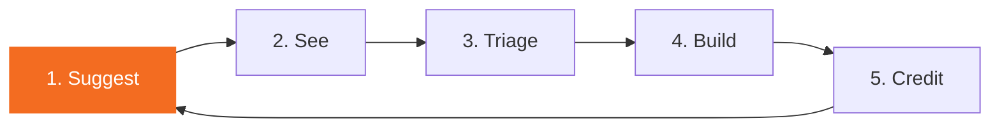

# Users are the moat

Three years ago a software company's moat was code. Two years ago it was the framework. Last year it was the data and the integrations. None of those moats hold any more. This doc explains what we believe the new moat is, and the system we build around it.

## The argument

**Code is commoditised.** Claude, ChatGPT, Grok, Qwen and Mistral can ship a working feature from a prompt. The technical bar to "build it yourself" has collapsed. We don't compete on lines of code.

**Open specs are commoditised.** OpenSpec is a public format. Anyone can write specs and feed them to an LLM. Our spec workflow is good practice, not a secret.

**Frameworks are commoditised.** Nextcloud is open source. Vue is open source. Our component library is EUPL. A competitor can fork it tonight.

**Business intelligence is commoditised.** Specter is one of many tender-scraping pipelines. Tender data, competitor analysis, requirement clusters: all reproducible.

What is **not** commoditised is **the actual humans using our product**, the **way they use it**, and the **things they tell us they need**. That information lives in one place: with us. Nobody else can read their minds. Nobody else sees their pain.

That makes user input the moat. Not code, not specs, not frameworks. **What we know about our users, sooner than anyone else.**

## What that means for the product

If user input is the moat, every part of the product must be tuned to one job: **make user input flow to us at the lowest possible friction, then turn it into shipped software faster than anyone else can.**

We've already built the front half (people can suggest things from inside the app). This strategy doc names the back half (how we turn suggestions into shipped code with their name on it) and locks the contract.

## The flywheel

Five steps. Each one feeds the next. Break any one and the moat leaks.

### 1. Suggest, effortlessly

The user must be able to suggest a feature from anywhere they are inside the product. No login wall, no separate ticket system, no email back-and-forth.

What we ship today:

- **In-product "+ Suggest feature" button** in every app's header (via `CnFeaturesAndRoadmapView`). One click, one modal, markdown supported.
- **Suggestion lands as a GitHub issue** on the app's repository, labelled `enhancement` + `feature`, with the submitter's Nextcloud account name attributed.
- **Per-feature context** travels with the suggestion. When a user opens the modal from a specific widget or page (via the `useSuggestFeatureAction` composable's `specRef`), the issue is tagged with the capability slug so we know which part of the app inspired it.

What we still need:

- **Quick suggestion from anywhere.** A keyboard shortcut (`?` or `Ctrl+/`) that opens the modal regardless of route.
- **Email or in-app inbox** when a customer support conversation surfaces a feature request, the support rep can convert it to a roadmap suggestion with one click. No copy-paste.

### 2. See, transparently

The user must see what happened to their suggestion. A black hole kills the flywheel.

What we ship today:

- **Roadmap surface** inside every app (`/features-roadmap`) showing every open `enhancement` or `feature` issue, sorted by reaction count.
- **GitHub reactions** as the voting mechanism. Other users +1 the issue, the count is visible inline.
- **Status labels** (`triaged`, `ready-to-build`, `in-progress`, `released`) drive a visible status badge on each card.

What we still need:

- **"You suggested this"** marker on cards where the submitter is the viewing user.
- **Email or in-app notification** when a suggestion changes status (triaged, scheduled, shipped, declined-with-reason). Right now contributors only know if they remember to check GitHub.

### 3. Triage, fast and explicit

Suggestions sit on the roadmap until a maintainer triages them. Triage is the bottleneck so it must be fast and the criteria must be public.

Triage rules:

- A maintainer reviews new suggestions **weekly**. Not daily, not monthly. Weekly is fast enough to keep contributors engaged and slow enough to batch the decisions.
- Each suggestion exits triage with **one** of four labels:
  - `ready-to-build`: scoped well enough to spec, no blockers, fits the app's direction. Will be picked up by the build half of the flywheel.
  - `needs-design`: good idea, but the shape isn't clear yet. Triggers a design conversation; reopens for re-triage after.
  - `parking-lot`: out of scope for the current quarter but worth keeping. Reviewed quarterly.
  - `wont-build`: with a public reason. We explain ourselves; we don't ghost.
- **Same-day acknowledgement** even if the triage is "we'll look at this Friday". Contributors hear from us within 24 hours.

### 4. Build, automatically

This is where the AI compounding kicks in. Triaged `ready-to-build` issues should become shipped software with as little manual orchestration as we can stomach.

The contract:

- An issue labelled `ready-to-build` triggers an **openspec change** auto-scaffolded by `/opsx-new`. Title, body, and labels seed the proposal.
- **Hydra picks up the change** in its standard pipeline. Builder agent writes code against the spec, reviewer agent audits, fixer agent retries on failures.
- **CI gates as published**: PHPCS, PHPMD, Psalm, PHPStan, ESLint, PHPUnit, Playwright. All thirteen Hydra mechanical gates.
- **Auto-merge** when all gates green AND the change is `size: small` (manifest, fewer than 200 LoC delta, no new schemas, no breaking changes). Anything larger requires a human-pressed merge button.
- **Release** rides the existing per-branch flow. The shipped feature carries a link back to the originating issue.

We don't promise that every suggestion ends here. We do promise that everything labelled `ready-to-build` reaches a draft PR within days, not months.

### 5. Credit, generously

This is the part where the rewards live. The contributor must feel that their suggestion mattered, beyond the +1 count.

Three forms of credit, all already mechanically possible:

- **Co-authorship on the spec.** When an openspec change is scaffolded from a user-suggested issue, the contributor's GitHub login goes in the spec's frontmatter `contributors: [<login>]`. Their name lives in the repo forever.
- **`Co-Authored-By:` trailer on the merge commit.** GitHub renders the trailer on the contributor's profile as a real commit. Their contribution shows up in their public graph.
- **Hall of fame on the app's docs site.** Each app's `/contributors` page (rendered from the openspec changes' contributor metadata) lists every person who's shipped an idea, with their avatar, the features they sparked, and a link to the released versions.

Plus one private piece:

- **Conduction Contributors Slack.** Everyone who lands a `ready-to-build` issue gets an invite. Direct line to the maintainers, early peek at the roadmap, voice in the prioritisation. The kind of access that money can't buy.

What we **don't do**: monetary bounties. They drag in legal complexity, attract gaming, and dilute the signal. Recognition + access scales better and selects for contributors who care about the product instead of the cheque.

## Pipelinq pilot

Pipelinq is the pilot for the full flywheel. Why pipelinq:

- It's pre-production so we can break things while we learn.
- It has the cleanest openspec coverage (18 implemented capabilities).
- The Features & Roadmap surface is wired and live.
- The user base is engaged enough to give us signal and small enough to keep the support load light.

Pilot duration: **four weeks** from the date this doc lands.

Pilot success criteria:

- ≥ 10 user-suggested issues filed across the four weeks.
- ≥ 50% of triaged `ready-to-build` issues have a PR open within five working days.
- ≥ 80% of contributors receive their first acknowledgement within 24 hours.
- ≥ 1 user-suggested feature shipped to `beta` with the contributor's `Co-Authored-By` trailer.

Pilot exit:

- If success criteria are met, we roll the flywheel to the rest of the production-ready apps (decidesk, openbuilt, scholiq, procest, openregister, docudesk).
- If criteria are missed, the retrospective lives at `.github/docs/hydra/retrospectives/` and informs the next iteration.

## Rollout sequence after pipelinq

The fleet rollout is per-app, not big-bang. Each app gates on the pilot's lessons.

| Wave | Apps | Trigger |
|------|------|---------|
| 1 (pilot) | pipelinq | This doc lands |
| 2 | decidesk, openbuilt | Pilot exit, success |
| 3 | scholiq, procest, docudesk | Wave 2 hits 4 weeks |
| 4 | openregister, opencatalogi | Wave 3 hits 4 weeks |
| 5 | softwarecatalog, larpingapp, zaakafhandelapp | Wave 4 hits 4 weeks |

Per-app cost to enter the rollout: configure the four triage labels, add the app's GitHub repo to the existing `CnFeaturesAndRoadmapView` config (already declarative in `manifest.json`), wire the auto-build trigger workflow (org-wide, one-time).

## Org-level abstractions we own (or owe)

Everything below sits in the `.github` repo so every app inherits the same shape.

What we already own:

- `CnFeaturesAndRoadmapView` + `CnFeaturesAndRoadmapSidebar` + `CnFeaturesAndRoadmapPage` in `@conduction/nextcloud-vue`. The in-product suggest + roadmap surface.
- `GitHubIssuesController` + `GitHubGuards` in `openregister`. The proxy that turns the modal into a GitHub issue.
- `/opsx-new`, `/opsx-ff`, `/opsx-apply` skills. The spec workflow.
- Hydra pipeline. The build half.
- Features Extract workflow stage in `.github/workflows/quality.yml`. The openspec-to-docs pipeline.

What we still owe (in priority order):

1. **Triage workflow on `.github`.** A reusable workflow that watches new `enhancement` or `feature` issues across the fleet, posts a same-day acknowledgement, and surfaces them in a single triage queue for the weekly maintainer review.
2. **`ready-to-build` → openspec change automation.** When a maintainer applies the `ready-to-build` label, a workflow opens a draft openspec change with the issue body as proposal seed. Hydra takes over from there.
3. **Hall-of-fame Docusaurus page.** A new `@conduction/docusaurus-preset` plugin that scans every committed openspec change for a `contributors:` frontmatter and renders an alphabetical hall of fame at `/contributors`.
4. **Contributors Slack invite automation.** When a user's first `ready-to-build` issue merges, a workflow posts to a maintainer channel with their GitHub login + suggested invite text. We send the invite manually; the workflow surfaces the prompt.
5. **Notification on status change.** Email or in-app banner when a contributor's issue moves between status labels. Closes the loop the user sees in step 2.

Each of the five owe-items is its own openspec change. None blocks the pipelinq pilot from starting.

## Why this is uncopyable

A competitor can copy our code, our specs, our framework, our intelligence. They cannot copy our **users**, their **conversations**, their **edge cases**, or their **trust** to keep telling us what's missing.

The flywheel above turns those conversations into shipped software with the user's name on it. That generates more trust. That generates more conversation. That generates the next feature. **That** is the moat, and it grows wider every time the flywheel turns.

## Open questions (deferred)

- **Spam guard.** Right now any authenticated NC user on any instance running our app can post to the GitHub proxy. Rate limit is per-user 60s. Does that scale once we have hundreds of installs?
- **Multi-language suggestions.** Most users write Dutch. GitHub issues are mostly English. Do we translate, or do we accept and respond in the submitter's language?
- **Cross-app suggestions.** A user in pipelinq might suggest something that belongs in openregister. How does the suggestion travel?
- **Decline reasons.** "Wont-build" with a reason: free text, or a fixed taxonomy (out of scope, duplicate, conflicts with strategy, technical limit)?
- **Feature-size scoring.** "Auto-merge if `size: small`": who labels the size, and based on what heuristic? Hydra's reviewer agent could assign it.

Each open question is worth one short follow-up doc once the pilot generates real data.

## Reference

- Architecture: [ADR-033 Features & Roadmap menu](https://github.com/ConductionNL/hydra/blob/development/openspec/architecture/adr-033-features-roadmap-menu.md) (proposed)
- Frontend contract: [`CnFeaturesAndRoadmapView`](https://conduction.github.io/nextcloud-vue/components/cn-features-and-roadmap-view) in `@conduction/nextcloud-vue`
- Backend contract: [`github-issue-proxy`](https://github.com/ConductionNL/openregister/tree/development/openspec/changes/add-features-roadmap-menu) in openregister
- Spec workflow: [Spec-Driven Development](./WayOfWork/spec-driven-development) on this site
- Pipeline: [Hydra](./hydra/README) on this site
