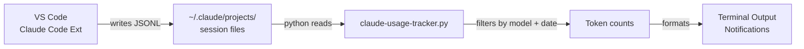

# Claude Usage Tracker for VS Code

Make **Claude token usage limits visible inside VS Code** with real-time monitoring, status indicators, and smart notifications.

**All commands run from the project root.**

## Features

| Feature | Details |
|---------|---------|
| 🟢 **Color-coded Status** | Live indicator: 🔵 0% · 🟢 active · 🟡 50%+ · 🟠 75%+ · 🔴 90%+ · ⚫ 99%+ |
| 📊 **Detailed Reports** | Session tokens (last ~5h), input/output split, weekly totals |
| 🔔 **Smart Notifications** | Alerts at 25%, 50%, 75%, 90% thresholds |
| ⚡ **Continuous Monitoring** | Real-time tracking with configurable refresh intervals |
| 📈 **Multi-Model Support** | Haiku, Sonnet, and Opus with model-specific limits |

---

## How It Works

The Claude Code extension writes full API responses (including token counts) to `~/.claude/projects/**/*.jsonl` as you work. The tracker reads those files directly — no log configuration needed, no extensions to install beyond Claude Code itself.

**What gets tracked:** every Claude Code API call made through VS Code (slash commands, agent tasks, inline chat). Today's usage and this week's running total are both shown.

> **Cursor user?** The tracker works identically in Cursor — see the note at the bottom of [SETUP.md](SETUP.md).

---

## What's Included

```
usage-tracker/
├── claude-usage-tracker.py    ← Main tracker script
├── claude-track.py            ← CLI launcher wrapper
├── install.sh                 ← Installation script
├── limits.json                ← Your plan limits (git-ignored, copy from limits.example.json)
├── limits.example.json        ← Template with default limits
├── SETUP.md                   ← Complete setup guide
├── QUICKSTART.md              ← 30-second quick start
├── MODELS.md                  ← Multi-model tracking guide
├── vscode-settings.json       ← Recommended VS Code settings
├── Makefile                   ← Convenient make commands
└── logs/                      ← Runtime data (git-ignored)
    ├── session.json           ← Last saved session snapshot (auto-created)
    └── session-state.json     ← Calibrated session reset time (auto-created)
```

---

## Quick Start (2 Minutes)

### 1. Install

```bash
bash usage-tracker/install.sh
```

### 2. Test

```bash
# Quick status
python3 usage-tracker/claude-usage-tracker.py --status-bar

# Full report
python3 usage-tracker/claude-usage-tracker.py

# Live monitoring
python3 usage-tracker/claude-usage-tracker.py --monitor
```

---

## Usage

All commands run from the project root:

### Command Options

```bash
# Show one-time report (Sonnet)
python3 usage-tracker/claude-usage-tracker.py

# Show all three models at once
python3 usage-tracker/claude-usage-tracker.py --all-models

# Compact status bar (single model)
python3 usage-tracker/claude-usage-tracker.py --status-bar

# Compact status bar (all models)
python3 usage-tracker/claude-usage-tracker.py --status-bar --all-models

# Continuous monitoring — one model
python3 usage-tracker/claude-usage-tracker.py --monitor

# Continuous monitoring — all models, 30s refresh
python3 usage-tracker/claude-usage-tracker.py --monitor --all-models --interval 300

# Show configured limits
python3 usage-tracker/claude-usage-tracker.py --limits

# Hide models with no usage
python3 usage-tracker/claude-usage-tracker.py --monitor --all-models --active-only

# Track a specific model
python3 usage-tracker/claude-usage-tracker.py --model haiku --status-bar

# Calibrate session at start of a new session
python3 usage-tracker/claude-usage-tracker.py --mark-session-start

# Calibrate session reset time (when claude.ai/settings/usage shows a known remaining time)
python3 usage-tracker/claude-usage-tracker.py --set-session-reset "4h 50m"
```

### Via Make Commands
```bash
make -C usage-tracker report              # Full report
make -C usage-tracker status              # Status bar
make -C usage-tracker monitor             # Monitor (60s)
make -C usage-tracker monitor-fast        # Monitor (10s)
make -C usage-tracker test                # Test setup
```

---

## Integration with VS Code

### Option A: Terminal Panel (Easiest)
1. Open Terminal: `` Ctrl + ` ``
2. Run: `python3 usage-tracker/claude-usage-tracker.py --monitor`
3. Keep panel open for live updates

### Option B: VS Code Task (Recommended)
1. `Ctrl + Shift + P` → `Tasks: Open User Tasks`
2. Add task from `SETUP.md` — it auto-starts when you open the workspace
3. Run manually: `Ctrl + Shift + P` → `Tasks: Run Task` → `Claude Usage Monitor`

### Option C: Custom Keyboard Shortcut
Add to VS Code `keybindings.json`:
```json
{
  "key": "ctrl+shift+u",
  "command": "workbench.action.tasks.runTask",
  "args": "Claude Usage Monitor"
}
```

---

## Output Examples

### Status bar — all models (`--all-models`)
```
─── 16:42:17 UTC ─── Session: 1h 33m elapsed  ·  3h 27m until reset  ·  5h (calibrated)
🟢🟢  All Models    │   83.6K ss │   2.34M wk │ Sess~:  10.0% │ Week~:  10.4% (cfg)
🟢🟢  Claude Haiku  │   18.6K ss │  278.8K wk │ Sess~:   1.6% │ Week~:   4.6% (cfg)
🟢🟡  Claude Sonnet │   65.0K ss │   2.06M wk │ Sess~:   5.8% │ Week~:  28.2% (cfg)
🔵🔵  Claude Opus   │  (no usage this period)
   Weekly resets: All Models in 16h 25m · Sonnet in 165h 25m
```
First circle = Session usage · Second circle = Weekly usage

`(cfg)` = your `limits.json` is loaded · `(est)` = using built-in defaults

Color scale: 🔵 0% · 🟢 >0–50% · 🟡 50–75% · 🟠 75–90% · 🔴 90–99% · ⚫ 99%+

`(X left)` is shown only when usage reaches 🟠 75%+ — at lower percentages it is omitted to keep the output clean.

`(calibrated)` in the header means the session reset time was set via `--set-session-reset`; `(approx)` means it is estimated as now − 5h.

### Full report
```
============================================================
📊 CLAUDE USAGE REPORT  —  CLAUDE SONNET
============================================================

⏰ Report time  : 2026-03-26T14:00:00 UTC
📁 Data source  : /home/you/.claude/projects
⚙️  Limits       : configured  (edit limits.json to configure)

📈 THIS SESSION (last ~5h, approx rolling window):
   Requests      : 42
   Input tokens  : 13.57K
   Output tokens : 31.66K
   Total         : 45.23K / 400.00K
   Used          : 11.3%  (354.77K remaining)

📊 THIS WEEK:
   Requests      : 312
   Total         : 45.23K / 2.00M
   Used          : 2.3%  (1.95M remaining)
============================================================
```

### Live monitoring (`--monitor --all-models`)
```
🔍 Monitoring all models — refresh every 300s  |  Ctrl+C to stop
   Circles: 1st 🟢 = Session usage  ·  2nd 🟢 = Weekly usage

─── 14:32:15 UTC ─── Session: 0h 45m elapsed  ·  4h 15m until reset  ·  5h (calibrated)
🟢🟢  All Models    │   37.43K ss │  199.50K wk │ Sess~:   4.5% │ Week~:   0.9% (cfg)
🟢🟢  Claude Haiku  │   12.00K ss │   55.00K wk │ Sess~:   1.0% │ Week~:   0.9% (cfg)
🟢🟢  Claude Sonnet │   25.43K ss │  144.50K wk │ Sess~:   2.3% │ Week~:   2.0% (cfg)
🔵🔵  Claude Opus   │  (no usage this period)
   Weekly resets: All Models in 16h 25m · Sonnet in 165h 25m

─── 14:37:15 UTC ─── Session: 0h 50m elapsed  ·  4h 10m until reset  ·  5h (approx)
🟠🟢  All Models    │  199.50K ss │    1.62M wk │ Sess~:  76.2% (338.50K left) │ Week~:   7.2% (cfg)
🟢🟢  Claude Haiku  │   12.00K ss │   55.00K wk │ Sess~:   1.0% │ Week~:   0.9% (cfg)
🟡🟢  Claude Sonnet │  187.50K ss │    1.57M wk │ Sess~:  16.7% │ Week~:  21.5% (cfg)
🔵🔵  Claude Opus   │  (no usage this period)
   Weekly resets: All Models in 16h 20m · Sonnet in 165h 20m
   🔔 Claude Sonnet weekly usage at 25% (1.57M tokens this week)
```

---

## Configuration

### Update Your Plan Limits

```bash
cp usage-tracker/limits.example.json usage-tracker/limits.json
# Edit limits.json with your values — see SETUP.md for full instructions
```

`limits.json` is git-ignored so it stays personal. The tracker shows `(cfg)` when configured and `(est)` when using defaults.

**Calibrating subscription quota limits:** divide the tracker's current token count by the percentage shown on [claude.ai/settings/usage](https://claude.ai/settings/usage). Example: tracker shows 286K tokens, page shows 24% → 286K ÷ 0.24 = ~1.2M quota limit. You can share a screenshot with Claude and it will calculate everything for you. (These are subscription quota limits, not model context windows — see [Two Kinds of Token Limits](../docs/claude/parallel-agents.md#two-kinds-of-token-limits).)

**Weekly reset times:** the "Sonnet only" and "All models" bars reset on different days — configure `weekly_reset_day` and `weekly_reset_hour_utc` in `limits.json` to get accurate weekly percentages. See [SETUP.md](SETUP.md) for the conversion guide.

### Change Notification Thresholds
Edit `claude-usage-tracker.py`:
```python
notification_percentages = [25, 50, 75, 90]
```

---

## Troubleshooting

| Issue | Solution |
|-------|----------|
| "Today: 0.0%" but you've been working | Check `ls ~/.claude/projects/` — Claude Code must be installed and have run at least once |
| Python not found | Use `python3` explicitly |
| Notifications not showing | Install `notify-send`: `sudo apt install libnotify-bin` |

For more help, see [`SETUP.md`](SETUP.md).

---

## Important Limitations

⚠️ **This tracker is an ESTIMATE ONLY**

- **Usage counts are accurate** — they come directly from the JSONL files Claude Code writes for every request
- **Limits are estimates** — Anthropic does not publish exact token budgets. You can see live usage percentages at [claude.ai/settings/usage](https://claude.ai/settings/usage), but absolute token values are not shown. Use the percentages there to calibrate your `limits.json`
- The actual structure is **session + weekly**: Anthropic tracks a "current session" limit (~5h rolling window) and two separate weekly limits — "All models" combined and "Sonnet only". The session boundary is not in the JSONL data so it is approximated as "last 5 hours"
- **Weekly windows do not reset on Monday** — configure `weekly_reset_day` and `weekly_reset_hour_utc` in `limits.json` for accurate weekly percentages (see [SETUP.md](SETUP.md)). Without this, weekly counts default to since Monday UTC which can be significantly wrong
- Edit `limits.json` to set token limits and reset times; use `--limits` to verify what is currently loaded

---

## Architecture



---

## Docs

- 📖 **[SETUP.md](SETUP.md)** — Complete installation & configuration guide
- ⚡ **[QUICKSTART.md](QUICKSTART.md)** — 30-second quick start
- 🎓 **[MODELS.md](MODELS.md)** — Multi-model tracking (Haiku, Sonnet, Opus)
- 📋 **[vscode-settings.json](vscode-settings.json)** — Recommended VS Code settings

---

## Related

- 📊 **[claude.ai/settings/usage](https://claude.ai/settings/usage)** — Your live usage percentages (session + weekly)
- 📚 **[Claude Code docs](https://docs.anthropic.com/en/docs/claude-code)** — Official documentation
