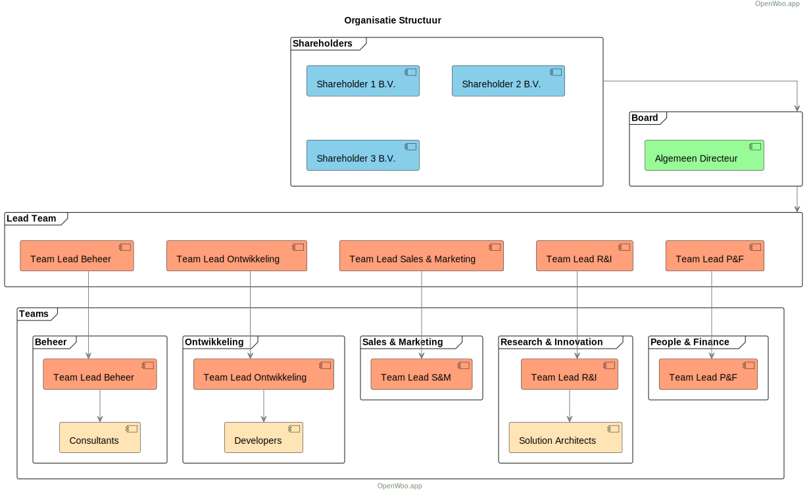

import Tabs from '@theme/Tabs';
import TabItem from '@theme/TabItem';

# Organizational Structure

At Conduction, we maintain a clear organizational structure that promotes collaboration, innovation, and efficient delivery of solutions. Here's an overview of our organization:

## Organizational Levels

### Shareholders
Our shareholder structure consists of three entities:
- Shareholder 1 B.V.
- Shareholder 2 B.V. 
- Shareholder 3 B.V.

### Board
Currently, our board consists of:
- General Director (Algemeen Directeur / Chief Executive Officer)

#### Strategic Focus
The board operates exclusively at a strategic level, focusing on:
- Long-term organizational vision and direction
- Strategic decision-making and policy development
- Overall company performance and growth
- Stakeholder relationships and accountability
- Risk management and compliance oversight
- Corporate governance

This strategic focus ensures that:
- The organization maintains its long-term vision while the Leadership Team handles operational execution
- Strategic decisions are made with consideration of market trends and organizational capabilities
- Resources are allocated in alignment with long-term objectives
- The organization maintains proper governance and oversight

#### Future Board Development
While our current board structure is intentionally lean with a single Chief Executive Officer, we have a strategic vision for board expansion that aligns with our organizational growth. This measured approach to board development ensures that our governance structure evolves in harmony with:

- **Organizational Scale**: Board expansion will parallel our company's growth in size and complexity
- **Operational Needs**: Additional board positions will be created to address specific organizational requirements
- **Market Demands**: Board composition will adapt to changing market conditions and opportunities
- **Regulatory Requirements**: Board structure will evolve to meet governance requirements as we grow

Potential future board positions may include:
- Chief Financial Officer (CFO)
- Chief Technology Officer (CTO)
- Chief Operations Officer (COO)

The timing and sequence of these additions will be carefully considered to ensure they:
- Add clear value to organizational governance
- Support sustainable growth
- Maintain efficient decision-making processes
- Provide appropriate oversight and leadership

This approach allows us to maintain agile decision-making in our current phase while having a clear vision for scaling our governance structure as the organization matures.

### Leadership Team
Our organization intentionally operates with a Leadership Team rather than a traditional Management Team. This distinction is fundamental to our organizational philosophy and way of working.

#### Leadership vs Management Approach
We believe in "first among equals" rather than traditional top-down management. Our Leadership Team members are:
- Actively involved in daily operations alongside their teams
- Leading by example and expertise rather than position
- Both team members and team leaders simultaneously
- Focused on enabling and empowering their teams

#### Operational Focus
The Leadership Team operates primarily at an operational level:
- Meets weekly to address operational concerns
- Ensures cross-team collaboration and alignment
- Resolves operational challenges
- Facilitates knowledge sharing between teams
- Implements strategic decisions in daily operations

#### Team Integration
Leadership Team members maintain a dual role:
- End responsibility for their team's performance and development
- Active participation in their team's daily work
This approach ensures leaders stay connected to operational realities while guiding their teams.

#### Expected Competencies for Leadership Team Members
- Strategic thinking: Ability to develop and implement long-term vision
- Strong leadership skills: Inspiring, decisive, and capable of driving team excellence
- Communication skills: Effective in both written and verbal interactions with various stakeholders
- Analytical insight: Ability to translate data into actionable insights and decisions
- Results-oriented: Focus on achieving impactful and measurable results

#### Key Responsibilities
- Anticipates long-term challenges and drives continuous improvement
- Operates autonomously in line with organizational strategy and objectives
- Creates a results-driven work environment and positive atmosphere
- Clearly communicates decisions and expectations
- Creates commitment among employees and teams
- Provides constructive feedback and coaching
- Resolves conflicts effectively
- Ensures long-term employee development

## Team Leads

### Expected Competencies for Team Leads
- Strong communication skills
- Connecting and coaching leadership
- Analytical ability to identify problems and opportunities
- Results-oriented with focus on quality
- Flexibility and solution-oriented thinking

### Key Responsibilities
- Anticipates long-term challenges within their domain
- Resolves complex issues requiring helicopter view and expertise
- Operates autonomously within goals and budget
- Provides content and/or hierarchical guidance

### Differences between Team Lead and Leadership Team
1. Strategic vs Operational
   - Leadership Team: Focus on strategic and long-term goals
   - Team Lead: Focus on operational execution

2. Cross-departmental Responsibility
   - Leadership Team: Responsible for positioning their department within the organization
   - Team Lead: Focus on department-specific goals

3. Vision and Innovation
   - Leadership Team: Key role in shaping innovation and strategic development
   - Team Lead: Contributing to execution of innovation initiatives

## Functions vs Roles

In our organization, we distinguish between functions and roles:

### Functions
- Formal, established positions
- Specific and structural
- Fixed tasks and responsibilities
- Part of employment agreement
- Long-term focused

### Roles
- Flexible task collections
- Context-dependent
- Can be filled by multiple persons
- Focused on collaboration and results
- Can change based on team needs

This structure allows us to maintain clear organizational hierarchy while enabling the flexibility needed in a modern, agile environment.

## Specific Team Roles and Responsibilities

### 1. HR (People & Finance)

<Tabs>
<TabItem value="hrLead" label="HR Lead" default>

#### HR Lead
**Key Responsibilities:**
- Strategic HR goals execution
- Policy development for recruitment and retention
- Culture development
- HR process management
- Administrative process oversight

**Key Roles:**
- Talent Developer
- Culture Guardian
- Onboarding Specialist
- Mediator
- Internal Communicator
- Recruiter

</TabItem>
<TabItem value="qualityManager" label="Quality Manager">

#### Quality Manager
**Key Responsibilities:**
- Managing ISO certification processes
- Maintaining quality management system
- Ensuring compliance with standards
- Coordinating internal and external audits
- Continuous improvement of processes

**Key Roles:**
- ISO Certification Manager
  - Manages ISO certification processes (9001, 27001, etc.)
  - Prepares for certification audits
  - Maintains certification documentation
  - Coordinates with certification bodies
  - Ensures compliance with ISO standards

- Quality System Administrator
  - Maintains quality management system
  - Updates quality documentation
  - Monitors quality metrics
  - Manages quality records
  - Ensures process standardization

- Internal Audit Coordinator
  - Plans and conducts internal audits
  - Trains internal auditors
  - Reports audit findings
  - Tracks corrective actions
  - Verifies effectiveness of improvements

- Process Improvement Specialist
  - Identifies improvement opportunities
  - Implements quality initiatives
  - Measures process effectiveness
  - Facilitates improvement workshops
  - Documents best practices

**Required Competencies:**
- Quality Management Skills
  - ISO standards knowledge
  - Quality system management
  - Audit experience
  - Process improvement methods
  - Risk management

- Technical Understanding
  - Documentation systems
  - Quality tools and methodologies
  - Basic IT knowledge
  - Data analysis
  - Reporting tools

- Soft Skills
  - Attention to detail
  - Communication abilities
  - Training and coaching
  - Project management
  - Change management

**Quality Principles:**
- Continuous Improvement
  - Regular system reviews
  - Process optimization
  - Performance monitoring
  - Feedback implementation

- Documentation Excellence
  - Clear and accessible documentation
  - Regular updates
  - Version control
  - Knowledge sharing

- Compliance Focus
  - Standards adherence
  - Regular compliance checks
  - Risk assessment
  - Preventive actions

</TabItem>
</Tabs>

### 2. Finance (People & Finance)

<Tabs>
<TabItem value="financeLead" label="Finance Lead" default>

#### Finance Lead
**Key Responsibilities:**
- Financial planning and KPI monitoring
- Cashflow management
- Financial reporting
- Budget responsibility

**Key Roles:**
- Cashflow Manager
- Budget Controller
- Cost Analyst
- Reporting Specialist

</TabItem>
</Tabs>

### 3. Quality and Safety

<Tabs>
<TabItem value="qualityLead" label="Quality Lead" default>

#### Quality and Safety Lead
**Key Responsibilities:**
- Quality standards maintenance
- ISO certification management
- Internal audit leadership
- Physical and digital security

**Key Roles:**
- Quality Controller
- ISO Project Lead
- Prevention Officer
- Risk Manager
- Audit Specialist

</TabItem>
</Tabs>

### 4. Operations (Beheer)

<Tabs>
<TabItem value="operationsLead" label="Operations Lead" default>

#### Operations Lead
**Key Responsibilities:**
- Operational process management
- Customer support management
- SLA monitoring
- Team management

**Key Roles:**
- Incident Manager
- SLA Monitor
- Process Documenter
- Technical Support
- Support Staff
- Implementation Specialist

</TabItem>
<TabItem value="supportEngineer" label="Support Engineer" default>

#### Support Engineer
**Key Responsibilities:**
- First and second line technical support
- Incident and problem management
- User assistance and training
- System monitoring and maintenance
- Documentation maintenance

**Key Roles:**
- Technical Support Specialist
  - Analyzes and resolves technical issues
  - Performs basic troubleshooting
  - Manages support tickets
  - Monitors system performance
  - Escalates complex issues appropriately

- User Support Professional
  - Provides direct user assistance
  - Conducts user training sessions
  - Creates user documentation
  - Manages user accounts and access
  - Handles user inquiries professionally

- System Monitor
  - Monitors system health and performance
  - Performs routine system checks
  - Identifies potential issues proactively
  - Maintains monitoring documentation
  - Reports system status regularly

- Knowledge Base Manager
  - Creates and maintains support documentation
  - Updates troubleshooting guides
  - Manages FAQ database
  - Shares knowledge with team members
  - Documents common solutions

**Required Competencies:**
- Technical Skills
  - Basic understanding of web technologies
  - Knowledge of support tools and systems
  - Understanding of security principles
  - Basic scripting abilities
  - System monitoring experience

- Customer Service Skills
  - Strong communication abilities
  - Problem-solving mindset
  - Patience and empathy
  - Clear explanation skills
  - Professional attitude

- Documentation Skills
  - Clear writing ability
  - Attention to detail
  - Process documentation
  - Knowledge sharing
  - Technical writing

**Support Principles:**
- Customer-First Approach
  - Prioritizes user satisfaction
  - Maintains professional communication
  - Shows empathy and understanding
  - Follows up on resolved issues

- Quality Standards
  - Follows support procedures
  - Maintains accurate documentation
  - Ensures thorough problem resolution
  - Meets response time SLAs

- Continuous Improvement
  - Identifies common issues
  - Suggests process improvements
  - Keeps skills up-to-date
  - Shares best practices

</TabItem>
</Tabs>

### 5. Development

<Tabs>
<TabItem value="developmentLead" label="Development Lead" default>

#### Development Lead
**Key Responsibilities:**
- Development team leadership
- Technical goal achievement
- Team coaching and development
- Resource allocation and planning
- Technical strategy execution

**Key Roles:**
- Team Leadership
- Technical Direction
- Process Improvement
- Stakeholder Management

</TabItem>
<TabItem value="productOwner" label="Product Owner" default>

#### Product Owner
**Key Responsibilities:**
- Product vision and strategy
- Backlog management and prioritization
- Stakeholder communication
- Feature definition and acceptance criteria
- Release planning

**Key Roles:**
- Vision Keeper
  - Maintains and communicates product vision
  - Aligns product development with business goals
  - Identifies market opportunities

- Backlog Manager
  - Prioritizes product backlog
  - Writes and refines user stories
  - Sets acceptance criteria
  - Makes trade-off decisions

- Stakeholder Liaison
  - Communicates with stakeholders
  - Gathers and processes feedback
  - Manages expectations
  - Presents product progress

</TabItem>
</Tabs>

#### Lead Developer
**Key Responsibilities:**
- Technical leadership and mentoring
- Code quality oversight
- Architecture implementation
- Technical decision-making
- Development standards maintenance

**Key Roles:**
- Technical Leader
  - Guides technical decisions
  - Reviews architectural choices
  - Ensures code quality standards
  - Mentors development team

- Code Quality Guardian
  - Performs code reviews
  - Establishes coding standards
  - Monitors technical debt
  - Implements best practices

- Technical Problem Solver
  - Resolves complex technical issues
  - Provides technical guidance
  - Optimizes development processes

#### Developer (Full Stack)
**Key Responsibilities:**
- Full stack development
- Code quality maintenance
- Testing and documentation
- Collaboration with team members

**Key Roles:**
- Full Stack Development
  - Develops both frontend and backend features
  - Implements responsive UI designs
  - Creates and maintains APIs
  - Manages database operations

**Specializations:**
- Frontend Focus
  - Deep expertise in UI/UX implementation
  - Advanced JavaScript/TypeScript
  - Modern framework proficiency (React, Vue, etc.)
  - State management and frontend architecture
  - Basic backend understanding required

- Backend Focus
  - Deep expertise in server-side development
  - Database design and optimization
  - API development and security
  - System architecture and scalability
  - Basic frontend understanding required

**Required Core Competencies:**
- Full Stack Understanding
  - Frontend fundamentals (HTML, CSS, JavaScript)
  - Backend basics (API design, database operations)
  - Version control (Git)
  - Basic DevOps knowledge

- Technical Skills
  - Problem-solving ability
  - Clean code practices
  - Testing methodologies
  - Security awareness

- Soft Skills
  - Team collaboration
  - Communication
  - Time management
  - Learning aptitude

**Development Principles:**
- Writes clean, maintainable code
- Follows team coding standards
- Creates comprehensive documentation
- Practices test-driven development
- Participates in code reviews
- Shares knowledge with team members
- Continuously learns and adapts to new technologies

### 6. Sales and Marketing

#### Commercial Lead
**Key Responsibilities:**
- Revenue growth
- Strategic partnerships
- Marketing and sales strategy
- KPI achievement

**Key Roles:**
- Account Manager
- Partnership Growth Specialist
- Marketeer
- Lead Generator

#### Sales Support & Marketing Communication Specialist
**Key Responsibilities:**
- Supporting sales processes and customer communication
- Creating and managing marketing content
- Coordinating communication channels
- Managing social media presence
- Organizing events and presentations
- Maintaining sales and marketing documentation

**Key Roles:**
- Marketing Communication Coordinator
  - Develops and executes communication strategies
  - Creates and manages content calendars
  - Maintains brand consistency
  - Writes and edits marketing materials

- Digital Marketing Specialist
  - Manages social media channels
  - Creates engaging online content
  - Monitors online engagement
  - Analyzes digital marketing metrics

- Sales Support Professional
  - Prepares sales presentations and proposals
  - Maintains CRM system
  - Coordinates customer meetings and follow-ups
  - Processes sales administration

- Event Coordinator
  - Organizes company events and webinars
  - Manages trade show participation
  - Coordinates customer events
  - Handles event logistics and follow-up

**Required Competencies:**
- Strong written and verbal communication skills
- Creative content development abilities
- Digital marketing expertise
- Organization and planning skills
- Customer service orientation
- Attention to detail
- Basic understanding of sales processes

### 7. Research & Innovation

#### R&D Lead
**Key Responsibilities:**
- Innovation and product development
- Research coordination
- Strategic alignment
- Business case development

**Key Roles:**
- Innovator
- Prototype Developer
- Trend Analyst
- Experiment Leader

#### Solution Architect
**Key Responsibilities:**
- Designing and maintaining technical architecture
- Ensuring scalability and sustainability of solutions
- Providing technical leadership and guidance
- Evaluating and recommending new technologies
- Creating and maintaining architecture documentation

**Key Roles:**
- Technical Visionary
  - Develops technical roadmaps
  - Evaluates emerging technologies
  - Defines architectural principles and standards

- Architecture Designer
  - Creates system architectures
  - Designs integration patterns
  - Ensures compliance with standards

- Technical Advisor
  - Guides development teams
  - Reviews technical solutions
  - Provides architectural oversight

- Innovation Driver
  - Identifies technical opportunities
  - Proposes innovative solutions
  - Leads proof-of-concept initiatives

**Required Competencies:**
- Deep technical expertise
- Strong analytical and problem-solving skills
- Excellent communication abilities
- Strategic thinking
- Innovation mindset
