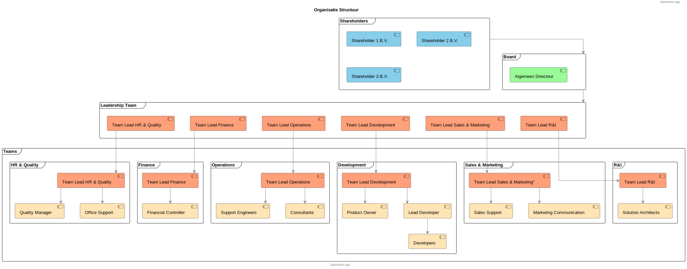

# Organizational Structure

At Conduction, we maintain a clear organizational structure that promotes collaboration, innovation, and efficient delivery of solutions. Here's an overview of our organization:

## Shareholders
Our shareholder structure consists of three entities:
- Shareholder 1 B.V.
- Shareholder 2 B.V. 
- Shareholder 3 B.V.

## Board
The board consists of:
- General Director (Algemeen Directeur)

## Leadership Team
Our leadership team consists of five key roles:
- Team Lead Management (Beheer)
- Team Lead Development (Ontwikkeling) 
- Team Lead Sales & Marketing
- Team Lead Research & Innovation
- Team Lead People & Finance

## Teams
We have five main teams, each led by their respective team leads:

### Service and Maintenance Team (Beheer)
- Team Lead Management
- Consultants

### Development Team (Ontwikkeling)
- Team Lead Development
- Developers

### Sales & Marketing Team
- Team Lead Sales & Marketing

### Research & Innovation Team
- Team Lead Research & Innovation
- Solution Architects

### People & Finance Team
- Team Lead People & Finance